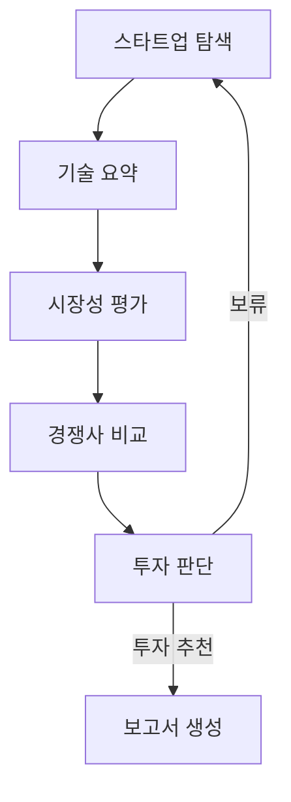
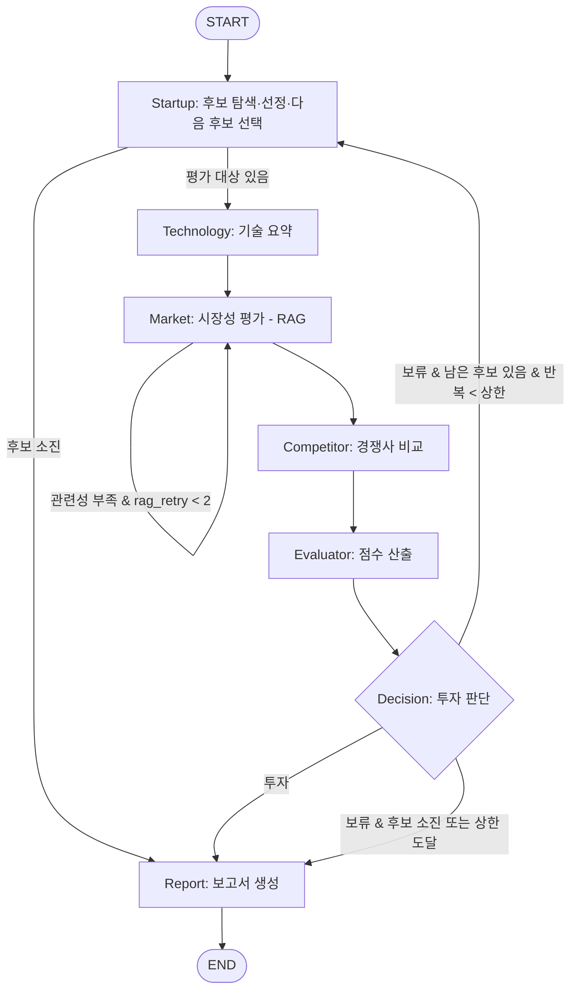

# CLAUDE.md — AI 스타트업 투자 평가 에이전트 (프로젝트 컨텍스트)

> 이 파일은 AI 코딩 어시스턴트가 작업 전에 **반드시 먼저 읽어야 하는** 프로젝트 컨텍스트 문서다.
> 과제 가이드(강사 제공)의 요구사항과, 조에서 확정한 설계 결정을 모두 담고 있다.
> **원칙: 가이드 요구사항과 이 문서의 설계를 벗어나는 구현을 하지 말 것. 불확실하면 구현 전에 질문할 것.**
>
> - `[확정]` = 조에서 확정된 내용
> - `[초안]` = 제안된 초안. 담당 조원의 최종본으로 교체될 수 있음
> - `[TODO]` = 아직 결정되지 않음. 임의로 채우지 말고 사용자에게 확인할 것

---

## 0. 한눈에 보기

| 항목 | 내용 |
|---|---|
| 과제명 | AI 스타트업 투자 평가 (SKALA, RAG Pipeline 과정 조별 실습, 1.5일) |
| 목표 | LangGraph 기반 Multi-Agent + Agentic RAG로 AI 스타트업의 투자 가능성을 평가하고 **투자 보고서를 자동 생성** |
| 도메인 | **Semiconductor (AI 반도체)** `[확정]` |
| 레포 | `github.com/yeonjep/ai-startup-investment-agent` (Public) |
| 오늘 | DAY 2 (2026-09-29): 설계 |
| 설계 PDF 마감 | **DAY 3 (2026-09-30) 10:00** — 반별 슬랙 스레드 |
| 개발 산출물 마감 | **DAY 3 (2026-09-30) 15:00** — GitHub 링크 + 투자 보고서 PDF, 반별 슬랙 스레드 |
| 발표 | DAY 3 15시 이후, README.md 화면으로 10분 (별도 자료 없음) |

---

## 1. 과제 가이드 요구사항 (원문 기준, 반드시 준수)

### 1.1 실습 목표 / 주제
- LangGraph 기반 Multi Agent + Agentic RAG 설계 및 개발
- 외부 정보 검색, 문서 요약 등의 목적에 맞는 도구 정의
- 주제: **AI 스타트업 투자 가능성 평가**
  - 국내외 AI 스타트업을 조사하고
  - 기술력, 시장성, 경쟁력 등의 관점에서 투자 가능성을 분석하여
  - 투자 가능한 스타트업에 대한 평가 보고서를 작성하는 Agentic RAG 설계 및 구현
- 가이드의 스타트업 정의:
  - 비상장 기업 (코스피, 코스닥 등 상장사 제외)
  - 투자 단계 Seed ~ Series C 수준
  - M&A 등으로 Exit이 완료되지 않았을 것
  - 제외 예시: 배달의민족(M&A로 Exit), 루닛·뷰노(코스닥 상장)
- 도메인 5개 중 택1: AgTech / Energy / Healthcare AI / Physical AI·Robotics / **Semiconductor** (AI 연산 특화 칩 설계, 또는 AI로 반도체 제조 공정 개선)

### 1.2 가이드의 Agent 정의(안)

| 에이전트 | 역할 | RAG 여부(가이드) | 내용 |
|---|---|---|---|
| 스타트업 탐색 | AI 스타트업 정보 수집 | O | 웹서치, 스타트업 평가 리포트 등 |
| 기술 요약 | 스타트업의 기술력 핵심 요약 | O | 홈페이지, 논문 등에서 핵심 기술, 장단점 |
| 시장성 평가 | 시장 성장성, 수요 분석 | O | 시장 리포트, 산업뉴스 검색 등 |
| 경쟁사 비교 | 경쟁 구도, 차별성 분석 | X | 경쟁사 정보 검색 및 비교 분석 |
| 투자 판단 | 종합 판단 (리스크, ROI 등) | X | 기준 점수에 따라 "투자" vs "보류" 결정 |
| 보고서 생성 | 결과 요약 보고서 생성 | X | 단계별 내용을 연결하여 보고서 생성 |

### 1.3 설계 규칙 (가이드 B)
- 에이전트: 정의(안)을 참고하되 설계 목적에 따라 추가/변경 가능
- **RAG: "RAG 여부 O" 중 최소 1개 에이전트는 RAG 기반으로 설계·개발**
- **RAG 문서: 조에서 자유 구성, 문서 개수와 무관하게 총 200페이지 이내**
- **Embedding: 경제성 고려하여 오픈소스 임베딩 반드시 적용. 후보군 선정 + 최종 선택 기준 정리**

### 1.4 투자 판단 기준 (가이드 C)
VC/PE 기준을 참고하여 설계 목적에 맞게 추가/변경하여 수립.

**Bessemer's Checklist** (YES/NO 또는 척도 기반)
1. 이 시장은 얼마나 큰가?
2. 제품이 시장의 실제 문제를 해결하는가?
3. 고객이 실제로 이 제품에 비용을 지불할 이유가 있는가?
4. 경쟁사보다 뚜렷한 차별성이 있는가?
5. 창업자와 팀은 이 분야에서 믿을만한가?
6. 초기 고객의 반응은 어떠한가?
7. 수익 모델은 명확한가?
8. 이 스타트업이 성공한다면, 정말 큰 기회가 될까?
9. 기술, 운영, 법률적 리스크는 무엇인가?
10. 이 창업자가 다음 10년을 이 분야에 쏟아부을 각오가 있는가?

**Scorecard Method** (엔젤 투자자 실전 평가)

| 항목 | 비중 | 평가 포인트 |
|---|---|---|
| 창업자 (Owner) | 30% | 전문성, 커뮤니케이션, 실행력 |
| 시장성 (Opportunity Size) | 25% | 시장 크기, 성장 가능성 |
| 제품/기술력 | 15% | 독창성, 구현 가능성 |
| 경쟁 우위 | 10% | 진입장벽, 특허, 네트워크 효과 |
| 실적 | 10% | 매출, 계약, 유저수 등 |
| 투자조건 (Deal Terms) | 10% | Valuation, 지분율 등 |

### 1.5 그래프 설계(안) (가이드 D, 강사 제공)
- 순차 흐름: 정보 수집 → 분석 → 평가 → 보고서
- 조건 분기:
  - 투자 판단 결과가 보류인 경우, 다른 스타트업으로 반복
  - 투자 판단 결과가 모두 부정(보류)이면, 루프 종료 후 보고서 생성

> 주의: 강사안에는 "모두 보류 시 루프 종료 → 보고서" 엣지가 그림에 없음. **우리 설계에는 반드시 추가**할 것.

### 1.6 투자 보고서 규칙 (가이드 E)
- 목적: 투자자에게 기업의 성장 가능성과 위험 요소를 전달
- 주요 내용: 사업 아이디어(핵심 컨셉), 사업 리스크(시장·기술·규제·경쟁 등), 시장 규모, 팀 구성(핵심 창업자, 기술 역량 등), 한계점 등
- 목차는 자유. 단 **맨 앞 "SUMMARY", 맨 끝 "REFERENCE"** 필수
  - SUMMARY: 전체 보고서의 핵심 요약 (개요 장표 아님). **1/2 페이지 이내**
  - REFERENCE: **실제로 활용한 자료만** 기재. 아래 형식 준수
- **보고서는 5장(페이지) 이내**

**REFERENCE 표기 형식**
- 기관 보고서: `발행기관(YYYY). *보고서명*. URL`
- 학술 논문: `저자(YYYY). 논문제목. *학술지명*, 권(호), 페이지.`
- 웹페이지: `기관명 또는 작성자(YYYY-MM-DD). *제목*. 사이트명, URL`
- 예: `한국은행(2024). *금융안정보고서*. https://www.bok.or.kr/...`
- 예: `김철수(2024). 인공지능 산업 전망. *투자연구*, 10(2), 50-60.`
- 예: `IEA(2024-04015). *Global EV Outlook 2024*. IEA. https://...`

### 1.7 제출물 (Deliverables)

**설계 산출물** (자유양식, DAY 3 10:00)
- 파일명: `RAG-Design_{캠퍼스}-{X반}_{이름1+이름2+이름3+이름4+이름5+이름6}.pdf`
- 포함 내용: Domain 선정 / B.설계(에이전트 정의, RAG 적용 대상, 선정한 Embedding 모델 + 선정 이유) / C.투자판단 기준(평가표) / D.그래프 설계(State 설계 table, Graph 흐름 mermaid) / E.투자 보고서 목차(초안)

**개발 산출물** (DAY 3 15:00)
- GitHub Link + README.md (아래 샘플 기준, 명확하고 간결하게)
  - **Contributors 섹션에는 개인별 수행 역할 작성. 단 PM, PL 역할은 포함하지 않음**
- 투자 보고서: `RAG-Output_{캠퍼스}-{X반}_{이름1+…+이름6}.pdf` — **코드 실행으로 생성된 결과물**

**README.md 샘플 (이 구조를 따를 것)**
```markdown
# AI Startup Investment Evaluation Agent
본 프로젝트는 {domain} 스타트업에 대한 투자 가능성을 자동으로 평가하는 에이전트를 설계하고 구현한 실습 프로젝트입니다.

## Overview
- Objective : AI 스타트업의 {관점1, 관점2, ...} 등을 기준으로 투자 적합성 분석
- Method : AI Agent, Agentic RAG, ...

## Features
- PDF 자료 기반 정보 추출
- ...

## Tech Stack
- Framework : LangGraph
- LLM/Generator : {GPT version}
- LLM/Judge : {GPT version}
- Retrieval : {VectorDB} - {Hit Rate@K}, {MRR}
- Embedding : {Open-source embedding}

## Agents
- Agent A: ...
- Agent B: ...

## Architecture
(그래프 이미지)

## Directory Structure
├── data/        # 문서 풀
├── agents/      # 평가 기준별 Agent 모듈
├── prompts/     # 프롬프트 템플릿
├── outputs/     # 평가 결과 저장
├── app.py       # 실행 스크립트
└── README.md

## Usage
python {app.py}

## Contributors
- 김철수 : Prompt Engineering, Agent Design
- 최영희 : PDF Parsing, Retrieval Agent
```

**발표**
- 개발 산출물 마감 후, README.md로 10분 발표. 조별 차별점 중심
- 말미: 투자 보고서의 핵심 포인트, Lessons Learned

### 1.8 채점표 (가이드 "(참고) 평가항목")

| 대상 | 항목 | 내용 | 배점 |
|---|---|---|---|
| 설계 (100) | 문제 정의 | 도메인에 따른 문제 정의가 명확·구체적 | 5 |
| | Agent 설계 | 역할 분리 합리적, 불필요한 에이전트 없이 명확한 책임 | 15 |
| | RAG 설계 | RAG 적용 에이전트 선정 적절, 문서 선정 전략 및 활용 방식 타당 | 15 |
| | Embedding 선택 | 오픈소스 임베딩 선택 이유·적용 전략 합리적 (**리더보드 상위 랭크는 적절한 이유 아님**) | 10 |
| | 평가 기준 설계 | 평가 기준이 구체적이고 합리적 | 15 |
| | State Schema | State가 Graph 흐름에 맞게 정의, 에이전트 간 데이터 흐름 명확 | 15 |
| | Graph 설계 | Workflow, Loop, Branch 논리적, 에이전트 간 협업 구조 표현 | 15 |
| | 보고서 구조 | 목차·전달 구조가 목적에 맞게 논리적 | 10 |
| 개발 (100) | **설계 구현 충실도** | **설계 문서 기준으로 Agent 구조, Graph 흐름, State 구조가 코드에 반영** | 15 |
| | Agent 구현 | 역할별 에이전트 분리 구현, 흐름 제어 논리적 | 15 |
| | **RAG Pipeline 구현** | 문서 로딩, 임베딩, 검색, 컨텍스트 활용 흐름 정상 구현 | **20** |
| | 코드 구조 | 디렉토리 구조, 모듈 분리, 실행 스크립트 명확 | 10 |
| | **실행 결과 재현성** | **코드 실행 시 실제로 보고서가 생성되는가** | 10 |
| | **Output - 보고서** | 설계 내용에 따라 생성, 보고 목적에 부합 | **20** |
| | Output - README | 목적, 구조, 실행방법 등 명확·간결 | 10 |

### 1.9 Final Reminders (가이드)
- AI 도구로 코딩할 수 있으나, **가이드 항목과 align 되도록 꼼꼼히 확인**
- **코드가 재현되지 않는 부분이 없는지 파일 점검**

---

## 2. 개발 환경 `[확정]`

- OS: macOS, IDE: VS Code
- 패키지 관리: **uv** (pip 사용 금지 → 시스템 Python에 설치될 수 있음). 패키지 추가는 **`uv add <pkg>`** (`uv pip install`은 pyproject에 기록되지 않아 `uv sync` 시 사라질 수 있음)
- **Python 3.11.11 고정** (`uv python pin 3.11.11`). 시스템에 Python 3.14가 있어 pin하지 않으면 3.14로 잡히고 일부 패키지(예: paddlepaddle)가 설치 실패함
- 과정 권장 스택: Python 3.11 / LangChain 1.0 / LangGraph 1.0 / Tracing: LangSmith / LLM: GPT
- 이 레포는 수업 실습 폴더(`~/workspace/ai-service/langchain-v1`, `langgraph-v1`)와 **별개의 새 프로젝트**다. 레포 루트에서 uv 프로젝트를 새로 구성할 것:
  ```bash
  uv init --python 3.11.11   # pyproject.toml 없을 때만
  uv python pin 3.11.11
  uv add langgraph langchain langchain-openai langchain-community langchain-text-splitters \
         langchain-huggingface sentence-transformers faiss-cpu pymupdf \
         langchain-tavily python-dotenv pydantic
  ```
  (필요 패키지는 구현하면서 조정. 보고서 PDF 생성 라이브러리는 `[TODO]`)
- `.env` (절대 커밋 금지, `.gitignore`에 포함):
  ```
  OPENAI_API_KEY=
  LANGCHAIN_API_KEY=
  LANGCHAIN_TRACING_V2=true
  LANGCHAIN_ENDPOINT=https://api.smith.langchain.com
  LANGCHAIN_PROJECT=SKALA
  HUGGINGFACEHUB_API_TOKEN=
  TAVILY_API_KEY=
  ```
  → 레포에는 값 없는 `.env.example`만 커밋
- LLM 모델: 비용 절감을 위해 **nano / mini 계열** 사용 (과정 가이드 권장). 예: `gpt-4.1-mini`, `gpt-4.1-nano`, `gpt-5.4-mini`, `gpt-5.4-nano`. Generator/Judge 모델 최종 선택은 `[TODO]`

---

## 3. 확정된 설계

### 3.1 Domain 선정 `[확정]`

**Semiconductor (AI 반도체)**: AI 연산에 특화된 칩(NPU, AI 가속기)을 설계하거나, AI로 반도체 설계·제조 공정을 개선하는 기술 분야

**선정 이유**
| 구분 | 이유 |
|---|---|
| 투자 정보 공개성 | 대규모 투자 라운드 보도가 많아 Scorecard의 실적·투자조건까지 근거 기반 평가 가능 |
| 평가 대상 확보 | 국내 비상장 AI 반도체 스타트업이 다수 존재 |
| 명확한 경쟁 구도 | NVIDIA 등 선두 기업과 해외 동종 스타트업이라는 비교축이 뚜렷 |
| RAG 문서 확보 | 정부·연구기관·글로벌 컨설팅의 공개 보고서가 풍부 |
| 리스크 구체성 | 수출통제(규제), 테이프아웃·양산(기술), 자본 소요(시장), 선두 기업 생태계(경쟁) |

**문제 정의**
AI 반도체 스타트업은 기술 난도가 높고 자본 소요가 커서, 투자 판단 시 기술 검증·시장성·글로벌 선두 대비 경쟁력을 동시에 분석해야 한다. 그러나 정보가 홈페이지·투자 기사·산업 보고서에 분산되어 수작업 조사에 시간이 많이 들고 평가자마다 판단 기준이 달라진다. 본 프로젝트는 LangGraph 기반 멀티 에이전트와 Agentic RAG로 국내 AI 반도체 스타트업을 탐색·분석·평가하고, 정량화된 평가표(Scorecard + Bessemer)로 투자 여부를 판단해, 근거와 출처가 명시된 투자 평가 보고서를 자동 생성한다.
- 입력: 평가 도메인(AI 반도체), 후보 탐색 조건
- 처리: 후보 탐색 → 기술·시장성·경쟁력 분석 → 평가표 점수화 → 투자/보류 판단
- 출력: 투자 평가 보고서 (SUMMARY ~ REFERENCE, 5장 이내)

### 3.2 스타트업 선정 기준 `[확정]`

가이드 스타트업 정의 + 도메인 적합성 + 평가 가능성. 기준별 **PASS / FAIL / REVIEW** 판정.

| # | 기준 | PASS | FAIL | REVIEW |
|---|---|---|---|---|
| 1 | 도메인 해당 | 주력 제품이 AI 반도체(NPU·AI 가속기, AI 기반 설계·공정 솔루션) | 반도체 무관, 단순 유통·부품 판매 | 반도체 사업이 일부 사업부에 한정 |
| 2 | AI 핵심성 | AI가 제품의 핵심 가치 | AI가 마케팅 문구 수준 | AI 활용 범위 불명확 |
| 3 | 국내 기업 | 본사 또는 주요 R&D 거점이 국내 | 국내 법인·거점 없음 | 해외 본사 한국계 창업 등 이중 구조 |
| 4 | 비상장 | 코스피·코스닥·코넥스 미상장 | 상장 완료 | 상장예비심사 청구 / IPO 추진 공식 발표 |
| 5 | 투자 단계 | 최근 라운드 Seed~Series C | Series D 이상 / Pre-IPO | 투자 단계 비공개 |
| 6 | Exit 미완료 | 피인수·합병·상장 이력 없음 | 타사 인수로 독립 법인 소멸 | 합병·지분 매각 진행 중 |
| 7 | 정보 충분성 | 홈페이지 + 관련 기사 2건 이상 | 공개 정보 거의 없음 | 관련 자료 1건 수준 |

**최종 판정 규칙 (코드 규칙으로 구현, LLM이 최종 결정하지 않음)**
- FAIL 1개 이상 → 제외
- 전부 PASS → 평가 대상 확정
- FAIL 없이 REVIEW 존재 → 해당 기준만 **추가 웹검색 1회 후 재판정**
  - PASS가 되면 평가 대상
  - 여전히 REVIEW면 후보 순서를 후순위로 조정하고 `uncertain=True` 플래그 → 보고서 한계점에 "정보 불확실" 명시

**구현 방식**: 탐색 에이전트가 후보마다 LLM 구조화 출력으로 기준별 `{status, evidence(근거 문장), source_url}`을 뽑고, 최종 판정은 위 규칙을 코드로 적용.

**설계 근거**
- Seed~Series C 한정: 후기 단계는 초기 투자 평가 취지와 다르고, Scorecard Method가 초기 기업 평가법이기 때문
- 국내 한정: 평가 일관성과 한국어 자료 활용도 확보. **해외 기업은 경쟁사 비교 에이전트에서 비교 대상으로 분석**하여 "국내외 조사" 요구를 충족
- 정보 충분성 추가: 정보가 없는 기업은 분석이 빈약해져 보고서 품질이 저하되므로 "평가 가능성"을 기준에 포함

### 3.3 후보 탐색 방식 `[확정]`

**하이브리드 방식**
- 메인: 탐색 에이전트가 **웹검색(Tavily)**으로 후보 수집 → 선정 기준으로 필터링
- 보조: 조가 만든 **시드 리스트** (`data/seed_startups.json`, 5~10개)를 입력/폴백으로 사용 → 재현성 확보, 탐색 정확도 검증용 정답지로도 활용
- 스타트업 후보를 위해 별도로 다운받는 파일은 없음. 회사별 세부 정보(창업자, 투자, 고객사, 기술)는 모두 **웹검색**으로 수집

**시드 리스트 후보** (정부 요약본 p.2에 언급된 국내 기업. **선정 기준 적용 전 웹검색 검증 필수**)
- 서버향: 퓨리오사AI, 리벨리온, 하이퍼엑셀 / 엣지향: 딥엑스, 모빌린트
- 주의: 요약본에 퓨리오사AI "메타 인수 논의(1.2조, '25.2), 기업가치 1조원('25.7)", 리벨리온 "기업가치 1.9조원('25.9)"으로 기재됨 → Exit 미완료(6번)·투자 단계(5번)에서 REVIEW 가능성. 선정 기준 작동 시연 사례로 활용 가능
- 최종 시드 목록: `[TODO]` (조원이 확정)

### 3.4 Agent 정의 `[확정]`

조 결정: 7개 에이전트 (Startup / Technology / Market / Competitor / Evaluator / Decision / Report)

| 에이전트 | 역할 | 입력 (State에서 읽음) | 출력 (State에 씀) | 도구 |
|---|---|---|---|---|
| **Startup** (탐색) | 후보 탐색, 선정 기준 판정, 다음 평가 대상 선택 | `domain`, `current_idx`, `candidates` | `candidates`, `current_idx`, `current_startup` | 웹검색 + 시드 리스트 |
| **Technology** (기술 요약) | 핵심 기술, 개발 단계(설계/테이프아웃/양산), 장단점 요약 | `current_startup` | `tech_summary` | 웹검색 |
| **Market** (시장성) | 목표 시장 규모, 성장률, 수요처 분석 | `current_startup`, `tech_summary` | `market_analysis` | **RAG** + 웹검색(보완) |
| **Competitor** (경쟁사) | 국내외 경쟁사 대비 차별성, 진입장벽 | `current_startup`, `tech_summary` | `competitor_analysis` | 웹검색 |
| **Evaluator** (평가) | 평가표로 항목별 점수 산출 (정성: 루브릭+LLM / 정량: 수치 추출+공식) | 분석 결과 3종 | `scores`, `total_score`, `missing_evidence` | LLM 구조화 출력 + 계산 로직 |
| **Decision** (판단) | 총점 vs 임계값으로 투자/보류 결정, 루프 종료 판단 | `total_score`, `current_idx`, `candidates` | `decision`, `evaluated` | 규칙 기반 |
| **Report** (보고서) | 목차에 맞춰 보고서 작성, REFERENCE 정리 | 전체 State | `final_report` | LLM |

**분리 근거**
- Evaluator/Decision 분리: 점수 산출(LLM 판단 개입)과 투자 결정(임계값 비교, 규칙 기반)을 분리해 판단 일관성 확보, 두 오류를 독립적으로 검증
- Startup이 다음 후보 선택까지 담당: 가이드 Graph(안)의 "보류 → 스타트업 탐색" 루프를 따름
- Technology/Market/Competitor 분리: 정보원과 평가표 항목이 각각 다름

### 3.5 RAG 적용 여부 `[확정]`

원칙: **"정적이고 신뢰도가 중요한 산업 정보는 RAG, 기업별 최신 정보는 웹검색"**

| 에이전트 | 가이드(안) | 본 설계 | 사유 |
|---|---|---|---|
| Startup | O | X (웹검색) | 스타트업 목록·투자 단계는 수시 변동, 최신 웹 정보가 적합 |
| Technology | O | X (웹검색) | 기업별 기술 정보는 홈페이지·보도자료에 분산, 개별 기업 문서를 200p 내 확보 어려움 |
| **Market** | O | **O (RAG)** | 시장 규모·성장률은 기관 보고서 신뢰도가 높고 변동이 적음. 평가표 정량 지표(TAM, CAGR)의 근거 |
| Competitor | X | X (웹검색) | 경쟁사 동향은 최신성이 중요 |
| Evaluator/Decision/Report | X | X | 외부 검색 없이 State만 사용 |

**Market Agent의 Agentic RAG 동작** (수업 실습 `langgraph-v1/20-RAG/04-QueryRewrite` 패턴)
- 검색 → **관련성 평가** → 불충분하면 **질의 재작성 후 재검색 (최대 2회, `rag_retry`)** → 그래도 부족하면 웹검색으로 보완하고 `missing_evidence`에 기록

### 3.6 RAG 문서 구성 `[확정]`

**선정 원칙**: 국내(정책·시장 수치) + 글로벌(최신 전망) 조합, 발간 시점 2024~2026 분산 → 신뢰도와 최신성 동시 확보

| # | 파일(업로드된 원본명) | 문서명 | 발행기관 | 발행일 | 사용 범위 | 페이지 | 언어 |
|---|---|---|---|---|---|---|---|
| 1 | `251219__별첨__AI반도체_산업_도약_전략_안__요약본.pdf` | AI반도체 산업 도약 전략(안)(요약본) | 관계부처 합동 | 2025-12-18 | 전체 | 10 | ko |
| 2 | `2026_Semiconductor_Industry_Outlook___Deloitte_Insights.pdf` | 2026 Global Semiconductor Industry Outlook | Deloitte | 2026-02-05 | 전체 | 13 | en |
| 3 | `_초점__새로운_기회의_창으로_AI반도체_시장_현황과_전망.pdf` | 새로운 기회의 창으로 AI반도체 시장 현황과 전망 (KISDI Perspectives) | 정보통신정책연구원 | 2024-07-25 | 전체 | 24 | ko |
| 4 | `AI반도체_글로벌_첨단_기술_산업_동향_조사_및_대응방향_연구.pdf` | AI반도체 글로벌 첨단 기술·산업 동향 조사 및 대응방향 연구 | 정보통신정책연구원 | 2024-02 | **1~2장만 (PDF 27~81쪽)** | 55 | ko |
| | | **합계** | | | | **102** | |

- 모든 PDF는 텍스트 레이어 있음 (스캔본 아님) → PyMuPDF로 추출 가능
- **4번 문서는 원본 155p라 그대로 쓰면 총 202p로 200p 초과.** 반드시 PDF 27~81쪽(본문 1장 시장 현황·전망 + 2장 선도기업 기술 동향)만 사용
  - 이 문서는 본문 1쪽 = PDF 27쪽 (앞 26쪽은 표지·목차·요약)
  - 3장(가치사슬, PDF 82~122)은 **3번 문서와 저자(김민식·오정숙) 동일 + 내용 중복**이라 제외
  - 4장(정책, PDF 123~145, 23p)은 선택 사항(넣어도 125p로 200p 이내)
  - 구현: 로딩 시 페이지 범위 필터 또는 사전에 해당 페이지만 잘라낸 PDF를 `data/`에 둠
- 기업별 정보(홈페이지, 투자 기사, 경쟁사)는 RAG 대상이 아니며 웹검색으로 수집

**문서별 핵심 내용 (Market Agent 근거)**
- 1번: 세계 AI반도체 시장(가트너) '24 713억달러 → '28 1,590억달러, 추론용 AI반도체 '23 60억달러 → '30 1,430억달러, 국산 NPU 현황(퓨리오사AI 레니게이드, 리벨리온 ATOM-MAX, 하이퍼엑셀 Bertha, 딥엑스 DX-M1/M2, 모빌린트 ARIES/REGULUS), 국내 20여개 기업 총 투자유치 1.7조원·기업가치 5.6조원, 자금력·인력 부족, K-NPU 프로젝트·공공조달·정책펀드 등 정부 지원
- 2번: 2026 반도체 시장 9,750억달러 전망, 생성형 AI 칩 약 5,000억달러(매출의 약 절반), AI 수요 둔화 시나리오 리스크(ROI, 전력, 효율 혁신, 가격), 수출통제 등 지정학
- 3번: AI반도체를 "새로운 기회의 창"으로 분석, 가치사슬(EDA, SIP, Fabless, Design House, Foundry) 변화, 정책 시사점
- 4번(1~2장): Gartner 기반 AI 반도체 시장 현황·전망(2022~2027), 선도기업(NVIDIA, AMD, Intel, SambaNova, Google TPU 등) 기술 동향

**REFERENCE 표기 (보고서에서 이 문서를 인용할 때)**
- 관계부처 합동(2025). *AI반도체 산업 도약 전략(안)(요약본)*. https://nsp.nanet.go.kr/plan/subject/detail.do?nationalPlanControlNo=PLAN0000058703
- Deloitte(2026). *2026 Global Semiconductor Industry Outlook*. https://www.deloitte.com/us/en/insights/industry/technology/technology-media-telecom-outlooks/semiconductor-industry-outlook.html
- 정보통신정책연구원(2024). *새로운 기회의 창으로 AI반도체 시장 현황과 전망*. https://www.kisdi.re.kr/report/view.do?key=m2102058837181&masterId=4334696&arrMasterId=4334696&artId=1776660
- 정보통신정책연구원(2024). *AI반도체 글로벌 첨단 기술·산업 동향 조사 및 대응방향 연구*. https://library.kisdi.re.kr/main.do/10210/contents/3934580?checkinId=3711250&articleId=1875096

> REFERENCE에는 **보고서 작성에 실제로 사용된 문서만** 넣어야 함 → 검색 결과로 실제 인용된 청크의 문서만 `sources`에 누적할 것

### 3.7 문서 메타데이터 스키마 `[확정, 구현 가능 범위로 축소]`

| 구분 | 필드 | 타입 | 용도 |
|---|---|---|---|
| 문서 단위 | `doc_id` | str | 문서 식별 |
| | `title` | str | REFERENCE 표기 |
| | `source` | str | 발행기관, REFERENCE 표기 |
| | `date` | str (YYYY-MM-DD) | 발행일, REFERENCE 표기 |
| | `url` | str | REFERENCE 표기 |
| | `document_type` | str | `gov_policy` / `market_report` / `research_report` |
| | `domain` | str | `ai_semiconductor` |
| | `language` | str | `ko` / `en` |
| | `mentioned_companies` | list[str] | 문서별 주요 언급 기업 (**수동 지정, 자동 추출 안 함**) |
| 청크 단위 | `page` | int | 인용 `[p.N]` 표기 (PDF 로더가 자동 부여) |
| | `chunk_id` | int | Retriever 평가(Hit Rate@K, MRR) 정답 식별 |

- `section` 필드는 구현 비용 대비 효용이 낮아 **제외**
- 조 원안의 `company` 대신 `mentioned_companies` 사용: RAG 문서가 특정 기업에 종속되지 않는 산업 보고서이기 때문

**문서별 값**
| doc_id | title | source | date | document_type | language | mentioned_companies |
|---|---|---|---|---|---|---|
| `gov_2025_strategy` | AI반도체 산업 도약 전략(안)(요약본) | 관계부처 합동 | 2025-12-18 | gov_policy | ko | 퓨리오사AI, 리벨리온, 하이퍼엑셀, 딥엑스, 모빌린트 |
| `deloitte_2026_outlook` | 2026 Global Semiconductor Industry Outlook | Deloitte | 2026-02-05 | market_report | en | NVIDIA, AMD |
| `kisdi_2024_perspectives` | 새로운 기회의 창으로 AI반도체 시장 현황과 전망 | 정보통신정책연구원 | 2024-07-25 | research_report | ko | `[TODO]` (필요 시 수동 지정) |
| `kisdi_2024_research` | AI반도체 글로벌 첨단 기술·산업 동향 조사 및 대응방향 연구(1~2장) | 정보통신정책연구원 | 2024-02 | research_report | ko | NVIDIA, AMD, Intel, SambaNova |

**구현 예시**
```python
DOC_META = {
    "gov_2025_strategy.pdf": {
        "doc_id": "gov_2025_strategy",
        "title": "AI반도체 산업 도약 전략(안)(요약본)",
        "source": "관계부처 합동", "date": "2025-12-18",
        "url": "https://nsp.nanet.go.kr/plan/subject/detail.do?nationalPlanControlNo=PLAN0000058703",
        "document_type": "gov_policy", "domain": "ai_semiconductor", "language": "ko",
        "mentioned_companies": ["퓨리오사AI", "리벨리온", "하이퍼엑셀", "딥엑스", "모빌린트"],
    },
    # ... 나머지 문서
}
chunks = splitter.split_documents(docs)   # page는 로더가 자동으로 넣음
for i, c in enumerate(chunks):
    c.metadata.update(DOC_META[filename])
    c.metadata["chunk_id"] = i
```

**메타데이터 활용**
- 보고서 생성: `source`, `date`, `title`, `url`로 REFERENCE를 가이드 형식 `발행기관(YYYY). *보고서명*. URL`으로 자동 생성, `page`로 본문 인용
- 평가: `chunk_id`로 Retriever 평가 → README Tech Stack의 Hit Rate@K, MRR
- (검색 필터 `document_type`/`date` 우선 적용은 **실제로 구현할 경우에만** 설계서·README에 기재)

### 3.8 Embedding 모델 `[TODO: 담당 조원 확정]`

- 조건: **오픈소스 필수**, 후보군 + 선정 기준 명시, **"리더보드 상위"는 선정 이유로 인정되지 않음**
- 우리 문서가 **한국어 3종 + 영어 1종** → **한·영 다국어 지원이 필수 조건**
- 후보(제안): `BAAI/bge-m3`, `intfloat/multilingual-e5-large`, `Qwen/Qwen3-Embedding-0.6B`
- 비교 기준(제안): 한·영 지원, 최대 입력 토큰(청크 길이), 차원/모델 크기(노트북 로컬 실행 가능), 라이선스, **우리 문서로 측정한 Hit Rate@K / MRR**
- 실측 방법: 수업 실습 `langchain-v1/14-Retriever/10-Retriever-Evaluation.ipynb` 방식 (청크 샘플 → LLM으로 질문 생성 → (질문, 정답 chunk_id) → Hit Rate@K, MRR)
- 로컬 임베딩: `langchain_huggingface.HuggingFaceEmbeddings` 사용. 첫 실행 시 모델 다운로드 시간 소요
- 최종 모델: `[TODO]`

---

## 4. 초안 (담당 조원 최종본으로 교체 예정)

### 4.1 투자 판단 기준 / 평가표 `[초안]`

Scorecard 가중치를 반도체에 맞게 조정 (딥테크 특성상 기술·경쟁 +5%씩)

| 항목 (가중치) | 세부 지표 | 유형 | 근거 출처 |
|---|---|---|---|
| 창업자/팀 (25%) | 창업자·핵심 인력의 반도체 설계 경력 | 정성 | 웹검색 |
| | 핵심 기술 인력 규모 | 정량 | 웹검색 |
| 시장성 (20%) | 목표 시장 규모(TAM) | 정량 | **RAG** |
| | 시장 연평균 성장률(CAGR) | 정량 | **RAG** |
| | 수요처의 명확성(데이터센터/엣지/온디바이스) | 정성 | RAG + 웹검색 |
| 제품/기술력 (20%) | 기술 개발 단계(설계→테이프아웃→양산) | 정량(단계 규칙) | 웹검색 |
| | 기술 독창성(아키텍처, 전력 효율) | 정성 | 웹검색 |
| 경쟁 우위 (15%) | NVIDIA·동종 스타트업 대비 차별성 | 정성 | 웹검색 |
| | 진입장벽(특허, SW 생태계, 파트너십) | 정성 | 웹검색 |
| 실적 (10%) | 고객사·PoC·공급 계약 건수 | 정량 | 웹검색 |
| | 매출 발생 여부 | 정량 | 웹검색 |
| 투자조건/리스크 (10%) | 누적 투자 유치 금액 | 정량 | 웹검색 |
| | 기술·운영·규제 리스크(수출통제, 파운드리 의존) | 정성 | RAG + 웹검색 |

**평가 방식**
| 유형 | 방법 | 출력 |
|---|---|---|
| 정성 | 근거 문서 + **루브릭(1~5점 기준 문장)** → LLM 구조화 출력 `{score, reason, source}` | 1~5점 |
| 정량 | LLM은 **수치 추출만**, 점수 변환은 **코드 공식** | 1~5점 |

- 루브릭 예 (기술 독창성): 5=독자 아키텍처 + 공개 성능·전력효율 근거 / 3=차별점 주장하나 객관 근거 부족 / 1=기존 제품과 구분 안 됨
- 공식 예 (CAGR): ≥20%→5, 15~20→4, 10~15→3, 5~10→2, <5→1
- 공식 예 (개발 단계): 양산 5, 테이프아웃 4, 시제품·FPGA 3, 설계 2, 정보 없음 1
- **정보 없음 → 3점(중립) + `missing_evidence`에 기록** → 보고서 한계점에 자동 기재
- 항목 점수 = 세부 지표 평균, **총점 = Σ(항목점수/5 × 가중치)** (100점 만점)
- **70점 이상 → 투자, 미만 → 보류** (임계값 최종값 `[TODO]`)

### 4.2 State 설계 `[초안]`

| 필드 | 타입 | Reducer | 쓰는 곳 | 읽는 곳 |
|---|---|---|---|---|
| `domain` | str | overwrite | 입력 | Startup |
| `candidates` | list[dict] (name, 판정 결과, uncertain) | overwrite | Startup | Startup, Decision |
| `current_idx` | int | overwrite | Startup | Startup, Decision |
| `current_startup` | dict | overwrite | Startup | Technology, Market, Competitor, Report |
| `max_iterations` | int | overwrite | 입력 | Decision (루프 상한) |
| `tech_summary` | str | overwrite | Technology | Market, Competitor, Evaluator, Report |
| `market_analysis` | str | overwrite | Market | Evaluator, Report |
| `rag_retry` | int | overwrite | Market | Market 내부 분기 |
| `competitor_analysis` | str | overwrite | Competitor | Evaluator, Report |
| `scores` | dict | overwrite | Evaluator | Decision, Report |
| `total_score` | float | overwrite | Evaluator | Decision, Report |
| `missing_evidence` | list[str] | add | Market, Evaluator | Report(한계점) |
| `decision` | str ("투자"/"보류") | overwrite | Decision | 분기 함수, Report |
| `evaluated` | list[dict] | add (`operator.add`) | Decision | Report (보류 기업 요약) |
| `sources` | list[dict] | add (`operator.add`) | 검색/RAG 노드 전체 | Report (REFERENCE) |
| `final_report` | str | overwrite | Report | 출력 |

- 새 후보로 넘어갈 때 `tech_summary`, `market_analysis`, `competitor_analysis`, `scores`, `rag_retry` 등 후보별 필드를 **초기화**할 것 (이전 후보 값이 남지 않게)
- 키 이름은 State 스키마와 **정확히 일치**해야 병합됨 (수업 교재 LangGraph 주의사항)

### 4.3 Graph 설계 `[초안]`

강사 Graph(안)을 기반으로 **"모두 보류 시 종료"** 엣지와 **Market 내부 RAG 재검색 루프**를 추가.



- Workflow(순차) + Loop(후보 반복, RAG 재검색) + Branch(투자/보류/종료) 모두 포함 → 채점 기준 충족
- **무한 루프 방지**: `max_iterations` + `recursion_limit` 설정 (LangGraph 기본 25)
- 모두 보류로 끝난 경우 보고서는 "투자 추천 없음 + 후보별 보류 사유 비교" 형태 `[TODO: 조 확정]`

### 4.4 보고서 목차 `[초안]` (5장 이내)
1. **SUMMARY** — 투자 결론과 핵심 근거 (1/2 페이지 이내)
2. 기업 개요 및 사업 아이디어
3. 기술력 분석
4. 시장 규모 및 성장성
5. 경쟁 구도 및 차별성
6. 팀 구성
7. 평가 결과 (점수표, 판단 근거, 보류 후보 요약)
8. 리스크 및 한계점 (시장·기술·규제·경쟁 + `missing_evidence`, `uncertain`)
9. **REFERENCE** — 가이드 형식, 실제 사용 자료만

---

## 5. 구현 원칙 (AI 어시스턴트 필독)

1. **설계서에 있는 것만 구현하고, 구현한 것만 설계서/README에 쓴다.** "설계 구현 충실도(15점)"는 설계 문서의 Agent 구조·Graph 흐름·State 구조가 코드에 반영됐는지 본다. State 필드명·노드명은 이 문서와 일치시킬 것
2. **디렉토리 구조는 README 샘플을 따른다**
   ```
   ├── data/            # RAG 문서 PDF, seed_startups.json
   ├── agents/          # 에이전트별 모듈 (startup.py, technology.py, market.py, competitor.py, evaluator.py, decision.py, report.py)
   ├── prompts/         # 프롬프트 템플릿
   ├── outputs/         # 생성된 보고서
   ├── app.py           # 실행 스크립트 (python app.py → 보고서 생성)
   └── README.md
   ```
   (필요 시 `rag/`(로더·임베딩·벡터DB), `graph.py`, `state.py` 등 추가 가능. 추가하면 README Directory Structure에도 반영)
3. **재현성**: `python app.py` 한 번으로 보고서가 `outputs/`에 생성돼야 함. 웹검색이 불안정해도 시드 리스트 폴백으로 반드시 끝까지 실행되게 할 것. 벡터DB는 없으면 생성, 있으면 재사용(`save_local`/`load_local`)
4. **보고서 PDF**: 코드로 생성. 파일명 `RAG-Output_{캠퍼스}-{X반}_{이름1+…+이름6}.pdf`. 한글 폰트 처리 필요. 라이브러리 선택 `[TODO]`
5. **REFERENCE 자동화**: 검색·RAG 노드에서 실제 사용한 출처(문서 메타데이터, 웹 URL·날짜·제목)를 `sources`에 누적 → Report에서 가이드 형식으로 출력. 사용하지 않은 자료는 넣지 말 것
6. **보고서 규칙 검증**: SUMMARY 맨 앞(1/2p 이내), REFERENCE 맨 끝, 전체 5장 이내
7. **비용**: LLM은 nano/mini 계열, 임베딩은 로컬 오픈소스. 반복 호출이 많으니 루프 상한 필수
8. **보안**: `.env` 커밋 금지, API 키를 코드·README·로그에 노출 금지
9. **LangSmith 추적**: `.env`의 LANGCHAIN 설정으로 추적 (디버깅·발표 근거 자료)
10. README Contributors에 **PM/PL 역할 쓰지 않기**

### 수업 실습 코드 참고 위치 (로컬 `~/workspace/ai-service/`)
| 구현 대상 | 참고 노트북 |
|---|---|
| PDF 로딩 | `langchain-v1/10-DocumentLoader/01-PDFLoader.ipynb` (PyMuPDFLoader) |
| 청킹 | `langchain-v1/11-TextSplitter/01-RecursiveCharacterTextSplitter.ipynb` |
| 벡터DB 저장/로드 | `langchain-v1/13-VectorStore/01-FAISS.ipynb` |
| 오픈소스 모델(BGE-M3) | `langchain-v1/14-Retriever/04b-BGE-M3.ipynb` |
| Retriever 평가 (Hit Rate, MRR) | `langchain-v1/14-Retriever/10-Retriever-Evaluation.ipynb` |
| 출처 표기·가드레일·Faithfulness 평가 | `langchain-v1/15-RAG/02-RAG-Advanced.ipynb` |
| LangGraph State/Node/Edge/Command/recursion_limit | `langgraph-v1/00-Basic/02-State.ipynb`, `03-Graph.ipynb` |
| 관련성 체크 + 재검색 카운터 | `langgraph-v1/20-RAG/02-RelevanceCheck.ipynb` |
| 웹검색 폴백 | `langgraph-v1/20-RAG/03-WebSearch.ipynb` |
| 질의 재작성 루프 | `langgraph-v1/20-RAG/04-QueryRewrite.ipynb` |
| 문서 관련성 평가·환각 체크 | `langgraph-v1/20-RAG/10-SelfRAG.ipynb` |
| 라우팅·재시도 카운터·결정론적 가드·평가 | `langgraph-v1/20-RAG/14-AgenticRAG-advanced.ipynb` |

### 알려진 함정
- 클래스명 대소문자: `PyMuPDFLoader` (교재 슬라이드의 `PyMuPDFloader`는 오타)
- `.env` 키 이름: `OPENAI_API_KEY` (교재 슬라이드의 `OPEN_API_KEY`는 오타)
- LangGraph 조건 함수의 반환값은 매핑 딕셔너리 키와 정확히 일치해야 함. `Command` 사용 시 `Command[Literal[...]]` 타입 힌트 필요
- 루프에는 반드시 카운터 + `recursion_limit` (초과 시 `GraphRecursionError`)
- RAGAS를 쓸 경우 교재의 `ragas.testset.generator` 등은 구버전 API. 신버전은 `EvaluationDataset`, `evaluate` 사용 (`langgraph-v1/20-RAG/14`)
- Python 3.14로 잡히면 설치 실패 → `uv python pin 3.11.11`

---

## 6. 남은 결정 사항 체크리스트 `[TODO]`

- [ ] 캠퍼스, 반, 조원 6명 이름 (파일명·README용)
- [ ] 임베딩 최종 모델 + 비교표 (3.8)
- [ ] 평가표 최종본: 가중치, 세부 지표, 루브릭, 임계값 (4.1)
- [ ] State 최종본 (4.2)
- [ ] Graph 최종본 mermaid (4.3)
- [ ] 보고서 목차 최종본 (4.4), 모두 보류 시 보고서 형태
- [ ] 시드 스타트업 리스트 확정 (`data/seed_startups.json`)
- [ ] Generator / Judge LLM 모델
- [ ] 벡터DB 선택 (FAISS 제안)
- [ ] 보고서 PDF 생성 방식
- [ ] 역할 분담 (README Contributors용, PM/PL 제외)
