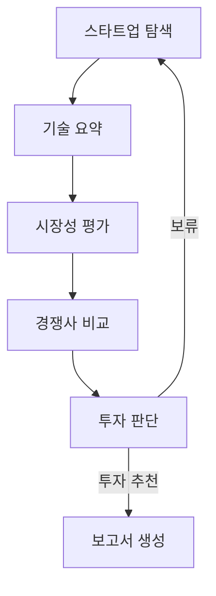

# CLAUDE.md — AI 스타트업 투자 평가 에이전트 (프로젝트 컨텍스트)

> 이 파일은 AI 코딩 어시스턴트가 작업 전에 **반드시 먼저 읽어야 하는** 프로젝트 컨텍스트 문서다.
> 과제 가이드의 공통 요구사항과 작업 규칙을 담고 있다. 조의 최종 설계는 [`docs/DESIGN.md`](docs/DESIGN.md)를 기준으로 한다.
> **원칙: 코드가 설계와 다르면 DESIGN.md를 따른다. 설계에 없는 결정을 임의로 추가하지 말고, 불명확하면 구현 전에 확인한다.**

---

## 0. 한눈에 보기

| 항목 | 내용 |
|---|---|
| 과제명 | AI 스타트업 투자 평가 (SKALA, RAG Pipeline 과정 조별 실습, 1.5일) |
| 목표 | LangGraph 기반 Multi-Agent + Agentic RAG로 AI 스타트업의 투자 가능성을 평가하고 **투자 보고서를 자동 생성** |
| 도메인 | **Semiconductor (AI 반도체)** `[확정]` |
| 레포 | `github.com/yeonjep/ai-startup-investment-agent` (Public) |
| 오늘 | DAY 2 (2026-09-29): 설계 |
| 설계 PDF 마감 | **DAY 3 (2026-09-30) 10:00** — 반별 슬랙 스레드 |
| 개발 산출물 마감 | **DAY 3 (2026-09-30) 15:00** — GitHub 링크 + 투자 보고서 PDF, 반별 슬랙 스레드 |
| 발표 | DAY 3 15시 이후, README.md 화면으로 10분 (별도 자료 없음) |

---

## 1. 과제 가이드 요구사항 (원문 기준, 반드시 준수)

### 1.1 실습 목표 / 주제
- LangGraph 기반 Multi Agent + Agentic RAG 설계 및 개발
- 외부 정보 검색, 문서 요약 등의 목적에 맞는 도구 정의
- 주제: **AI 스타트업 투자 가능성 평가**
  - 국내외 AI 스타트업을 조사하고
  - 기술력, 시장성, 경쟁력 등의 관점에서 투자 가능성을 분석하여
  - 투자 가능한 스타트업에 대한 평가 보고서를 작성하는 Agentic RAG 설계 및 구현
- 가이드의 스타트업 정의:
  - 비상장 기업 (코스피, 코스닥 등 상장사 제외)
  - 투자 단계 Seed ~ Series C 수준
  - M&A 등으로 Exit이 완료되지 않았을 것
  - 제외 예시: 배달의민족(M&A로 Exit), 루닛·뷰노(코스닥 상장)
- 도메인 5개 중 택1: AgTech / Energy / Healthcare AI / Physical AI·Robotics / **Semiconductor** (AI 연산 특화 칩 설계, 또는 AI로 반도체 제조 공정 개선)

### 1.2 가이드의 Agent 정의(안)

| 에이전트 | 역할 | RAG 여부(가이드) | 내용 |
|---|---|---|---|
| 스타트업 탐색 | AI 스타트업 정보 수집 | O | 웹서치, 스타트업 평가 리포트 등 |
| 기술 요약 | 스타트업의 기술력 핵심 요약 | O | 홈페이지, 논문 등에서 핵심 기술, 장단점 |
| 시장성 평가 | 시장 성장성, 수요 분석 | O | 시장 리포트, 산업뉴스 검색 등 |
| 경쟁사 비교 | 경쟁 구도, 차별성 분석 | X | 경쟁사 정보 검색 및 비교 분석 |
| 투자 판단 | 종합 판단 (리스크, ROI 등) | X | 기준 점수에 따라 "투자" vs "보류" 결정 |
| 보고서 생성 | 결과 요약 보고서 생성 | X | 단계별 내용을 연결하여 보고서 생성 |

### 1.3 설계 규칙 (가이드 B)
- 에이전트: 정의(안)을 참고하되 설계 목적에 따라 추가/변경 가능
- **RAG: "RAG 여부 O" 중 최소 1개 에이전트는 RAG 기반으로 설계·개발**
- **RAG 문서: 조에서 자유 구성, 문서 개수와 무관하게 총 200페이지 이내**
- **Embedding: 경제성 고려하여 오픈소스 임베딩 반드시 적용. 후보군 선정 + 최종 선택 기준 정리**

### 1.4 투자 판단 기준 (가이드 C)
VC/PE 기준을 참고하여 설계 목적에 맞게 추가/변경하여 수립.

**Bessemer's Checklist** (YES/NO 또는 척도 기반)
1. 이 시장은 얼마나 큰가?
2. 제품이 시장의 실제 문제를 해결하는가?
3. 고객이 실제로 이 제품에 비용을 지불할 이유가 있는가?
4. 경쟁사보다 뚜렷한 차별성이 있는가?
5. 창업자와 팀은 이 분야에서 믿을만한가?
6. 초기 고객의 반응은 어떠한가?
7. 수익 모델은 명확한가?
8. 이 스타트업이 성공한다면, 정말 큰 기회가 될까?
9. 기술, 운영, 법률적 리스크는 무엇인가?
10. 이 창업자가 다음 10년을 이 분야에 쏟아부을 각오가 있는가?

**Scorecard Method** (엔젤 투자자 실전 평가)

| 항목 | 비중 | 평가 포인트 |
|---|---|---|
| 창업자 (Owner) | 30% | 전문성, 커뮤니케이션, 실행력 |
| 시장성 (Opportunity Size) | 25% | 시장 크기, 성장 가능성 |
| 제품/기술력 | 15% | 독창성, 구현 가능성 |
| 경쟁 우위 | 10% | 진입장벽, 특허, 네트워크 효과 |
| 실적 | 10% | 매출, 계약, 유저수 등 |
| 투자조건 (Deal Terms) | 10% | Valuation, 지분율 등 |

### 1.5 그래프 설계(안) (가이드 D, 강사 제공)
- 순차 흐름: 정보 수집 → 분석 → 평가 → 보고서
- 조건 분기:
  - 투자 판단 결과가 보류인 경우, 다른 스타트업으로 반복
  - 투자 판단 결과가 모두 부정(보류)이면, 루프 종료 후 보고서 생성

> 주의: 강사안에는 "모두 보류 시 루프 종료 → 보고서" 엣지가 그림에 없음. **우리 설계에는 반드시 추가**할 것.

### 1.6 투자 보고서 규칙 (가이드 E)
- 목적: 투자자에게 기업의 성장 가능성과 위험 요소를 전달
- 주요 내용: 사업 아이디어(핵심 컨셉), 사업 리스크(시장·기술·규제·경쟁 등), 시장 규모, 팀 구성(핵심 창업자, 기술 역량 등), 한계점 등
- 목차는 자유. 단 **맨 앞 "SUMMARY", 맨 끝 "REFERENCE"** 필수
  - SUMMARY: 전체 보고서의 핵심 요약 (개요 장표 아님). **1/2 페이지 이내**
  - REFERENCE: **실제로 활용한 자료만** 기재. 아래 형식 준수
- **보고서는 5장(페이지) 이내**

**REFERENCE 표기 형식**
- 기관 보고서: `발행기관(YYYY). *보고서명*. URL`
- 학술 논문: `저자(YYYY). 논문제목. *학술지명*, 권(호), 페이지.`
- 웹페이지: `기관명 또는 작성자(YYYY-MM-DD). *제목*. 사이트명, URL`
- 예: `한국은행(2024). *금융안정보고서*. https://www.bok.or.kr/...`
- 예: `김철수(2024). 인공지능 산업 전망. *투자연구*, 10(2), 50-60.`
- 예: `IEA(2024-04015). *Global EV Outlook 2024*. IEA. https://...`

### 1.7 제출물 (Deliverables)

**설계 산출물** (자유양식, DAY 3 10:00)
- 파일명: `RAG-Design_{캠퍼스}-{X반}_{이름1+이름2+이름3+이름4+이름5+이름6}.pdf`
- 포함 내용: Domain 선정 / B.설계(에이전트 정의, RAG 적용 대상, 선정한 Embedding 모델 + 선정 이유) / C.투자판단 기준(평가표) / D.그래프 설계(State 설계 table, Graph 흐름 mermaid) / E.투자 보고서 목차(초안)

**개발 산출물** (DAY 3 15:00)
- GitHub Link + README.md (아래 샘플 기준, 명확하고 간결하게)
  - **Contributors 섹션에는 개인별 수행 역할 작성. 단 PM, PL 역할은 포함하지 않음**
- 투자 보고서: `RAG-Output_{캠퍼스}-{X반}_{이름1+…+이름6}.pdf` — **코드 실행으로 생성된 결과물**

**README.md 샘플 (이 구조를 따를 것)**
```markdown
# AI Startup Investment Evaluation Agent
본 프로젝트는 {domain} 스타트업에 대한 투자 가능성을 자동으로 평가하는 에이전트를 설계하고 구현한 실습 프로젝트입니다.

## Overview
- Objective : AI 스타트업의 {관점1, 관점2, ...} 등을 기준으로 투자 적합성 분석
- Method : AI Agent, Agentic RAG, ...

## Features
- PDF 자료 기반 정보 추출
- ...

## Tech Stack
- Framework : LangGraph
- LLM/Generator : {GPT version}
- LLM/Judge : {GPT version}
- Retrieval : {VectorDB} - {Hit Rate@K}, {MRR}
- Embedding : {Open-source embedding}

## Agents
- Agent A: ...
- Agent B: ...

## Architecture
(그래프 이미지)

## Directory Structure
├── data/        # 문서 풀
├── agents/      # 평가 기준별 Agent 모듈
├── prompts/     # 프롬프트 템플릿
├── outputs/     # 평가 결과 저장
├── app.py       # 실행 스크립트
└── README.md

## Usage
python {app.py}

## Contributors
- 김철수 : Prompt Engineering, Agent Design
- 최영희 : PDF Parsing, Retrieval Agent
```

**발표**
- 개발 산출물 마감 후, README.md로 10분 발표. 조별 차별점 중심
- 말미: 투자 보고서의 핵심 포인트, Lessons Learned

### 1.8 채점표 (가이드 "(참고) 평가항목")

| 대상 | 항목 | 내용 | 배점 |
|---|---|---|---|
| 설계 (100) | 문제 정의 | 도메인에 따른 문제 정의가 명확·구체적 | 5 |
| | Agent 설계 | 역할 분리 합리적, 불필요한 에이전트 없이 명확한 책임 | 15 |
| | RAG 설계 | RAG 적용 에이전트 선정 적절, 문서 선정 전략 및 활용 방식 타당 | 15 |
| | Embedding 선택 | 오픈소스 임베딩 선택 이유·적용 전략 합리적 (**리더보드 상위 랭크는 적절한 이유 아님**) | 10 |
| | 평가 기준 설계 | 평가 기준이 구체적이고 합리적 | 15 |
| | State Schema | State가 Graph 흐름에 맞게 정의, 에이전트 간 데이터 흐름 명확 | 15 |
| | Graph 설계 | Workflow, Loop, Branch 논리적, 에이전트 간 협업 구조 표현 | 15 |
| | 보고서 구조 | 목차·전달 구조가 목적에 맞게 논리적 | 10 |
| 개발 (100) | **설계 구현 충실도** | **설계 문서 기준으로 Agent 구조, Graph 흐름, State 구조가 코드에 반영** | 15 |
| | Agent 구현 | 역할별 에이전트 분리 구현, 흐름 제어 논리적 | 15 |
| | **RAG Pipeline 구현** | 문서 로딩, 임베딩, 검색, 컨텍스트 활용 흐름 정상 구현 | **20** |
| | 코드 구조 | 디렉토리 구조, 모듈 분리, 실행 스크립트 명확 | 10 |
| | **실행 결과 재현성** | **코드 실행 시 실제로 보고서가 생성되는가** | 10 |
| | **Output - 보고서** | 설계 내용에 따라 생성, 보고 목적에 부합 | **20** |
| | Output - README | 목적, 구조, 실행방법 등 명확·간결 | 10 |

### 1.9 Final Reminders (가이드)
- AI 도구로 코딩할 수 있으나, **가이드 항목과 align 되도록 꼼꼼히 확인**
- **코드가 재현되지 않는 부분이 없는지 파일 점검**

---

## 2. 개발 환경 `[확정]`

- OS: macOS, IDE: VS Code
- 패키지 관리: **uv** (pip 사용 금지 → 시스템 Python에 설치될 수 있음). 패키지 추가는 **`uv add <pkg>`** (`uv pip install`은 pyproject에 기록되지 않아 `uv sync` 시 사라질 수 있음)
- **Python 3.11.11 고정** (`uv python pin 3.11.11`). 시스템에 Python 3.14가 있어 pin하지 않으면 3.14로 잡히고 일부 패키지(예: paddlepaddle)가 설치 실패함
- 과정 권장 스택: Python 3.11 / LangChain 1.0 / LangGraph 1.0 / Tracing: LangSmith / LLM: GPT
- 이 레포는 수업 실습 폴더(`~/workspace/ai-service/langchain-v1`, `langgraph-v1`)와 **별개의 새 프로젝트**다. 레포 루트에서 uv 프로젝트를 새로 구성할 것:
  ```bash
  uv init --python 3.11.11   # pyproject.toml 없을 때만
  uv python pin 3.11.11
  uv add langgraph langchain langchain-openai langchain-community langchain-text-splitters \
         langchain-huggingface sentence-transformers faiss-cpu pymupdf \
         langchain-tavily python-dotenv pydantic
  ```
  필요한 의존성은 DESIGN.md의 범위에 맞춰 관리하며, 설계에 없는 기술 선택은 임의로 확정하지 않는다.
- `.env` (절대 커밋 금지, `.gitignore`에 포함):
  ```
  OPENAI_API_KEY=
  LANGCHAIN_API_KEY=
  LANGCHAIN_TRACING_V2=true
  LANGCHAIN_ENDPOINT=https://api.smith.langchain.com
  LANGCHAIN_PROJECT=SKALA
  HUGGINGFACEHUB_API_TOKEN=
  TAVILY_API_KEY=
  ```
  → 레포에는 값 없는 `.env.example`만 커밋
- LLM 모델 선택과 역할별 사용처: DESIGN.md의 F. Tech Stack을 따른다. 임베딩 모델은 B-4. Embedding · Retrieval 설계를 따른다.

---

## 3. 설계 기준

모든 설계 결정의 단일 기준은 [`docs/DESIGN.md`](docs/DESIGN.md)다. 코드·주석·README·다른 문서와 설계가 다르면 **DESIGN.md를 따른다**. 본 CLAUDE.md는 작업 규칙과 설계 참조 위치를 제공하며, 설계 세부값을 복제하거나 별도로 확정하지 않는다.

| 구현·검토 주제 | DESIGN.md 참조 위치 |
|---|---|
| 도메인, 문제 정의, 스타트업 선정 기준 | A. Domain 선정 > 3. 스타트업 선정 기준 |
| 에이전트 역할·입출력·도구·에이전트별 동작 | B-1. Agent 설계 |
| 에이전트별 RAG 적용 | B-2. Agent별 RAG 적용 대상 |
| RAG 문서, 원본 물리 페이지, Cleaning·청킹·Metadata·manifest | B-4. RAG 문서 및 전처리 |
| 임베딩, query instruction, Dense/BM25 Hybrid·Weighted RRF, Corrective RAG | B-5. Embedding 및 Retrieval 설계 |
| 투자/보류의 결정 조건 | C-3. 투자/보류 판정 |
| State 필드·초기값·Reducer, Evidence·ScoreEntry·EvaluationRecord | D-1, D-2 |
| 10개 노드, Branch·Loop·Evidence refresh·Graph edge | D-3, D-4 |
| 보고서 목차·작성 규칙·REFERENCE | E. 투자 보고서 |
| 확정 기술 스택 및 구현 범위 | F. Tech Stack 및 구현 범위 |

DESIGN.md F장의 **“향후 확장 (본 과제 범위 외)”은 구현하지 않는다**. 해당 항목을 구현 범위에 포함하려면 조의 설계 변경이 먼저 반영된 새 DESIGN.md가 필요하다.

## 4. 작업 규칙

1. State 키, 그래프 노드 이름, 점수 기준, 가중치 및 투자 판단 임계값은 DESIGN.md와 정확히 일치시킨다. 이름이나 규칙을 임의로 바꾸거나, 초안·관례를 근거로 보완하지 않는다.
2. DESIGN.md와 기존 코드가 다르면 DESIGN.md를 따른다. 설계 내용이 서로 모순되거나 필요한 결정이 빠져 있으면 임의로 정하지 말고 구현 전에 확인한다.
3. 구현 작업은 작은 단계로 나누고, **각 단계가 끝날 때마다 `uv run python app.py`를 실행해 그래프가 끝까지 완료되는지 확인한다**. 실패하면 다음 단계로 넘어가기 전에 원인을 해결한다.
4. 비밀키와 토큰은 프로젝트 `.env`에서만 읽고 코드·README·로그·커밋에 값이나 기본값을 넣지 않는다. 모델명, 점수 임계값, 가중치 등 변경 가능한 실행 설정은 config에 둔다. `.env`는 커밋하지 않고 값 없는 `.env.example`만 유지한다.
5. 설계와 구현의 변경은 함께 검토한다. 구현하지 않은 기능을 README나 보고서에서 구현된 것처럼 설명하지 않는다.

## 5. 개발 환경

- OS: macOS, IDE: VS Code
- 패키지 관리: **uv**. 패키지 추가는 `uv add <pkg>`를 사용한다. `uv pip install`은 프로젝트 의존성에 기록되지 않아 `uv sync` 후 사라질 수 있으므로 사용하지 않는다.
- Python 버전: **3.11.11** (`uv python pin 3.11.11`)
- 의존성 설치: `uv sync`
- 환경 변수: `.env.example`을 참고해 로컬 `.env`를 설정한다. `.env`는 절대 커밋하지 않는다.
- 앱 종단 간 확인: `uv run python app.py`

### 수업 실습 참고 위치

| 구현 주제 | 참고 자료 |
|---|---|
| PDF 로딩 | `langchain-v1/10-DocumentLoader/01-PDFLoader.ipynb` (`PyMuPDFLoader`) |
| 청킹 | `langchain-v1/11-TextSplitter/01-RecursiveCharacterTextSplitter.ipynb` |
| FAISS 저장·로드 | `langchain-v1/13-VectorStore/01-FAISS.ipynb` |
| 오픈소스 임베딩 | `langchain-v1/14-Retriever/04b-BGE-M3.ipynb` |
| Retriever 평가 | `langchain-v1/14-Retriever/10-Retriever-Evaluation.ipynb` |
| 출처 표기·가드레일·Faithfulness 평가 | `langchain-v1/15-RAG/02-RAG-Advanced.ipynb` |
| LangGraph State·Node·Edge·재귀 제한 | `langgraph-v1/00-Basic/02-State.ipynb`, `03-Graph.ipynb` |
| 관련성 평가·재검색 | `langgraph-v1/20-RAG/02-RelevanceCheck.ipynb`, `04-QueryRewrite.ipynb` |
| 웹검색 폴백 | `langgraph-v1/20-RAG/03-WebSearch.ipynb` |
| Self-RAG | `langgraph-v1/20-RAG/10-SelfRAG.ipynb` |
| 라우팅·재시도·결정론적 가드 | `langgraph-v1/20-RAG/14-AgenticRAG-advanced.ipynb` |

### 알려진 환경상 주의점

- PDF 로더 클래스는 `PyMuPDFLoader`가 정확한 표기다.
- OpenAI 환경 변수명은 `OPENAI_API_KEY`다.
- LangGraph 조건 분기의 반환값은 조건 Edge 매핑 키와 정확히 일치시킨다.
- 반복 흐름에는 DESIGN.md에 정의된 카운터·상한과 적절한 `recursion_limit`을 적용한다.
- Python 인터프리터가 프로젝트의 `.python-version` 및 uv 환경을 사용하는지 확인한다.
