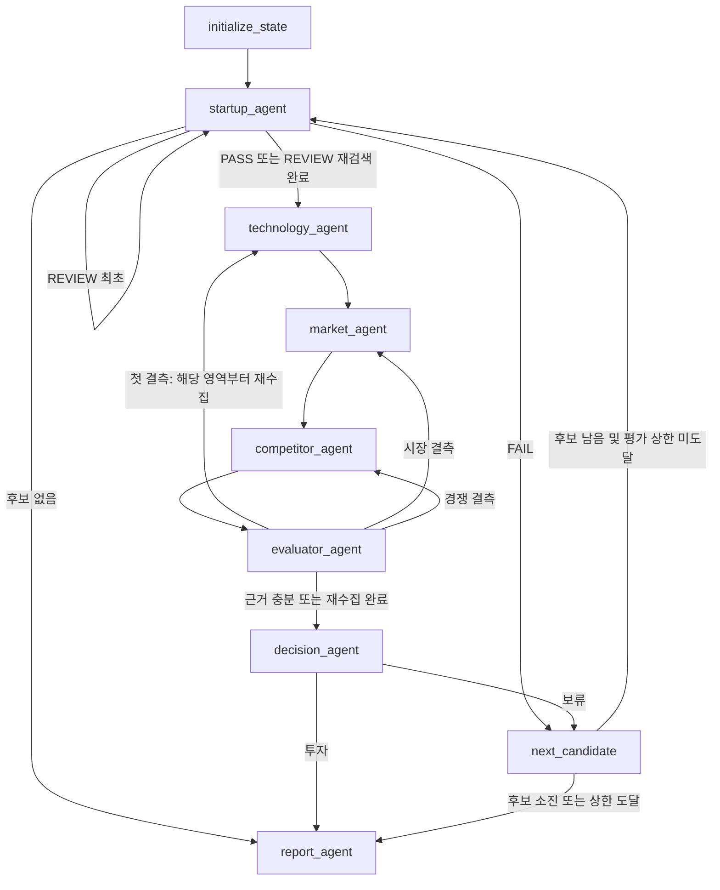

# AI Startup Investment Evaluation Agent

국내 비상장 AI 반도체 스타트업을 탐색하고 기술·시장·경쟁 근거를 수집하여 평가 보고서를 생성합니다. [확정 설계](docs/RAG-Design.md)를 구현했으며, 이전 `CLAUDE.md`의 초안보다 첨부 설계의 확정값을 우선했습니다.

## Overview

- Objective: AI 반도체 스타트업의 기술력·시장성·경쟁력·팀·실적·자금 여력 분석
- Method: LangGraph 7개 에이전트 + Corrective RAG + 코드 기반 선정·점수·판정
- 대상: 국내 기업, AI 핵심성, 비상장, Seed~Series C, Exit 미완료, 공개정보 충분성
- 출력: 한글 Markdown/PDF, 후보별 선정 근거, 평가 점수, 실행 State

## Features

- 6개 선정 기준 PASS/FAIL/REVIEW 판정. FAIL 제외, REVIEW는 재검색 1회 후 불확실 표시
- 최대 10개 후보 탐색·중복 제거. 선정 탈락을 제외한 실제 평가 수는 기본 5개로 제한
- 시장 분석에서 질의 3개 → Dense+BM25 Top-5 → 관련성 평가 → 질의별 재검색 최대 2회 → 웹 보완
- 13개 지표, 6개 가중 항목. 정성만 LLM 채점, 정량은 명시적 단위·구간으로 코드 계산
- 결측은 3점. 기술·시장·경쟁 중 결측이 가장 많은 영역부터 재수집 1회
- 총점 ≥70 및 결측 <5이면 투자. 나머지는 보류 후 다음 후보. 최초 투자에서 종료
- 원문 인용 문자열과 출처 ID 검증, 문서의 원본 PDF 페이지 보존, 보고서 인용 자료만 REFERENCE 생성
- 한글 PDF 최대 5쪽, 최소 9pt. 초과 시 내용을 잘라내지 않고 오류를 알리며 Markdown 보존
- 합성 데이터 데모는 API·임베딩 다운로드·LangSmith 전송 없이 실행

## Tech Stack

| 구분 | 구현 |
|---|---|
| Python / 환경 | Python 3.11.11 / 고정 requirements.txt |
| Framework | LangGraph / LangChain |
| LLM / Generator·Judge | gpt-4.1-mini (환경 변수로 변경 가능) |
| 평가 질문 생성 | gpt-4.1-nano |
| Web | Tavily |
| Embedding | Qwen/Qwen3-Embedding-0.6B, 로컬, 정규화, 질의 instruction |
| Retrieval | FAISS + rank-bm25, 가중 RRF 0.5/0.5, rank constant 60 |
| PDF | PyMuPDF, 한글 내장 fallback 폰트 |
| Tracing | LangSmith, 선택 활성화 |

확정 설계에 기록된 **기존 Dense 평가**는 Qwen Hit Rate@1/3/5=0.85/1.00/1.00, MRR=0.925입니다. 원본 `outputs/embedding_eval.csv`를 보존했습니다. 이번 구현은 정제와 청크 ID를 변경한 v2이므로 이 수치를 현재 Hybrid 성능으로 주장하지 않습니다. `rag.eval_embeddings`로 새 청크의 동일 20문항 평가셋을 생성하고 Dense/Hybrid를 재측정할 수 있습니다.

## Agents

| 모듈 | 책임 |
|---|---|
| `agents/startup.py` | 후보 탐색, 이름 정규화/중복 제거, 선정 재판정, 팀·실적·투자 프로필 |
| `agents/technology.py` | 아키텍처·공정·성능·개발 단계 분석 |
| `agents/market.py` | Agentic RAG, TAM/CAGR·수요·리스크 분석 |
| `agents/competitor.py` | 국내외 동종 기업·NVIDIA, 차별성·진입장벽 |
| `agents/evaluator.py` | 근거 매핑, 정량 공식, 정성 루브릭, 결측·가중 총점 |
| `agents/decision.py` | 코드 판정과 평가 이력 누적 |
| `agents/report.py` | 근거 기반 서술, 점수표·한계·출처 및 PDF 생성 |

## Architecture



`evaluated`만 후보별 평가 기록을 누적합니다. `warnings`는 실행 진단 누적용 추가 필드입니다. 후보 전환에서 evidence·점수·재시도·분석 필드를 초기화합니다. 같은 영역 재수집은 그 영역 evidence를 교체합니다. `retry_target`은 evaluator의 재수집 예약과 이미 사용한 횟수를 구분해 한 번만 반복하도록 합니다.

## Directory Structure

```text
agents/       # 7개 에이전트, 스키마, State, 그래프, 실행 서비스/데모
prompts/      # 근거 기반 분석 및 외부 자료 명령 무시 정책
rag/          # PDF 준비·정제·청킹·임베딩·Hybrid 검색·평가
tools/        # 웹검색, Markdown→PDF
tests/        # 점수 경계값·분기·반복·근거·검색 검증
docs/         # 제공된 확정 설계 사본
data/raw/     # 원본 PDF (수정하지 않음)
data/docs/    # 범위 추출된 RAG PDF 4종 (실제 100쪽, 125개 청크)
data/seed_startups.json # 탐색 실패 시 이름 후보; 현재 자격 확정 아님
outputs/      # 실행 결과
app.py        # CLI
```

## Usage

```bash
bash scripts/setup_env.sh
# 신규 환경에는 config/env.sample에서 .env가 자동 생성됩니다.
# .env에 OPENAI_API_KEY, TAVILY_API_KEY 설정
# 선택: LANGCHAIN_TRACING_V2=true, LANGCHAIN_API_KEY 설정

# API 없이 전체 그래프와 PDF 생성 검증
.venv/bin/python app.py --demo
.venv/bin/python app.py --demo --scenario all_hold
.venv/bin/python app.py --demo --scenario missing
.venv/bin/python app.py --demo --scenario excluded

# 문서 준비 및 인덱스 구축 (이미 준비된 data/docs가 포함됨)
.venv/bin/python -m rag.prepare_docs
.venv/bin/python -m rag.ingest

# 실제 웹검색·LLM·RAG 실행: 외부 API 비용 발생
.venv/bin/python app.py --max-candidates 5
# 특정 기업명 목록으로 시작 (선정 검사는 동일하게 실행)
.venv/bin/python app.py --candidates data/seed_startups.json --max-candidates 1

# 테스트
.venv/bin/python -m unittest discover -s tests -v

# 새 청크 평가 (질문 생성 API 비용 및 모델 다운로드 발생)
.venv/bin/python -m rag.eval_embeddings --model Qwen/Qwen3-Embedding-0.6B
# 세 모델 모두 비교
.venv/bin/python -m rag.eval_embeddings
```

실제 출력은 `outputs/live/<실행시각-고유ID>/`, 데모는 `outputs/demo/<scenario>/<실행시각-고유ID>/`에 저장됩니다. `--output-dir`은 저장 루트를 변경합니다. 매번 고유 폴더를 생성하므로 이전 보고서를 덮어쓰지 않습니다. 루트의 `latest.json`이 최근 성공한 실행을 가리킵니다.

- `RAG-Output_울산 캠퍼스-4반_박연제+이정인+정예지.md/.pdf` (데모는 `DEMO_` 접두사)
- `candidates.json`: 후보·6개 선정 판정·근거
- `evaluated.json`: 기업별 점수·결측·판정·분석·evidence
- `state.json`: 노드별 최신 상태 체크포인트
- `run.json`: 실행 모델·시각·성공/실패·노드 이력
- `diagnostics/`: 원본 구조화 응답·검색 자료·근거 탈락 사유 (Git 제외)
- `quality.json`: PDF 분량, 근거 확보율, 인용 오류 진단

첫 실제 검색은 Qwen 모델을 다운로드하고 v2 인덱스를 구축하므로 시간이 걸립니다. 기존 평가용 `index.pkl`은 로드하지 않고 보존합니다. 신규 인덱스는 `data/vectorstores/<model>/v2/`의 FAISS·JSON 및 입력 해시로 재사용하며, PDF·모델·청킹 설정 변경을 감지합니다. 환경 변수 모델 설정은 `.env` 로딩 후 적용됩니다.

웹검색 실패는 진단에 기록하고 근거를 결측으로 남깁니다. 탐색 실패 시 시드 기업의 현재 자격을 다시 확인합니다. RAG 실패는 웹검색으로 보완합니다. LLM/API 인증·구조화 출력 실패는 숨기거나 데모로 전환하지 않고 실행 오류로 알립니다. PDF 용량 초과 시 Markdown과 평가 JSON은 남고 PDF는 생성하지 않습니다.

분석 에이전트는 이전 기업 소개를 사실로 재사용하지 않으며 영역별 지표와 원문 인용을 별도로 추출합니다. 숫자는 raw_value/raw_unit과 정규화된 값의 변환을 검증합니다. 잘못된 인용은 최대 한 번만 교정하고, 원문과 일치하지 않으면 탈락 사유를 보존합니다. 라운드 금액은 누적 투자액으로 사용하지 않고, 전체 직원 수는 기술 인력 수로 사용하지 않습니다. 실적의 목표·예정 수치는 채점하지 않습니다.

정량 단위는 기술 인력 `명`, TAM `USD billion`, CAGR `%`, 고객·PoC·계약 `건`, 투자액 `억 원`입니다. 변환 근거 없는 통화, 잘못된 단위, 상충 수치는 결측 처리합니다. 산업 전체 규모를 기업 TAM으로 대입하지 않도록 프롬프트에서 제한합니다. LLM 해석의 정확성까지 코드로 보증하지는 않으므로 제출 전 원문과 수치를 검토해야 합니다.

## Verification

단위·통합 테스트는 실제 PDF 청킹을 포함하며, API 응답/임베딩은 합성 fixture를 사용해 재현 가능한 분기와 계산을 검증합니다. 데모 PDF는 실제 투자 보고서가 아닙니다. 실제 Qwen 모델·외부 API 전체 실행도 완료했고, 각 실행 폴더의 `quality.json`과 진단 파일에서 근거 연결을 확인할 수 있습니다. 모델 출력의 사실 해석은 원문 대조가 필요합니다.

구현 API 참고: [LangGraph conditional edges](https://reference.langchain.com/python/langgraph/graph/state/StateGraph/add_conditional_edges), [PyMuPDF Story](https://pymupdf.readthedocs.io/en/latest/story-class.html).

## Contributors

- **박연제 — Data·Evaluation Design:** 데이터 선정, 스타트업 기준, 문서 구성, 정성/정량 투자평가 기준 및 Scorecard 설계
- **정예지 — RAG Pipeline:** 파싱, 정제, Chunking, Embedding, Vector DB, Retriever, 검색 품질·비용 최적화
- **이정인 — Agent·LangGraph·Integration:** Agent 정의, Graph 설계, RAG 연결, 조건 분기·재검색, 점수 조합 및 보고서 생성

## 공동 작업 환경

`.python-version`, `pyproject.toml`, `uv.lock`, `.venv`, `.env*`, OS/IDE 설정 및 생성 인덱스는 Git에서 제외합니다. `config/env.sample`에는 비밀값 없이 변수 이름만 공유합니다. 이미 추적 중이던 환경 파일과 생성 인덱스는 로컬 파일을 보존한 채 추적에서 제외했습니다. 공동 환경은 `requirements.txt`와 `scripts/setup_env.sh`로 재현합니다. 로컬에서 uv 프로젝트를 사용하는 경우 의존성을 변경한 뒤 `requirements.txt`도 함께 갱신해야 합니다.

## 현재 코퍼스의 검색 평가

2026-09-30 확인한 동일 20문항 v2 평가 결과입니다. 모델 선택의 근거와 실제 파이프라인 품질을 구분합니다.

| 모델 | 방식 | Hit@1 | Hit@3 | Hit@5 | MRR@5 |
|---|---|---:|---:|---:|---:|
| BGE-M3 | Dense | .75 | .90 | .95 | .8267 |
| BGE-M3 | Hybrid | .75 | .95 | 1.00 | .8625 |
| E5-large | Dense | .70 | .90 | .95 | .8042 |
| E5-large | Hybrid | .75 | .95 | 1.00 | .8458 |
| Qwen3-0.6B | Dense | .65 | .95 | .95 | .8000 |
| Qwen3-0.6B | Hybrid | .70 | 1.00 | 1.00 | .8250 |

확정 설계의 Qwen을 유지합니다. 이 평가셋에서 Top-3 정답 포함률은 가장 높으나 MRR은 BGE-M3 Hybrid가 가장 높습니다. 모델이 모든 지표에서 우월하다는 주장은 하지 않습니다. 20문항·125청크의 소규모 평가이며 검색 품질이 보고서 사실성까지 보증하지 않습니다. [평가기준별 점검](docs/RUBRIC_AUDIT.md)을 참고하세요.
