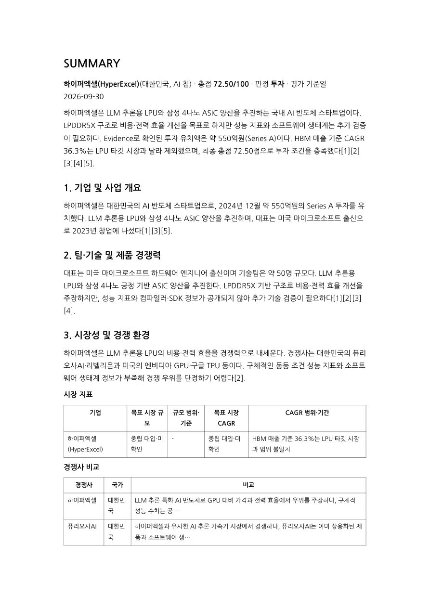
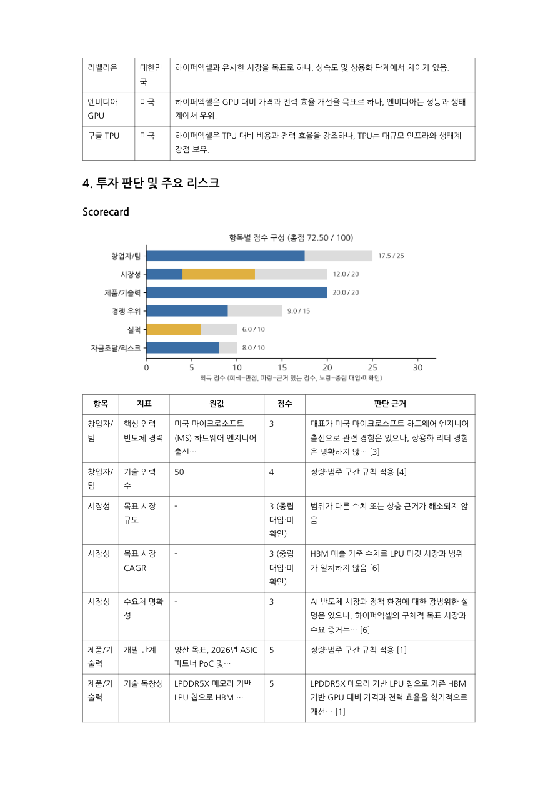
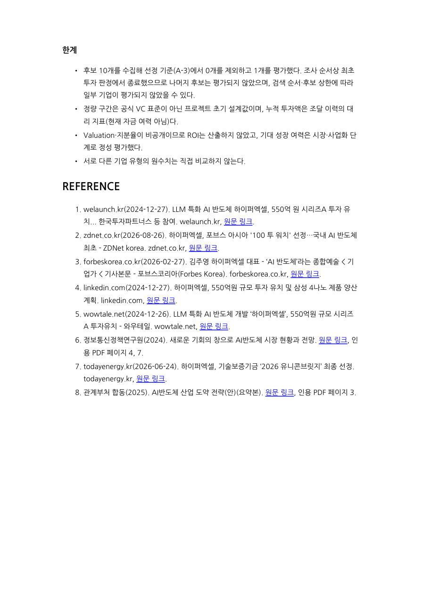

# AI Startup Investment Evaluation Agent

본 프로젝트는 AI 반도체(Semiconductor) 스타트업에 대한 투자 가능성을 자동으로 평가하는 에이전트를 설계하고 구현한 실습 프로젝트입니다. AI 연산용 칩을 설계·개발하거나, AI로 반도체 설계·제조 공정을 개선하는 국내외 비상장 스타트업(Seed~Series C)을 대상으로 합니다.

> 설계 기준 문서: [docs/DESIGN.md](docs/DESIGN.md) · 울산 캠퍼스 4반

## Overview

- Objective : AI 반도체 스타트업의 **팀, 시장성, 제품/기술력, 경쟁 우위, 실적, 자금조달·리스크**를 기준으로 투자 적합성을 분석하고 투자 평가 보고서(PDF)를 자동 생성
- Method : AI Agent(LangGraph Multi-Agent), Agentic RAG(Hybrid 검색 + 관련성 평가 + 재검색 + 웹 보완), 근거(Evidence) 기반 13개 지표 채점, 코드 규칙에 의한 투자/보류 판정

## Problem & Approach

- **문제**: AI 반도체 스타트업 투자 검토는 기술 검증·시장성·경쟁력 정보가 홈페이지·기사·산업 보고서에 흩어져 있어 수작업 조사가 오래 걸리고, 평가자마다 점수 기준이 달라집니다.
- **접근**: 후보 탐색과 기술·시장·경쟁 분석을 Agent별로 분담하고, 공통 **Evidence(출처 포함)** 와 평가표로 통합합니다. LLM은 정보 추출·요약·정성 채점만 맡고, **점수 계산·투자/보류 판정·분기는 코드**가 처리합니다.

## 차별점 (Differentiators)

1. **Corrective Agentic RAG — 부족한 topic만 다시 검색**

   시장 분석 질의를 규모·성장률·수요/리스크 3개 topic으로 나눠 Hybrid 검색(Dense + BM25, Weighted RRF)을 하고, topic별로 관련성을 평가합니다. 기준에 못 미친 topic만 질의를 재작성해 최대 2회 재검색하고, 그래도 부족하면 웹 검색으로 보완합니다. 임베딩은 한·영 혼합 과제 문서로 3종을 직접 비교해 Qwen3-Embedding-0.6B를 골랐습니다.

2. **LLM과 코드의 역할 분리**

   LLM은 지표별 근거(URL·원문 발췌)를 추출하고 보고서 문장을 씁니다. 가중 합산 점수와 투자/보류 분기(`총점 ≥ 70` · `미확인 < 5` · `선정 불확실성 없음`)는 코드가 계산하므로 입력이 같으면 결론도 같습니다. 시장 수치는 인용 원문에 그 숫자가 실제로 있는지 코드로 대조해 LLM이 만든 수치를 걸러냅니다.

3. **3-상태 채점: 확인 / 부재 확인 / 미확인**

   "없음이 확인됨"(1점)과 "정보를 못 찾음"(미확인)을 구분합니다. 미확인 지표는 중립 3점을 넣고 보고서에 표시하며, 미확인 지표만 골라 근거 보완 검색을 1회 더 실행합니다. 그래도 5개 이상 남으면 판정을 보류합니다. API 오류나 빈 검색 결과도 미확인으로 처리합니다.

4. **기업 유형별 해석 + 공통 13개 지표**

   후보를 칩(CHIP)·AI 설계/EDA(DESIGN_AI)·AI 공정(PROCESS_AI)으로 분류하고, 유형마다 개발 단계·기술 검증 조건·진입장벽·리스크를 다르게 해석합니다. 13개 지표와 가중치는 고정이라 유형 분류가 점수를 유리하게 바꾸지 못합니다.

## Features

- **국내외 후보 탐색**: 한국어·영어 웹검색으로 후보를 최대 10개 수집하고, 6개 선정 기준(도메인·AI 핵심성·비상장·투자 단계·Exit 미완료·정보 충분성)으로 PASS/FAIL/REVIEW 판정
- **PDF 자료 기반 시장 분석(Agentic RAG)**: 정부·연구기관·컨설팅 보고서 4종(100페이지)을 Hybrid 검색(Dense + BM25, Weighted RRF)으로 조회하고, topic별 관련성 평가 → 질의 재작성 → 웹 보완
- **근거 기반 채점**: 모든 지표는 출처가 연결된 Evidence로만 채점하고, 근거가 없으면 중립 3점 + `missing`으로 구분. 정량 점수·총점·투자/보류 분기는 LLM이 아닌 코드가 계산
- **분기·루프**: 선정 재검색(1회), RAG 재검색(topic별 2회), 결측 근거 보완(1회), 보류 시 다음 후보로 순회, 전원 보류/후보 없음 시 종료 후 보고서 생성
- **투자 보고서 자동 생성**: SUMMARY~REFERENCE 구조, 5장 이내 PDF(한글 폰트, 차트 포함). 실제 인용한 출처만 REFERENCE에 기재

## Tech Stack

- Framework : LangGraph, LangChain (Python 3.11, uv)
- LLM/Generator : gpt-4.1-mini (분석·보고서 작성)
- LLM/Judge : gpt-4.1-mini (정성 채점·관련성 평가, temperature=0)
- Retrieval : FAISS(Dense) + BM25(Sparse), Weighted RRF (0.5/0.5, c=60), Top-5 — 사전 벤치마크 Hit Rate@1/3/5 = 0.85 / 1.00 / 1.00, MRR = 0.925 (Qwen3, 125청크 파일럿·합성 질문 20개 기준, [outputs/embedding_eval.csv](outputs/embedding_eval.csv))
- Embedding : Qwen/Qwen3-Embedding-0.6B (오픈소스, 로컬 실행)
- Web Search : Tavily
- Report : PyMuPDF(PDF 변환), matplotlib(차트), 나눔고딕(한글 폰트, OFL)
- Tracing : LangSmith

### Embedding 선정

BAAI/bge-m3, intfloat/multilingual-e5-large, Qwen/Qwen3-Embedding-0.6B 3종을 동일한 청크·질문·정답으로 비교했습니다. 리더보드 순위가 아니라 **본 과제 문서(한·영 혼합 4종)에서의 실측 검색 성능**으로 선택했습니다.

| 모델                           |    Hit@1 |    Hit@3 |    Hit@5 |       MRR | 인덱싱(초) |
| ------------------------------ | -------: | -------: | -------: | --------: | ---------: |
| BAAI/bge-m3                    |     0.75 |     0.95 |     0.95 |     0.842 |       48.4 |
| intfloat/multilingual-e5-large |     0.70 |     0.95 |     0.95 |     0.817 |       43.7 |
| **Qwen/Qwen3-Embedding-0.6B**  | **0.85** | **1.00** | **1.00** | **0.925** |      110.4 |

인덱싱 시간은 최초 1회 비용이며 인덱스를 재사용합니다. 현재 RAG 적재본은 4개 문서, PDF 100페이지, 117청크(chunk_size=1000, overlap=100)입니다. 평가는 125청크 파일럿·합성 질문 20개 기준의 상대 비교이며 Hybrid 적용 효과는 별도로 검증하지 않았습니다.

## Agents

- **Startup Agent** : 국내외 후보 수집·정규화·중복 제거, A-3 선정 기준 판정과 기업 유형(CHIP / DESIGN_AI / PROCESS_AI) 분류, 팀·인력·투자·고객·매출 근거 수집
- **Technology Agent** : 기업 유형별 기술 지표·개발 단계·검증 조건 수집, 기업 주장과 검증된 효과 구분
- **Market Agent (RAG)** : `market_size` / `market_growth` / `demand_risk` topic별 Hybrid RAG → 관련성 평가 → 재검색 → 웹 보완, 범위·기준연도가 다른 수치는 결합하지 않음
- **Competitor Agent** : 같은 유형·고객 문제의 국내외 경쟁 3~5개(기존 비AI 방식 포함) 비교, 진입장벽 근거 수집
- **Evaluator Agent** : 13개 지표 채점(정량·범주는 코드, 정성은 1/3/5 루브릭), 결측 처리, 가중 총점 계산
- **Decision Agent** : `total_score ≥ 70` · `결측 < 5` · `uncertain == False` 세 조건을 코드로 판정하고 후보별 스냅샷 저장
- **Report Agent** : 투자 기업 중심 / 전원 보류 비교 / 평가 대상 없음 3유형 보고서를 생성하고 PDF로 변환(5장 초과 시 분량 축소 재생성)

## Architecture


`initialize_state → startup_agent → technology_agent → market_agent → competitor_agent → evaluator_agent → decision_agent → report_agent` 흐름에 다음 분기·루프가 있습니다. (상세: [docs/DESIGN.md](docs/DESIGN.md) D장)

- `startup_agent`: PASS → Technology / FAIL → 다음 후보 / REVIEW → 1회 재검색 후 재판정 / 후보 없음 → Report
- `market_agent`: 부족한 topic만 재검색(topic별 최대 2회) 후 웹 보완
- `evaluator_agent`: 분석 영역 결측이 있으면 `evidence_refresh`(1회) 후 재채점
- `decision_agent`: 투자 → Report / 보류 → 다음 후보 (수집 최대 10개, 평가 완료 최대 5개)

## 실행 결과 (제출본 기준)

`uv run python app.py` 한 번의 실행에서 그래프가 아래 순서로 동작해 보고서를 생성했습니다.

```text
initialize_state → startup_agent → technology_agent → market_agent ×3(RAG 재검색 2회) → competitor_agent
→ evaluator_agent → evidence_refresh(결측 보완 1회) → evaluator_agent → decision_agent
→ [투자] report_agent
```

| 단계      | 결과                                                                                                      |
| --------- | --------------------------------------------------------------------------------------------------------- |
| 후보 수집 | 국내외 검색으로 10개 수집 (하이퍼엑셀, 페블스퀘어, 하이퍼비주얼AI, 딥엑스, 세카, iHW, Velaura AI, 퓨리오사AI, 아티크론, 리벨리온) |
| 1번째 평가 | **하이퍼엑셀(HyperExcel)** — 총점 **72.50**, 결측 4개, 선정 불확실성 없음 → **투자**                    |
| 종료      | 최초 투자 판정에서 종료 → 나머지 9개 후보는 평가하지 않음 (전체 후보 중 최우수 기업이라는 의미가 아님)    |

### 투자 보고서 핵심 포인트

- **판정**: 하이퍼엑셀(대한민국, AI 칩, Series A) — 총점 72.50/100, 투자. Evidence로 확인된 누적 투자 유치액은 약 550억원입니다.
- **결측 4개(목표 시장 규모, 목표 시장 CAGR, 고객·PoC·계약 수, 매출 발생)** 는 3점을 중립 대입하고 보고서에 '중립 대입·미확인'으로 표시했습니다.
- **시장 범위 검증**: HBM 매출 기준 CAGR 36.3%는 LPU 타깃 시장과 범위가 달라 시장 성장률 점수에서 제외했습니다.
- **주요 리스크**: 구체적 성능 지표와 SW 생태계 정보 미공개(기술), 구체적 고객·계약 근거 미확인(실적), 글로벌 강자와의 경쟁, 규제 근거 미확인.
- 보고서 구성: SUMMARY → 1. 기업 및 사업 개요 → 2. 팀·기술 및 제품 경쟁력 → 3. 시장성 및 경쟁 환경 → 4. 투자 판단 및 주요 리스크(Scorecard·차트·리스크 4종·한계) → REFERENCE (4페이지, 인용 출처만 기재)

> 웹검색과 LLM 응답은 실행마다 달라져 후보·점수가 매번 같지는 않습니다. 위 내용은 제출본 PDF와 같은 실행 기준입니다.

### 투자 보고서 미리보기

| 1페이지: SUMMARY ~ 3장                | 2페이지: 4장 Scorecard·차트           | 4페이지: 한계·REFERENCE               |
| ------------------------------------- | ------------------------------------- | ------------------------------------- |
|  |  |  |

전체 4페이지 미리보기: [1](docs/report_preview/page-1.png) · [2](docs/report_preview/page-2.png) · [3](docs/report_preview/page-3.png) · [4](docs/report_preview/page-4.png)

## Directory Structure

```text
├── agents/             # Agent 모듈(startup, technology, competitor, report), State, Graph, config
│   └── stubs.py        # Market·Evaluator·Decision 및 공통 노드(initialize_state, next_candidate, evidence_refresh)
├── data/
│   ├── raw/            # 원본 PDF
│   ├── docs/           # RAG 적재용 PDF (4종, 100페이지)
│   └── vectorstores/   # FAISS·BM25 인덱스
├── prompts/            # 프롬프트 템플릿
├── rag/                # 문서 적재·청킹, Hybrid 검색, 임베딩 평가
├── tools/              # web_search, 차트, PDF 변환
├── tests/              # 단위 테스트, 보고서 fixture
├── assets/fonts/       # 보고서용 한글 폰트
├── outputs/            # 실행 결과(보고서 PDF·MD, 후보 목록, 그래프 이미지)
├── docs/DESIGN.md      # 설계 문서(구현 기준)
├── app.py              # 실행 스크립트
└── README.md
```

## Usage

```bash
# 1. 의존성 설치
uv sync

# 2. 환경 변수 설정 (.env는 커밋하지 않습니다)
cp .env.example .env
# OPENAI_API_KEY, TAVILY_API_KEY 등을 입력

# 3. (선택) RAG 인덱스 재생성 — 저장소에 인덱스가 포함되어 있어 보통 필요 없습니다
uv run python -m rag.ingest

# 4. 실행: 후보 탐색 → 분석 → 채점 → 판정 → 보고서 생성
uv run python app.py
```

- 결과: `outputs/RAG-Output_울산캠퍼스-4반_박연제+이정인+정예지.pdf` (+ 같은 이름의 `.md`)
- 평가 수 상한은 환경 변수 `MAX_CANDIDATES`(1~10, 기본 5), 기준일은 `AS_OF_DATE`(YYYY-MM-DD)로 조정합니다.
- 최초 실행 시 임베딩 모델(Qwen3-Embedding-0.6B)이 다운로드됩니다.
- 웹 검색과 LLM 응답은 실행마다 달라질 수 있어 후보·점수가 매번 같지는 않습니다.
- `--scenario invest|all_hold|zero_pass|evidence_retry|no_candidates|uncertain` 옵션은 그래프 분기 검증용 stub 후보이며, 결과는 `stub-*` 파일로 분리 저장됩니다.
- 보고서 유형별 렌더링 확인: `uv run python -m tests.run_report_fixtures` (가상 데이터, `outputs/fixtures/`)
- 단위 테스트: `uv run --with pytest python -m pytest -q`

## Lessons Learned

- **State 형식 불일치**: Agent 통합 시 `tech_summary`가 dict가 아닌 문자열로 전달되어 Decision 노드에서 실행 중단. State·Evidence 규격에 맞춰 수정. 개발 초기 공통 fixture와 스키마 테스트의 선행 구축 필요.
- **LLM 실패 시 기본값**: 초기 코드는 LLM 호출 실패 시 기본 후보·기술 정보를 채워 넣는 구조. 실제 근거로 오인될 위험이 있어 전부 제거, 실패 시 결측으로 기록하도록 변경.
- **단위 환산 버그**: `"1,228억"`과 `"달러"`가 1,228달러로 환산되어 시장 규모가 $0M으로 채점. 환산 로직 수정, 인용 원문–수치 대조 검증 및 회귀 테스트 추가.
- **웹 검색 발행일**: 웹 검색 결과 다수에서 발행일 누락. URL·본문·페이지 메타데이터 기반 날짜 추출, 미확인 시 조회일로 표기.
- **판정 로직 분리**: 점수 계산·판정·분기의 코드 기반 처리로, 실행마다 검색 결과가 달라도 결과 도출 과정 추적 가능.
- **정성 지표 점수**: 하이퍼엑셀의 일부 정성 지표는 기업·투자사 발표 근거 비중이 높아, 외부 자료 교차 검증을 강화할 필요가 있습니다.

## Limitations

- 정량 구간·투자 임계값(70점, 결측 5개)은 검증된 VC 표준이 아닌 프로젝트 정책값이며, 공통 점수는 선별 보조값입니다.
- Valuation·지분율이 비공개이므로 ROI는 계산하지 않고, 누적 투자액은 조달 이력의 대리 지표로만 사용합니다.
- 조사 순서상 최초 투자 판정에서 종료하므로 투자 기업이 전체 후보 중 최우수 기업이라는 뜻은 아닙니다.
- RAG 문서 4종은 AI 반도체 산업 배경 중심이라 AI 기반 EDA·공정 개선의 세부 시장은 웹 보완으로 확인하며, 확인하지 못한 지표는 결측으로 처리합니다.
- 글로벌 **HBM 시장** CAGR 36.3%(2022~2027)는 하이퍼엑셀의 LPU 타깃 시장과 범위가 달라 제출본의 목표 시장 성장률 점수에서 제외했습니다.
- 정성 지표는 LLM 채점이라 실행마다 다소 달라질 수 있고, 기업 발표 위주의 근거는 우호적으로 평가될 수 있습니다.
- 웹 자료의 발행일은 검색 결과의 공개일 또는 URL·본문에 명시된 날짜로만 표기하며, 확인되지 않으면 조회일을 기재합니다.

## Contributors

- **박연제 : RAG 인프라 및 그래프 통합**
  - RAG 문서 준비·청킹·메타데이터 스키마, Qwen3 로컬 임베딩
  - FAISS + BM25 Hybrid 검색(가중 RRF), 인덱스 재사용, 관련성 평가 도구
  - 임베딩 3종 비교 평가(Hit Rate@1/3/5, MRR, 인덱싱 시간)
  - State·Evidence 스키마 설계, LangGraph 조립(후보 순회·후보별 초기화·조건부 분기), LangSmith 추적
  - Report Agent(투자/전원 보류/대상 없음 3종 보고서, REFERENCE 자동 생성), 한글 PDF 변환
  - 후보 1개 end-to-end 통합 테스트, README 작성

- **이정인 : 후보 탐색 및 웹 기반 분석**
  - 웹검색·출처 요약 도구
  - Startup Agent: 국내·해외 후보 탐색·정규화, PASS/FAIL/REVIEW 선정 판정, 기업 유형 분류(CHIP / DESIGN_AI / PROCESS_AI), 팀·투자·고객 프로필 근거 수집
  - Technology Agent: 기업 유형별 개발 단계·기술 지표·검증 조건 분석
  - Competitor Agent: 동일 유형 국내외 경쟁사 비교, 진입장벽 3범주 분석
  - 결측 지표 보완용 기술·경쟁 재조사 함수

- **정예지 : 시장 분석, 채점 및 투자 판정**
  - Market Agent: topic별 Corrective RAG(시장 규모·성장률·수요/리스크), 근거 충분성 판정, topic별 재검색 2회 상한, 웹 보완
  - Evaluator Agent: 13개 지표 채점(정량 구간 점수 변환은 코드, 정성 루브릭 채점은 LLM), 결측·부재 구분 처리, 통화 환산, 가중 총점 계산
  - 결측 영역 근거 보완(evidence_refresh) 흐름
  - Decision Agent: 투자/보류 규칙 판정(총점·결측 수·선정 불확실성), 후보별 평가 스냅샷 저장
  - 채점·판정 규칙 단위 테스트
