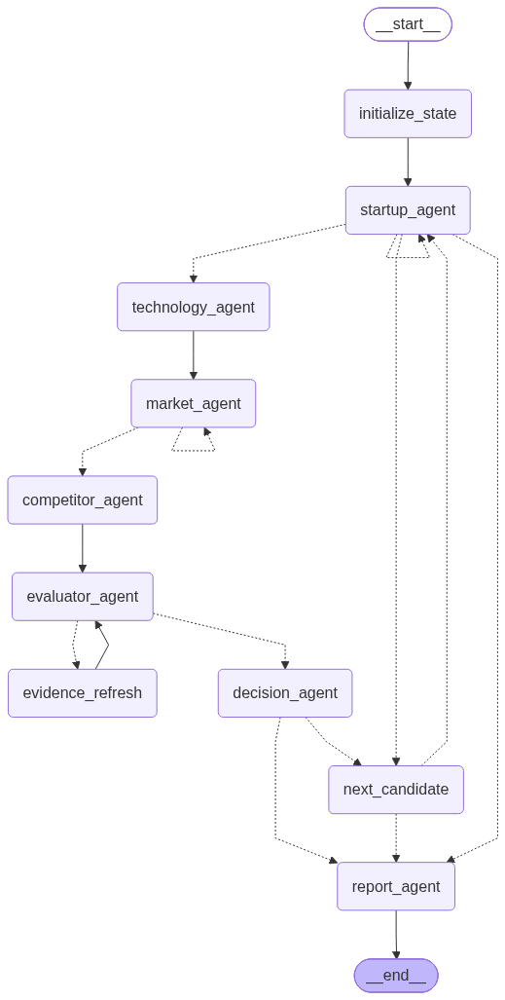

# AI Startup Investment Evaluation Agent

본 프로젝트는 **AI 반도체(Semiconductor)** 스타트업에 대한 투자 가능성을 자동으로 평가하는 에이전트를 설계하고 구현한 실습 프로젝트입니다.

## Overview

- **Objective**: 국내외 AI 반도체 스타트업의 팀 역량, 시장성, 기술력, 경쟁 우위, 실적, 자금조달·리스크를 기준으로 투자 적합성을 분석
- **Method**: LangGraph 기반 Multi-Agent + Agentic RAG(Corrective RAG) + Scorecard·Bessemer Checklist 기반 평가표
- **Output**: SUMMARY부터 REFERENCE까지 포함한 5페이지 이내 투자 평가 보고서(PDF)

## Features

- **국내외 후보 탐색**: 한국어·영어 웹검색으로 후보를 수집하고, 6개 선정 기준(도메인·AI 핵심성·비상장·투자 단계·Exit·정보 충분성)을 PASS/FAIL/REVIEW로 판정
- **기업 유형별 기술 평가**: 칩(CHIP), AI 설계(DESIGN_AI), AI 공정(PROCESS_AI) 유형에 맞는 개발 단계·기술 검증 기준 적용
- **Agentic RAG 시장 분석**: 산업 보고서 4종(100p)에서 Hybrid 검색(Dense + BM25) → 관련성 평가 → 부족한 주제만 질의 재작성·재검색 → 웹 보완
- **근거 기반 채점**: 13개 지표를 공통 Evidence(출처 포함)로 채점, 정량 점수·총점·판정은 코드로 계산하여 재현성 확보
- **결측 관리**: 근거가 없는 지표는 중립 대입 후 보고서 한계점에 명시, 결측이 많으면 투자 판정 보류
- **보고서 자동 생성**: 투자 / 전원 보류 / 평가 대상 없음 3가지 경우에 맞춰 PDF 생성, 5페이지 초과 시 자동 축약

## Tech Stack

| Category | Details |
|---|---|
| Framework | LangGraph, LangChain, Python 3.11 (uv) |
| LLM/Generator | gpt-4.1-mini (분석·보고서 작성) |
| LLM/Judge | gpt-4.1-mini (선정 기준 판정, 정성 지표 채점, RAG 관련성 평가) |
| Retrieval | FAISS + BM25 (Weighted RRF) — Hit Rate@1 0.85, Hit Rate@3 1.00, MRR 0.925 |
| Embedding | Qwen/Qwen3-Embedding-0.6B (오픈소스, 로컬 실행) |
| Web Search | Tavily |
| PDF | PyMuPDF (문서 처리·페이지 수 확인) |
| Tracing | LangSmith |

> Retrieval 수치는 RAG 청크에서 생성한 질문 20개로 측정한 Dense 검색 기준입니다. 후보 3종(bge-m3, multilingual-e5-large, Qwen3-Embedding-0.6B) 중 MRR·Hit Rate@1이 가장 높은 모델을 선택했습니다.

## Agents

| Agent | 역할 | 도구 |
|---|---|---|
| Startup Agent | 국내외 후보 수집·정규화·중복 제거, 선정 기준 판정, 기업 유형 분류, 팀·투자·고객 프로필 수집 | Tavily, LLM 구조화 출력 |
| Technology Agent | 유형별 핵심 기술·개발 단계·검증 조건·장단점 분석 | Tavily, LLM 구조화 출력 |
| Market Agent | 시장 규모·성장률·수요·규제 분석 (Agentic RAG) | Hybrid RAG, 관련성 평가, Tavily 보완 |
| Competitor Agent | 같은 유형·고객 문제의 국내외 경쟁사 대비 차별성·진입장벽 비교 | Tavily, LLM 구조화 출력 |
| Evaluator Agent | 13개 지표 채점, 결측 기록, 가중 총점 계산 | LLM 루브릭 채점 + 계산 코드 |
| Decision Agent | 총점 70점 이상 · 결측 5개 미만 · 선정 불확실성 없음 → 투자, 그 외 보류 | 코드 규칙 |
| Report Agent | 목차에 따라 보고서 작성, PDF 변환 | LLM, PDF 변환 |

## Architecture



- 보류 판정 시 다음 후보로 반복하고, 첫 투자 판정 또는 후보 소진·평가 상한 도달 시 보고서를 생성합니다.
- 선정 REVIEW 재검색(1회), Market topic별 RAG 재검색(최대 2회), 결측 근거 보완(1회)은 모두 상한이 있는 코드 기반 분기로 제어합니다.
- 상세 설계는 [docs/DESIGN.md](docs/DESIGN.md)를 참고하세요.

## Directory Structure

```
├── data/                  # RAG 원본·적재 문서, Retriever 평가셋
├── rag/                   # 문서 준비, 인제스트, Hybrid 검색, 임베딩 평가
├── agents/                # 평가 기준별 Agent 모듈
├── prompts/               # 프롬프트 템플릿
├── tests/                 # 점수 계산·판정 규칙 테스트, 테스트용 데이터
├── outputs/               # 평가 결과, 보고서(md·pdf), 그래프 이미지
├── docs/                  # 설계 문서
├── app.py                 # 실행 스크립트
├── pyproject.toml         # 의존성 (uv)
└── README.md
```

## Usage

```bash
# 1. 설치 (uv 필요: brew install uv)
uv sync

# 2. API 키 설정
cp .env.example .env       # OPENAI_API_KEY, TAVILY_API_KEY, LANGSMITH 키 입력

# 3. RAG 인덱스 생성 (최초 1회, 임베딩 모델 다운로드로 몇 분 소요)
uv run python -m rag.ingest

# 4. 실행
uv run python app.py
```

- 결과 보고서: `outputs/RAG-Output_울산캠퍼스-4반_박연제+이정인+정예지.pdf`
- 웹검색 결과는 실행 시점에 따라 달라질 수 있어, 제출본 보고서를 `outputs/`에 함께 커밋했습니다.

## Contributors

- **박연제**: 프로젝트 환경 구성, RAG 파이프라인(문서 전처리·청킹·메타데이터·Hybrid 검색), 임베딩 모델 비교 평가, State·Graph 구현, Report Agent
- **이정인**: 웹검색·요약 도구, Startup Agent(후보 탐색·선정 기준 판정), Technology Agent, Competitor Agent
- **정예지**: Market Agent(Agentic RAG), Evaluator Agent(평가표 채점), Decision Agent, 점수·판정 테스트
