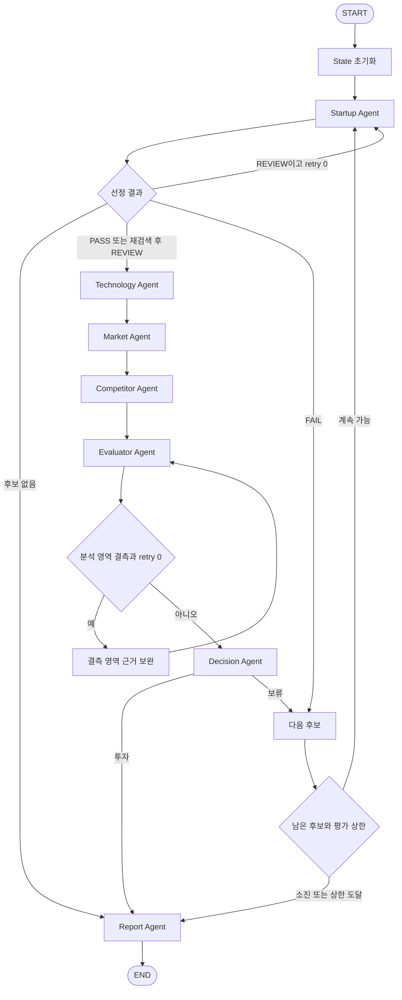

# 설계 산출물

> AI 스타트업 투자 평가 Agent (Semiconductor)
>
> LangGraph 기반 Multi-Agent + Agentic RAG
>
> 울산 캠퍼스 4반 · 조원: 박연제, 이정인, 정예지

## A. Domain 선정 및 문제 정의

### A-1. 평가 도메인

**국내외에서 AI 연산에 특화된 반도체를 설계·개발하거나, AI를 활용해 반도체 설계·제조 공정을 개선하는 비상장 스타트업**을 평가한다. NPU·AI Accelerator뿐 아니라 AI 기반 설계·EDA, 제조 공정 최적화·검사·수율 개선 솔루션을 포함한다. AI 관련성이 없는 일반 반도체 사업과 단순 유통·부품 판매는 제외한다.

과제의 Semiconductor 도메인 범위를 유지하면서 기업 유형에 따라 기술 검증 기준을 구분한다. 팀·시장성·고객·자금조달은 공통 항목으로 평가하고, 개발 단계·기술 독창성·경쟁력은 각 제품과 적용 현장에 맞는 근거로 평가한다. 국내와 해외 기업 모두 Startup Agent의 직접 평가 후보이며, Competitor Agent도 같은 유형·고객 문제를 다루는 국내외 경쟁사를 조사한다.

| 선정 이유                      | 평가 설계와의 연결                                                                          |
| ------------------------------ | ------------------------------------------------------------------------------------------- |
| 공개 투자·기술 자료 활용 가능  | 홈페이지·보도자료·투자 기사에서 팀, 개발 단계, 고객·투자 이력을 수집                        |
| 기술 검증이 중요               | 칩 성능, 설계 효율, 공정·수율 개선 등 기업 유형에 맞는 검증 근거를 평가                     |
| 경쟁 구도가 구체적             | 칩은 동일 워크로드, 설계·공정 솔루션은 동일 고객 문제를 해결하는 기존 도구·방법·기업과 비교 |
| 산업 보고서 확보 가능          | 정부·연구기관·컨설팅 보고서로 시장 규모·성장률·수요를 분석                                  |
| 리스크가 평가 결과에 직접 영향 | 칩 공급망·규제, 설계 도구 연동·IP, 제조 현장 데이터·오작동 위험 등 유형별 위험을 반영       |

### A-2. 문제 정의

AI 반도체 스타트업의 투자 검토에는 기술 검증, 시장성, 경쟁력 분석이 함께 필요하다. 관련 정보가 기업 홈페이지·기사·산업 보고서에 분산되어 있어 수작업 조사 시간이 길고, 평가자마다 점수 기준이 달라지는 문제가 있다.

본 프로젝트는 후보 탐색과 기술·시장·경쟁 분석을 Agent별로 분담하고, 공통 Evidence와 평가표로 결과를 통합한다. 정량 점수 계산과 투자/보류 판정은 코드로 처리하며, 사용한 근거와 출처를 포함한 투자 평가 보고서를 자동 생성한다.

- **입력**: 도메인, 후보 탐색 조건, 평가 기준일(`as_of_date`), 평가 수 상한(`max_candidates`, 기본 5)
- **처리**: 후보 탐색 → 적합성 판정 → 기술·시장·경쟁 분석 → 근거 확인 → 점수화 → 투자/보류 판정
- **출력**: SUMMARY부터 REFERENCE까지 포함한 투자 평가 PDF, 최대 5페이지

### A-3. 스타트업 선정 기준

| 기준          | PASS                                                           | FAIL                                              | REVIEW                                |
| ------------- | -------------------------------------------------------------- | ------------------------------------------------- | ------------------------------------- |
| 도메인 적합성 | 국내외 AI 연산용 칩 또는 AI 기반 반도체 설계·제조 개선 기술    | AI와 무관한 일반 반도체 사업, 단순 유통·부품 판매 | 주력 제품·사업 범위 확인 불가         |
| AI 핵심성     | AI 연산이 칩의 핵심 목적이거나 AI가 설계·공정 개선의 핵심 기술 | AI가 부수 기능·마케팅 문구에 그침                 | AI의 역할·기술 기여 확인 불가         |
| 비상장        | 평가 기준일에 국내외 거래소 미상장으로 확인                    | 상장 완료                                         | 상장 여부 확인 불가, IPO 절차 진행 중 |
| 투자 단계     | 최근 확인 라운드가 Seed~Series C                               | Series D 이상 또는 Pre-IPO                        | 최근 단계 비공개·확인 불가            |
| Exit 미완료   | M&A·상장에 따른 Exit 미완료로 확인                             | 인수·합병 또는 상장을 통한 Exit 완료              | 거래 진행 중·완료 여부 확인 불가      |
| 정보 충분성   | 공식 홈페이지 및 관련 기사 2건 이상 확보                       | 공개 평가 자료가 거의 없음                        | 자료가 일부만 확보됨                  |

자료는 평가 기준일 이전에 공개된 것으로 제한한다. 기사가 없는 사실을 곧바로 'Exit 없음'이나 '매출 없음'으로 간주하지 않는다. 동일 보도자료를 재전송한 기사는 독립된 근거로 중복 집계하지 않는다.

**최종 판정 규칙**

1. FAIL이 하나라도 있으면 후보를 제외한다.
2. 모두 PASS이면 분석 대상으로 확정한다.
3. FAIL 없이 REVIEW가 있으면 해당 기준만 추가 웹검색 1회 후 재판정한다.
4. 재판정 후에도 REVIEW이면 `uncertain=True`로 분석하되, 불확실한 기준을 보고서에 명시하고 최종 투자 판정은 보류한다.

기준별 상태·근거·출처는 LLM 구조화 출력으로 수집한다. 최종 선정 상태는 코드가 결정한다. 국내·해외 검색을 각각 수행하여 통합 후보를 최초 최대 10개 수집하며, FAIL 후보를 제외하고 실제 평가를 완료한 수가 `max_candidates`에 도달하면 종료한다.

**국내외 후보 처리 규칙**

- 한국어·영어 질의를 모두 사용하여 국내와 해외 기업을 탐색한다. 후보에는 법인명·별칭·본사 국가·공식 도메인·제품·주요 시장을 기록하며 국적에 따른 가점·감점은 두지 않는다.
- 해외의 Seed~Series C 또는 해당 단계로 공식 확인되는 라운드는 같은 기준을 적용한다. 다른 명칭을 사용하거나 단계가 공개되지 않으면 금액만으로 라운드를 추정하지 않고 REVIEW 처리한다.
- 금액은 원값·통화·기준일을 보존한다. TAM은 USD, 누적 투자액은 KRW 기준으로 채점하며, 통화 변환은 출처가 확인된 평가 기준일 환율(휴일은 직전 공개 영업일)을 공통 적용하고 환율·날짜·출처를 기록한다. 필요한 환율을 확인하지 못하면 해당 지표를 결측 처리한다.
- 통합 후보는 확인된 기업·투자 자료의 최신 공개일 내림차순, 동률이면 공식 도메인 오름차순으로 정렬하고 기준을 후보 목록에 기록한다. 공개일 미확인은 후순위로 두고 REVIEW 사유에 포함한다. 국내외 탐색은 모두 수행하되 국가별 적격 후보 수를 인위적으로 보장하지 않는다. 검색 순서·후보 상한에 따라 일부 기업이 평가되지 않을 수 있음을 보고서에 명시한다.

**기업 유형 분류**

| `company_type` | 포함 기업                                   | 기술 평가의 핵심                                            |
| -------------- | ------------------------------------------- | ----------------------------------------------------------- |
| `CHIP`         | NPU·AI Accelerator 등 AI 연산용 반도체 개발 | 칩 성능·전력효율, 제조·검증 단계, SW 생태계                 |
| `DESIGN_AI`    | AI 기반 반도체 설계·EDA 솔루션              | 설계 시간·PPA 개선, 설계 제약 충족, 기존 도구·워크플로 연동 |
| `PROCESS_AI`   | AI 기반 제조 공정 최적화·검사·수율 개선     | 수율·불량·검사·공정 개선, 현장 검증, 운영 안정성            |

Startup은 주력 제품·고객·사업화 근거로 `current_startup.company_type`을 분류한다. 복수 유형을 다루면 주력 제품에 대응하는 유형 하나로 채점하고 다른 사업은 설명에 기재한다. 점수를 높이기 위해 유형을 선택하거나 같은 지표를 유형별로 중복 채점하지 않는다. 유형이 불명확하면 선정 REVIEW로 보완하고, 끝내 확정되지 않으면 `company_type=None`, `uncertain=True`로 기록한다. 이 경우 유형별 점수는 임의로 부여하지 않고 결측으로 처리한다.

## B. Agent 및 RAG 설계

### B-1. Agent 역할·입력·출력

| Agent      | 역할                                                  | 주요 입력                                                              | 주요 출력                                                                           | 도구                            |
| ---------- | ----------------------------------------------------- | ---------------------------------------------------------------------- | ----------------------------------------------------------------------------------- | ------------------------------- |
| Startup    | 후보 수집·정규화, 선정 판정, 팀·투자·고객 프로필 수집 | `domain`, `as_of_date`, `candidates`, `current_idx`, `selection_retry` | `candidates`, `current_startup`, `selection_status`, `selection_retry`, `uncertain` | Tavily, 구조화 출력             |
| Technology | 핵심 기술·개발 단계·장단점 분석                       | `current_startup`, `as_of_date`                                        | `tech_summary`, `tech_evidence`                                                     | Tavily, 구조화 출력             |
| Market     | 목표 시장·성장률·수요·규제 분석                       | `current_startup`, `tech_summary`, `as_of_date`, `rag_retry`           | `market_analysis`, `market_evidence`, `rag_retry`                                   | Hybrid RAG, Tavily, 관련성 평가 |
| Competitor | 동일 유형·고객 문제의 경쟁사와 차별성·진입장벽 비교   | `current_startup`, `tech_summary`, `as_of_date`                        | `competitor_analysis`, `competitor_evidence`                                        | Tavily, 구조화 출력             |
| Evaluator  | 13개 지표의 채점·결측 판정·총점 계산                  | `current_startup`, 분석 3종, Evidence 3종                              | `scores`, `total_score`, `missing_evidence`                                         | 정성 채점 LLM, 계산 코드        |
| Decision   | 투자/보류 판정 및 후보별 결과 보존                    | 후보·분석·근거·점수·결측·선정 불확실성                                 | `decision`, `evaluated`                                                             | 코드 규칙                       |
| Report     | E장 목차에 따라 보고서 작성·PDF 변환                  | `evaluated`, `candidates`, `as_of_date`                                | `final_report`                                                                      | LLM, PDF 변환                   |

가이드의 6개 Agent에 Evaluator를 추가하여 채점과 판정을 분리한다. 분석 Agent는 근거와 분석만 작성한다. 후보 제외는 선정 규칙이, 투자/보류는 Decision의 코드 규칙이 결정한다. LLM은 정보를 추출·요약하고 정성 지표를 채점하며, 정량 점수·총점·분기는 코드가 처리한다.

### B-2. Agent별 수행 내용

| Agent      | 수행 내용                                                                                                                                                                                  |
| ---------- | ------------------------------------------------------------------------------------------------------------------------------------------------------------------------------------------ |
| Startup    | 국내외 후보 탐색 → 법인명·별칭·국가·공식 도메인 정규화 → 중복 제거 → A-3 판정 및 기업 유형 분류 → 창업자·핵심 인력 경력, 기술 인력 수, 투자 단계·누적액, 고객·PoC·계약·매출 근거 수집      |
| Technology | 기업 유형·평가 제품 확인 → C-1 유형별 기술 지표와 개발 단계 수집 → 기술 독창성·검증 조건·한계 요약. 칩은 성능·전력효율, 설계 AI는 설계 시간·PPA, 공정 AI는 수율·불량·현장 적용 근거를 조사 |
| Market     | 기업의 타깃 시장에 맞춘 질의 생성 → Hybrid 검색 → 관련성·지표 적합성 평가 → 부족한 topic만 재검색 → 웹 보완 → 출처를 붙인 시장 분석                                                        |
| Competitor | 동일 유형·고객 문제의 국내외 경쟁 기업 3~5개 선정 → 유형별 성능·개선 효과, 기존 도구·현장 연동, 사업화 단계 비교. 기존 비AI 방식도 비교 기준으로 포함                                      |
| Evaluator  | Evidence를 지표별로 매핑 → 정량 구간 점수·정성 루브릭 점수 산출 → 결측 기록 → 가중 총점 계산                                                                                               |
| Decision   | C-3 규칙으로 판정 → 판정 사유 및 후보 전체 결과를 `evaluated`에 저장                                                                                                                       |
| Report     | 투자 판정 기업 중심 보고서, 전원 보류 비교 보고서, 평가 대상 없음 보고서 중 해당 유형 생성                                                                                                 |

Startup의 프로필은 `current_startup.profile_evidence`에 공통 Evidence 형식으로 근거를 저장한다. Evaluator는 이 목록과 `tech_evidence`, `market_evidence`, `competitor_evidence`를 합쳐 채점한다. 따라서 팀·실적·투자 지표도 출처 없이 점수를 부여하지 않는다.

개발 단계는 C-1의 유형별 기준을 적용한다. 칩 기업에만 테이프아웃·양산 기준을 사용하며, 설계·공정 AI에는 프로토타입·고객 PoC·상용 적용 기준을 사용한다. 제품별 단계가 다르면 평가 대상 제품을 고정한다.

기술 효과는 같은 조건의 비교 근거로 확인한다. 칩은 워크로드·정밀도·배치·전력 조건, 설계 AI는 대상 회로·설계 제약·비교 도구·검증 데이터, 공정 AI는 장비·라인·기간·제품·데이터 분할 조건을 기록한다. 조건이 다른 수치나 기업의 효과 주장만으로 검증된 우위를 인정하지 않는다.

### B-3. 도구 정의 및 RAG 적용 이유

| 도구                | 입력                               | 출력                                         | 사용 Agent                                   |
| ------------------- | ---------------------------------- | -------------------------------------------- | -------------------------------------------- |
| `web_search`        | query, max_results(기본 5), 기준일 | title, url, content, 공개일·조회일           | Startup, Technology, Competitor, Market 보완 |
| `rag_search`        | query, k(기본 5), filters          | content, doc_id, title, page, chunk_id, rank | Market                                       |
| `grade_relevance`   | query, chunks, 요구 지표           | 청크별 yes/no, 사유, 답변 가능한 지표        | Market                                       |
| `summarize_sources` | topic, documents                   | summary, metrics, sources                    | 분석 Agent                                   |
| `export_report_pdf` | markdown, path                     | 한글 폰트를 적용한 PDF 경로                  | Report                                       |

**RAG는 Market Agent에 적용한다.** 시장 규모·성장률·정책·수요의 문맥은 기관 보고서에서 검색하고, 기업별 기술·투자 단계·경쟁사 동향은 최신 웹 자료로 확인한다. 가이드에서 RAG 가능 Agent로 제시한 Agent 중 최소 하나에 적용한다는 요구를 충족한다. Evaluator·Decision·Report는 이미 수집한 State만 사용한다.

산업 보고서는 신뢰도 높은 배경 근거이지만 시점과 시장 정의가 다를 수 있다. 발행일만으로 최신 수치를 선택하지 않고, 수치의 기준연도·예측기간·지역·제품 범위를 함께 확인한다.

### B-4. RAG 문서 및 전처리

#### 1. 문서 구성

| doc_id                    | 문서명                                                    | 발행기관           | 발행 시기 | 사용 범위                   | PDF 페이지 수 | 언어 |
| ------------------------- | --------------------------------------------------------- | ------------------ | --------- | --------------------------- | ------------: | ---- |
| `gov_2025_strategy`       | AI반도체 산업 도약 전략(안)(요약본)                       | 관계부처 합동      | 2025.12   | 전체                        |            10 | ko   |
| `deloitte_2026_outlook`   | 2026 Semiconductor Industry Outlook                       | Deloitte           | 2026      | 전체                        |            12 | en   |
| `kisdi_2024_perspectives` | 새로운 기회의 창으로 AI반도체 시장 현황과 전망            | 정보통신정책연구원 | 2024.07   | 전체                        |            23 | ko   |
| `kisdi_2024_research`     | AI반도체 글로벌 첨단 기술·산업 동향 조사 및 대응방향 연구 | 정보통신정책연구원 | 2024.02   | 원본 PDF 27~81페이지, 1~2장 |            55 | ko   |
| **합계**                  |                                                           |                    |           |                             |       **100** |      |

정부 문서는 국내 정책·지원 방향, Deloitte 문서는 글로벌 수요·위험, KISDI 문서들은 가치사슬·시장 전망·선도기업 기술 동향을 보완한다. 국내 정책 자료를 해외 기업의 적용 법규나 지원 혜택으로 그대로 해석하지 않는다.

현재 4개 문서는 AI 반도체 산업 배경 중심이므로 AI 기반 EDA·공정 개선의 세부 시장이나 특정 해외 국가의 규제를 모두 담고 있다고 가정하지 않는다. 해당 근거가 부족하면 Market의 웹 보완으로 관련 기관·공식 자료를 확인하고, 끝내 확보하지 못하면 결측으로 남긴다. 현재 100페이지 corpus는 유지하며, 추가 RAG 문서를 적재할 경우 전체 200페이지 한도와 적재 manifest를 다시 확인한다. 사용 범위는 200페이지 이내이다. 연구 보고서 전체 원본은 155페이지이며, RAG에는 위 55페이지 범위만 적재한다.

페이지 수는 표지·목차를 포함한 **PDF 물리 페이지** 기준이다. 문서에 인쇄된 쪽수와 혼동하지 않는다.

#### 2. Metadata Schema

| 필드                  | 타입          | 용도                                                     |
| --------------------- | ------------- | -------------------------------------------------------- |
| `doc_id`              | str           | 문서 고유 ID                                             |
| `title`               | str           | 정확한 문서 제목, REFERENCE                              |
| `source`              | str           | 발행기관                                                 |
| `date`                | str 또는 None | 확인된 발행일, YYYY-MM-DD/월/연도 중 실제 확인 수준 사용 |
| `url`                 | str 또는 None | 확인한 공식 원문·배포 페이지 주소                        |
| `document_type`       | enum          | gov_policy / market_report / research_report             |
| `domain`              | str           | ai_semiconductor                                         |
| `language`            | str           | ko / en                                                  |
| `mentioned_companies` | list[str]     | 문서에서 실제 확인된 기업명, 미확인 시 빈 목록           |
| `chunk_id`            | str           | 청크 고유 ID, 평가 정답 키                               |
| `page`                | int           | 원본 PDF의 1부터 시작하는 물리 페이지 번호               |

각 청크는 문서 Metadata를 상속한다. 원문 주소가 확인되지 않으면 URL을 만들어 넣지 않고, 문서명·발행기관·원본 파일명·페이지로 추적한다. 문서별 실제 Metadata는 적재 시 작성·검증한다. `mentioned_companies`가 빈 목록이라는 이유로 산업 근거를 검색에서 제외하지 않는다.

#### 3. 처리 흐름

1. 원본 PDF를 보존하고 `doc_id`에 따라 적재 파일을 준비한다. 연구 보고서는 PDF 27~81페이지만 추출한다.
2. PyMuPDF로 페이지별 텍스트를 추출한다. Loader의 0부터 시작하는 페이지 번호를 원본 PDF의 1부터 시작하는 번호로 변환한다. 발췌본은 원본 오프셋을 반영한다.
3. 반복 공백·불필요한 줄바꿈을 정리한다. 표의 단위·기간·수치 연결이 손상된 페이지는 원본과 대조한다.
4. `RecursiveCharacterTextSplitter(chunk_size=1000, chunk_overlap=100)`로 페이지 안에서 청킹한다. 이는 **문자 수** 기준이며, 표·문장이 잘렸는지 샘플을 확인한다.
5. Metadata와 안정적인 `chunk_id`를 부여하고 로컬 임베딩 → FAISS 및 BM25 인덱스를 저장한다.
6. 문서·청킹 설정·모델·입력 규칙이 동일할 때 인덱스를 재사용한다. 변경 시 재구축한다.

**청크 수**: 사전 파일럿 전처리 단계에서는 총 125개의 청크가 도출되었다. 본 설계에서 최종 확정한 100페이지 적재 범위 및 청킹 파라미터(chunk_size=1000, chunk_overlap=100)에 따른 최종 청크 수는 구현 단계에서 청크 manifest를 빌드하며 확정·기록한다.

### B-5. Embedding 및 Retrieval 설계

#### 1. 임베딩 후보

한글 3종·영문 1종 문서를 동일한 검색 체계로 처리하기 위해 로컬에서 실행 가능한 오픈소스 다국어 모델 3종을 비교한다.

| 모델                           | 비교 설정의 차원 | 선정 이유                                 |
| ------------------------------ | ---------------: | ----------------------------------------- |
| BAAI/bge-m3                    |             1024 | 다국어·긴 입력 지원, 로컬 실행            |
| intfloat/multilingual-e5-large |             1024 | 다국어 기준 모델, query/passage 구분 입력 |
| Qwen/Qwen3-Embedding-0.6B      |             1024 | 0.6B 다국어 모델, 질의 instruction 지원   |

#### 2. 평가 방법

- 사전 구축된 125개 파일럿 청크 풀에서 고정 seed로 20개를 무작위 샘플링하고, gpt-4.1-nano로 각 청크에 대응하는 질문을 생성하여 (question, gold_chunk_id) 벤치마크 평가셋을 구축하였다.
- 같은 청크·질문·정답으로 세 모델의 Dense 검색을 비교한다. E5는 `query:`/`passage:` 접두어를 적용한다. Qwen은 질의에 instruction을 적용한다.
- Hit Rate@1/3/5는 정답 청크가 상위 K개에 포함된 질문의 비율이다. MRR은 각 질문의 정답 순위 역수 평균이며, 탐색 범위와 미검색 처리 규칙을 실행 로그에 남긴다.
- 인덱싱 시간은 같은 실행 환경에서 비교한다. 모델 버전, seed 값, 하드웨어, 청킹 설정, 질문·정답 manifest를 결과와 함께 보관한다.

#### 3. 임베딩 모델 사전 벤치마크 평가 결과

| 모델                           | Hit Rate@1 | Hit Rate@3 | Hit Rate@5 |       MRR | 인덱싱 시간(초) |
| ------------------------------ | ---------: | ---------: | ---------: | --------: | --------------: |
| BAAI/bge-m3                    |       0.75 |       0.95 |       0.95 |     0.842 |            48.4 |
| intfloat/multilingual-e5-large |       0.70 |       0.95 |       0.95 |     0.817 |            43.7 |
| **Qwen/Qwen3-Embedding-0.6B**  |   **0.85** |   **1.00** |   **1.00** | **0.925** |           110.4 |

위 평가는 모델 선정의 객관적 타당성을 확보하기 위해 파일럿 데이터셋(125개 청크, 20개 합성 질문)을 대상으로 실측한 사전 벤치마크 기록이다. 본 평가는 동일 조건 하에서 모델 간 상대적 검색 역량을 검증하기 위한 사전 검색 벤치마크(Relative Search Benchmark) 역할을 수행하며, 최종 시스템 구현 시 인덱스 재구축과 함께 파이프라인 전반의 성능을 지속 점검한다

#### 4. 최종 선택 및 적용

Qwen/Qwen3-Embedding-0.6B를 채택한다. 사전 벤치마크 실험 결과 Hit Rate@1(0.85)과 MRR(0.925)이 가장 우수하여, 상위 검색 결과에 의존하는 Agentic RAG 파이프라인에 가장 적합한 것으로 검증되었다. 인덱싱 소요 시간은 110.4초로 비교 모델 대비 다소 길었으나, 이는 최초 인덱스 빌드 시에만 발생하는 1회성 비용이며 저장된 인덱스를 지속 재사용하므로 실서비스 영향도는 낮다.

질의에만 instruction을 적용하고 문서는 본문 그대로 임베딩한다. 로컬 임베딩은 API 호출 비용이 없지만 실행 자원 비용은 존재한다. Top-5, 인덱스 재사용, 재검색 상한으로 비용을 관리한다.

#### 5. Hybrid 검색

| 단계      | 설정                                                                          | 목적                                 |
| --------- | ----------------------------------------------------------------------------- | ------------------------------------ |
| 범위 제한 | 필요 시 domain·language 필터를 두 검색기에 동일하게 적용                      | 검색 범위 일치                       |
| Dense     | Qwen + FAISS, 상위 5개                                                        | 의미가 유사한 문맥 검색              |
| Sparse    | BM25, 상위 5개                                                                | CAGR·TOPS·기업명 등 키워드 보완      |
| 결합      | `chunk_id` 기준 중복 제거, Weighted RRF(Dense 0.5/BM25 0.5, rank constant 60) | 서로 다른 점수 척도 대신 순위로 통합 |
| 최종 선택 | 통합 상위 5개                                                                 | 관련성 평가에 전달                   |

두 검색기의 순위는 1부터 계산하고, 통합 점수는 `Σ(weight / (60 + rank))`로 산출한다. 초기 동일 가중치는 두 방식에 동등한 비중을 주기 위한 설계값이다. 모델 비교표는 Dense 기준이며, Hybrid 적용 효과는 별도로 검증한다.

#### 6. Corrective RAG 조건

질의를 `market_size`, `market_growth`, `demand_risk`의 3개 topic으로 관리한다. 각 topic의 Top-5 청크를 평가한다.

- 시장 규모·성장률 topic은 **관련성 yes인 근거가 최소 1개**이고, 타깃 시장 범위·기준연도/기간·단위·수치가 확인되어야 충분하다.
- 수요·리스크 topic은 수요처와 시장/규제 리스크를 설명할 근거가 각각 최소 1개 있어야 충분하다. 같은 청크가 두 요구를 충족할 수 있다.
- 부족한 topic만 질의를 재작성한다. `rag_retry[topic]`은 재검색 직전에 증가하며 **topic별 후보당 최대 2회**이다. 최초 검색은 카운터에 포함하지 않는다.
- 상한 도달 후에도 부족하면 해당 topic에 대해 웹검색 1회로 보완한다. 찾지 못한 지표는 결측으로 남긴다.
- Evidence 보완으로 Market이 다시 호출되어도 `rag_retry`를 초기화하지 않는다. 확보한 결과를 재사용하고, 이미 상한에 도달한 topic은 RAG 재검색을 반복하지 않는다.

충분성은 청크 개수만으로 판단하지 않는다. 전체 반도체 시장이나 AI 칩 시장을 EDA·공정 AI 기업의 TAM으로 대입하거나, 서로 다른 지역·연도·기간의 수치를 결합하지 않는다. 기준이 같은 수치끼리 비교하고, 충돌이 해소되지 않으면 병기한 뒤 해당 지표를 결측으로 처리한다.

## C. 투자 판단 기준

### C-1. 평가표 및 가중치

과제의 Scorecard 6개 항목을 AI 반도체에 맞게 조정하고, Bessemer Checklist의 시장·팀·차별성·고객 반응·리스크 질문을 13개 지표와 연결한다. 이는 프로젝트의 **근거 기반 평가 점수**이며 기업가치나 실제 투자 수익률을 산출하는 모델은 아니다.

AI 반도체 칩과 설계·제조 개선 솔루션은 기술 효과 검증과 기존 제품·도구·현장 대비 경쟁력이 사업화에 크게 영향을 주므로 제품/기술력과 경쟁 우위를 각각 5%p 높인다. 합계 100%를 유지하기 위해 창업자/팀과 시장성에서 각각 5%p를 조정한다.

| 항목·가중치         | 지표 ID / 세부 지표                            | 채점 방식   | 점수 기준                                                                                                            |
| ------------------- | ---------------------------------------------- | ----------- | -------------------------------------------------------------------------------------------------------------------- |
| 창업자/팀 25%       | `team_experience` / 핵심 인력 반도체 경력      | 정성        | 해당 유형의 개발·상용화 또는 고객 현장 적용 리드 이력 5 / 관련 경력 있음 3 / 관련 경력 없음이 확인됨 1               |
|                     | `technical_headcount` / 기술 인력 수           | 정량        | 100명 이상 5 / 50~99명 4 / 20~49명 3 / 10~19명 2 / 10명 미만 1                                                       |
| 시장성 20%          | `market_tam` / 목표 시장 규모                  | 정량        | 1,000억 달러 이상 5 / 500억 이상~1,000억 미만 4 / 100억 이상~500억 미만 3 / 10억 이상~100억 미만 2 / 10억 미만 1     |
|                     | `market_cagr` / 목표 시장 CAGR                 | 정량        | 20% 이상 5 / 15% 이상~20% 미만 4 / 10% 이상~15% 미만 3 / 5% 이상~10% 미만 2 / 5% 미만 1                              |
|                     | `demand_clarity` / 수요처 명확성               | 정성        | 구체적 타깃·수요 근거 5 / 타깃만 제시 3 / 제품·사업 자료에서 수요처 불명확함이 확인됨 1                              |
| 제품/기술력 20%     | `development_stage` / 개발 단계                | 범주 규칙   | 기업 유형에 따른 아래 개발 단계 표 적용                                                                              |
|                     | `technical_originality` / 기술 독창성          | 정성        | 아래 유형별 기술 요소·검증 근거 적용: 독자 기술과 검증 효과 5 / 주장만 있음 3 / 차별 없음 확인 1                     |
| 경쟁 우위 15%       | `competitive_difference` / 동종 대비 차별성    | 정성        | 동일 유형·동일 조건에서 기존 제품·방법 대비 우위 입증 5 / 주장만 있음 3 / 차별 없음 확인 1                           |
|                     | `entry_barrier` / 진입장벽                     | 정성        | 유형별 IP·제품/데이터·연동/파트너십 3종 확인 5 / 1~2종 확인 3 / 모두 없음 확인 1                                     |
| 실적 10%            | `customer_traction` / 고객·PoC·계약 수         | 정량        | 5건 이상 5 / 3~4건 4 / 2건 3 / 1건 2 / 0건 확인 1                                                                    |
|                     | `revenue_stage` / 매출 발생                    | 범주 규칙   | 상용 제품·라이선스·서비스의 반복 매출 확인 5 / 초기·일회성 매출 3 / 매출 없음 확인 1                                 |
| 자금조달/리스크 10% | `funding_total` / 누적 투자 유치액             | 정량        | 3,000억 원 이상 5 / 1,000억 이상~3,000억 미만 4 / 300억 이상~1,000억 미만 3 / 100억 이상~300억 미만 2 / 100억 미만 1 |
|                     | `risk_mitigation` / 기술·규제·공급망 위험 완화 | 정성·역점수 | 주요 위험 완화 근거 확인 5 / 일부 완화 3 / 치명적 위험 미해결 확인 1                                                 |

#### 유형별 기술 평가 기준

모든 유형에 동일한 13개 지표 ID와 항목 가중치를 적용한다. 아래 기준은 기존 지표의 해석을 구분한 것이며 추가 가점을 만들지 않는다.

| 유형       | `development_stage` 개발 단계: 5 / 4 / 3 / 2 / 1점                                                                             | `technical_originality` 독창성·효과 근거                              | `competitive_difference` 비교 기준                                      |
| ---------- | ------------------------------------------------------------------------------------------------------------------------------ | --------------------------------------------------------------------- | ----------------------------------------------------------------------- |
| CHIP       | 양산 / 테이프아웃 / FPGA·시험 칩 시제품 / 설계 / 구상                                                                          | 독자 아키텍처·연산 구조, 실측 성능·전력효율·지연, 검증 조건           | 동일 워크로드·정밀도·배치·전력 조건의 칩과 SW 이식·지원 수준            |
| DESIGN_AI  | 고객의 실제 설계에서 상용 운영 / 고객 설계 데이터·워크플로 PoC 완료 / 작동 프로토타입 검증 / 모델·솔루션 개발 중 / 구상        | 독자 AI 설계 방법, 설계 시간 단축·PPA 개선·제약 충족의 비교 검증      | 동일 회로·제약에서 기존 EDA·수동 설계 대비 개선 효과, 도구 연동·재현성  |
| PROCESS_AI | 제조 현장에서 상용 운영 / 고객 생산 데이터·현장 PoC 완료 / 시험·오프라인 데이터의 프로토타입 검증 / 모델·솔루션 개발 중 / 구상 | 독자 공정·검사 방법, 수율·불량률·검사 성능·공정 시간 개선의 비교 검증 | 동일 장비·제품·라인·기간에서 기존 공정 제어·검사 대비 효과, 현장 안정성 |

- 칩의 테이프아웃은 제조용 설계 제출이며 실리콘 성능 검증 완료와 같지 않다. 설계·공정 AI의 고객 PoC는 고객 데이터·환경에서 수행한 검증이며 내부 시연과 구분한다. 상용 운영은 실제 사용 근거로 확인하고, 매출은 별도 `revenue_stage`에서 채점한다.
- 유형별 단계는 사업화 진척을 비교하기 위한 프로젝트 기준이다. 같은 4점이라도 칩과 SW의 비용·위험이 같다는 의미는 아니며, 각 단계의 잔여 위험을 보고서에 함께 적는다.
- 기술 독창성 5점은 독자 방법 설명과 비교 조건이 확인되는 효과 근거가 모두 있어야 한다. 유형별 수치를 하나의 TOPS·정확도 기준으로 환산하지 않는다. `PPA`는 전력·성능·면적이며, 개선 방향과 상충 관계를 함께 기록한다.
- 공정 AI의 수율·불량 개선은 %와 %p를 구분하고, 관측 개선만으로 AI의 인과적 기여를 단정하지 않는다. 검증 구분·대조 조건이 불명확하면 근거의 한계를 표시한다.

| 유형       | `entry_barrier`의 3개 근거 범주                                                                                   | `risk_mitigation`에서 확인할 주요 위험                              |
| ---------- | ----------------------------------------------------------------------------------------------------------------- | ------------------------------------------------------------------- |
| CHIP       | 보호 가능한 칩 IP·특허 / 자체 컴파일러·SDK·제품 스택 / 파운드리·고객 등 핵심 파트너십                             | 제조·수율·공급망, 수출 통제, 개발 자금, SW 생태계 의존              |
| DESIGN_AI  | 보호 가능한 설계·알고리즘 IP / 사용 권리가 확인된 설계 데이터·모델·제품 기술 / EDA·PDK·고객 워크플로 연동 및 협력 | 설계 IP·데이터 권리, 제약·검증 오류, 기존 도구 의존, 고객 도입 난도 |
| PROCESS_AI | 보호 가능한 공정·검사 IP / 사용 권리가 확인된 현장 데이터·모델·운영 기술 / 장비·생산 시스템 연동 및 고객 협력     | 현장 데이터 접근, 공정 변화·일반화 실패, 오탐·미탐, 운영 중단·보안  |

공개 자료에서 확인되는 근거만 인정한다. 자체 모델·데이터가 있다는 주장만으로 배타적 진입장벽이 입증된 것으로 취급하지 않는다. 자료가 없는 범주는 '없음 확인'과 구분한다.

공개되지 않는 Valuation·지분율 대신 자금조달 이력과 위험 완화 수준을 사용한다. **누적 투자액은 조달 이력의 대리 지표**이며 현재 현금, 런웨이, 잔여 자금과 동일하지 않으므로 항목명을 '투자조건'이나 '현재 자금 여력'으로 표기하지 않는다.

정량 구간은 공식 VC 표준값이 아니라 넓은 시장·고객 확보·조달 규모를 구분하기 위한 프로젝트 초기 설계값이다. 초기·후기 기업, 칩·소프트웨어 기업 간 인력·자본 규모 차이를 완전히 보정하지 못한다. 따라서 공통 점수는 선별 보조값으로 사용하며 같은 유형·유사 단계의 비교를 우선하고, 서로 다른 유형의 원수치를 직접 순위화하지 않는다. 보고서에 투자·개발 단계를 함께 제시하고, 표본을 확보하면 구간별 쏠림과 경계값 민감도를 확인한다.

### C-2. 채점·결측 규칙

- 정성 지표는 근거와 루브릭을 함께 주고 `{metric, score, reason, evidence_ids}`로 출력한다. 표의 1/3/5 기준을 사용하고 2/4점은 임의로 생성하지 않는다.
- 정량·범주 지표는 LLM이 원값·단위·근거만 추출하고 코드가 점수로 변환한다. 기술 인력 수를 전체 직원 수로 대체하지 않는다. 유형에 맞지 않는 지표를 1점이나 결측으로 벌점 처리하지 않고 C-1의 해당 유형 기준으로 채점한다. 기업 유형 자체가 미확정이면 유형 의존 지표는 결측으로 남긴다.
- 고객·PoC·계약은 같은 고객·같은 프로젝트를 중복 집계하지 않는다. 단순 협력 발표를 유료 계약으로 해석하지 않는다.
- **확인된 부재·0과 정보 부족을 구분한다.** 부재가 근거로 확인되면 표의 1점, 확인할 자료가 없거나 기준이 맞지 않으면 결측이다.
- 결측 지표는 3점으로 계산하되 `status="missing"`, 사유를 기록하고 `missing_evidence`에 지표 ID를 넣는다. 근거 있는 3점과 구분한다.
- 판정의 결정성은 동일한 **확정 지표 점수**에 대해 보장한다. 정성 채점은 LLM 출력의 변동 가능성이 있으므로 실제 채점 결과·프롬프트·모델 설정을 보존한다.

**총점**은 각 항목 안에서 지표를 동일 비중으로 평균한 다음 `Σ(항목 평균 / 5 × 항목 가중치)`로 계산한다. 가중치는 25·20·20·15·10·10이며 합계 100이다. 비교에는 반올림 전 총점을 사용하고, 보고서 표시는 소수 둘째 자리로 한다.

### C-3. 투자/보류 판정

다음 세 조건을 모두 만족하면 **투자**, 하나라도 불충족이면 **보류**이다.

1. `total_score >= 70`
2. `len(missing_evidence) < 5`
3. `uncertain == False`

70점은 항목 평균 3.5점에 해당한다. 5개 결측은 전체 13개 중 약 38%이므로, 이 수준 이상은 중립 대입 점수만으로 투자 판단하지 않도록 보류한다. 두 임계값은 프로젝트의 정책값이며 실제 투자 성과로 검증된 기준은 아니다.

리스크는 `risk_mitigation` 점수와 보고서의 위험 설명에 반영한다. 시장 규모·성장률·사업화 단계로 성장 잠재력을 설명하되, Valuation·지분율·회수 조건이 없는 상태에서 **ROI를 계산하거나 추정 ROI로 표시하지 않는다.** Decision의 판정을 LLM 서술이 변경하지 않는다. ROI는 Valuation 비공개로 수치 산출이 불가하므로, ROI 관점을 기대 성장 여력(시장 규모·성장률·사업화 단계)으로 정성 평가하여 판정 사유

## D. State Schema 및 Graph 설계

### D-1. State Schema

아래 기본값은 `initialize_state`가 모두 생성한다. 같은 역할의 필드를 여러 Agent가 덮어쓰지 않도록 Evidence를 영역별로 분리한다.

| 필드                  | 타입 / 초기값                                               | 갱신 방식                | 주요 작성 노드                   |
| --------------------- | ----------------------------------------------------------- | ------------------------ | -------------------------------- |
| `domain`              | str / 실행 인자                                             | overwrite                | initialize_state                 |
| `as_of_date`          | str / 평가 기준일                                           | overwrite                | initialize_state                 |
| `max_candidates`      | int / 5                                                     | overwrite                | initialize_state                 |
| `candidates`          | list[dict] / []                                             | overwrite                | Startup                          |
| `discovery_done`      | bool / False                                                | overwrite                | Startup                          |
| `current_idx`         | int / **0**                                                 | overwrite                | initialize_state, next_candidate |
| `current_startup`     | dict 또는 None / None; 국가·기업 유형·제품·프로필 근거 포함 | overwrite                | Startup                          |
| `selection_status`    | PASS/FAIL/REVIEW 또는 None / None                           | overwrite                | Startup                          |
| `selection_retry`     | int / 0                                                     | overwrite                | Startup                          |
| `uncertain`           | bool / False                                                | overwrite                | Startup                          |
| `tech_summary`        | dict / {}                                                   | overwrite                | Technology                       |
| `market_analysis`     | dict / {}                                                   | overwrite                | Market                           |
| `competitor_analysis` | dict / {}                                                   | overwrite                | Competitor                       |
| `tech_evidence`       | list[Evidence] / []                                         | overwrite                | Technology, evidence_refresh     |
| `market_evidence`     | list[Evidence] / []                                         | overwrite                | Market, evidence_refresh         |
| `competitor_evidence` | list[Evidence] / []                                         | overwrite                | Competitor, evidence_refresh     |
| `rag_retry`           | dict[str,int] / 각 topic 0                                  | overwrite                | Market                           |
| `evidence_retry`      | int / 0                                                     | overwrite                | evidence_refresh                 |
| `scores`              | dict[str,ScoreEntry] / {}                                   | overwrite                | Evaluator                        |
| `total_score`         | float 또는 None / None                                      | overwrite                | Evaluator                        |
| `missing_evidence`    | list[str] / []                                              | overwrite                | Evaluator                        |
| `decision`            | 투자/보류 또는 None / None                                  | overwrite                | Decision                         |
| `evaluated`           | list[EvaluationRecord] / []                                 | **add (`operator.add`)** | Decision                         |
| `final_report`        | str / 빈 문자열                                             | overwrite                | Report                           |

`rag_retry` 초기값은 `{"market_size": 0, "market_growth": 0, "demand_risk": 0}`이다. `current_startup=None`, `total_score=None`, `decision=None`은 미평가 상태이며, Report가 이를 0점·보류 평가 완료로 바꾸지 않는다.

**근거 보존 규칙**

- 각 분석 Agent는 자기 Evidence 필드만 반환한다. Market 호출이 `tech_evidence`를 덮어쓰지 않는다.
- 동일 영역 재수집 시 기존 근거를 읽고 `evidence_id` 기준으로 병합한 전체 목록을 반환한다. 다른 영역은 그대로 유지한다.
- Startup 프로필 근거는 `current_startup.profile_evidence`에 저장한다.
- `evaluated`의 각 레코드는 기업 프로필(국가·유형·평가 제품 포함)·선정 불확실성·분석 3종·근거 전체·지표 점수·총점·결측·판정·사유의 **스냅샷**을 보존한다. 다음 후보 초기화 후에도 이전 기업의 REFERENCE를 생성할 수 있다.
- add reducer가 적용된 `evaluated`에는 새 레코드 한 개만 `[record]`로 반환한다. 기존 전체 목록을 다시 반환하여 중복 누적하지 않는다.

`next_candidate`는 `current_idx`를 1 증가시키고, `current_startup`부터 `decision`까지의 후보별 필드·카운터를 위 기본값으로 초기화한다. 실행 공통 필드, `candidates`, `discovery_done`, `evaluated`, `final_report`는 보존한다. 후보의 선정 상태·근거는 `candidates` 안에 남긴다.

### D-2. Evidence 및 점수 레코드

| Evidence 필드         | 타입 / 의미                                                             |
| --------------------- | ----------------------------------------------------------------------- |
| `evidence_id`         | str / 기업·영역·지표·출처 위치로 구분되는 안정적인 ID                   |
| `company`             | str / 대상 기업                                                         |
| `category`            | profile / tech / market / competitor                                    |
| `metric`              | str / C-1의 지표 ID 또는 분석 주제                                      |
| `value`, `unit`       | 수치·범주·문장 값과 단위, 수치 미확인 시 None                           |
| `source_type`         | rag / web                                                               |
| `title`, `source`     | 자료명·발행기관 또는 매체                                               |
| `date`, `accessed_at` | 확인된 발행일·조회일                                                    |
| `url`, `doc_id`       | 웹 URL 또는 RAG 문서 ID, 해당하지 않는 값은 None                        |
| `page`, `chunk_id`    | 원본 PDF 위치·청크 ID, 웹 자료는 None 가능                              |
| `quote`               | 해당 값을 뒷받침하는 짧은 원문 근거                                     |
| `scope`               | 시장 범위·지역·기준연도·기간, 유형별 기술 검증 조건 또는 환율 변환 기준 |

`ScoreEntry`는 `metric`, `raw_value`, `score`, `status(observed/missing)`, `reason`, `evidence_ids`를 가진다. 실제 출처와 연결되지 않은 지표는 관측값으로 인정하지 않는다. RAG 인용은 원본 PDF 페이지를 표시하며, 웹 인용은 URL을 표시한다.

### D-3. Node와 Branch·Loop

| Node               | 역할 및 분기                                                                                                                                                                |
| ------------------ | --------------------------------------------------------------------------------------------------------------------------------------------------------------------------- |
| `initialize_state` | D-1 기본값을 모두 생성하고 실행 인자 검증(`max_candidates`는 1~10)                                                                                                          |
| `startup_agent`    | `discovery_done=False`일 때만 후보 수집. 목록이 비면 Report로 이동. 현재 후보 선정 PASS → Technology, FAIL → next_candidate, REVIEW → 1회 재검색 후 PASS/FAIL/REVIEW 재판정 |
| `technology_agent` | 기술 분석 후 Market으로 이동                                                                                                                                                |
| `market_agent`     | B-5의 topic별 RAG 재검색·웹 보완 후 Competitor로 이동                                                                                                                       |
| `competitor_agent` | 경쟁 분석 후 Evaluator로 이동                                                                                                                                               |
| `evaluator_agent`  | 채점·결측 계산. 분석 영역에 결측이 있고 `evidence_retry==0`이면 evidence_refresh, 그 외 Decision으로 이동                                                                   |
| `evidence_refresh` | 기술·시장·경쟁의 결측 지표만 담당 Agent 도구로 보완하고 해당 Evidence에 병합. 카운터를 먼저 1 증가시킨 후 Evaluator로 복귀                                                  |
| `decision_agent`   | C-3 판정·스냅샷 기록. 투자 → Report, 보류 → next_candidate                                                                                                                  |
| `next_candidate`   | 다음 후보로 이동·후보별 초기화. 목록 내 후보가 남고 평가 상한 미도달 → Startup, 그 외 Report                                                                                |
| `report_agent`     | 보존된 결과에 따라 보고서 생성 후 END                                                                                                                                       |

Evidence 보완은 전체 분석 체인을 다시 실행하지 않는 코드 노드이다. 기술 → 시장 → 경쟁 순으로 필요한 영역만 보완하며 기존 기업 유형·타깃 제품·시장·비교 범위는 유지한다. 새로운 자료가 기존 범위를 뒤집거나 충돌하면 임의로 혼합하지 않고 해당 지표를 결측으로 남긴다. 결측 보완의 담당은 `development_stage`·`technical_originality`는 Technology, `market_tam`·`market_cagr`·`demand_clarity`는 Market, `competitive_difference`·`entry_barrier`는 Competitor이다. `risk_mitigation`은 기술·시장 근거를 함께 보완한다. 팀·실적·투자 지표는 Startup의 최초 프로필 수집에서 확보하며 Evidence 보완 루프 대상에서는 제외한다.

| Loop          | 반복 조건                     | 상한·카운터 갱신                                                   |
| ------------- | ----------------------------- | ------------------------------------------------------------------ |
| 선정 보완     | FAIL 없이 REVIEW 존재         | 후보당 추가 웹검색 1회, 검색 직전 `selection_retry=1`              |
| RAG 보완      | topic의 근거 충분성 불충족    | 후보·topic별 최대 2회, 검색 직전 `rag_retry[topic]+=1`             |
| Evidence 보완 | 기술·시장·경쟁 영역 결측 존재 | 후보당 보완 단계 1회, 실행 직전 `evidence_retry=1`                 |
| 후보 순회     | 선정 FAIL 또는 투자 보류      | 수집 최대 10개, 평가 완료 최대 `max_candidates`, 최초 투자 시 종료 |

모든 분기는 코드가 결정한다. 추가 검색에서도 해결되지 않은 결측은 중립 점수와 결측 표시를 유지하고 최종 판정으로 넘어간다. API 오류·빈 검색 결과는 근거 없음으로 기록하며 반복 상한을 우회하지 않는다.

### D-4. Graph

Market의 topic별 검색·관련성 평가·질의 재작성은 Market 내부 루프로 수행한다. 순차 실행은 Market·Competitor가 Technology의 기업 유형·타깃 제품·고객 문제를 읽기 때문이며, 후보별 State 초기화와 결과 스냅샷으로 기업 간 자료 혼입을 방지한다.

## E. 투자 보고서 목차 및 작성 규칙

| 구분                        | 주요 내용                                                                          |        권장 분량 |
| --------------------------- | ---------------------------------------------------------------------------------- | ---------------: |
| SUMMARY                     | 기업·총점·판정·핵심 근거, 평가 기준일                                              |        0.5페이지 |
| 1. 기업 및 사업 개요        | 본사 국가·기업 유형, 사업 아이디어, 제품·고객, 투자·사업 단계                      |        0.5페이지 |
| 2. 팀·기술 및 제품 경쟁력   | 핵심 인력, 유형별 기술·개발 단계, 검증 조건과 차별성                               |          1페이지 |
| 3. 시장성 및 경쟁 환경      | 시장 규모·성장률의 지역·범위·기간, 수요, 같은 유형의 국내외 경쟁사 비교            |          1페이지 |
| 4. 투자 판단 및 주요 리스크 | Scorecard, 판단 사유, 시장·기술·규제·경쟁 위험, 결측·선정 불확실성, 보류 후보 요약 |          1페이지 |
| REFERENCE                   | 실제 인용한 자료만 기재                                                            |          1페이지 |
| **합계**                    | SUMMARY와 REFERENCE 포함                                                           | **최대 5페이지** |

**보고서 유형**

- 투자 기업이 있으면 해당 기업을 중심으로 작성하고, 앞서 평가한 보류 후보는 4장에 요약한다. 조사 순서상 최초 투자 판정에서 종료하므로 전체 후보 중 최우수 기업이라고 표현하지 않는다.
- 전원 보류이면 `evaluated`에 저장된 후보별 총점·결측·사유와 공통 한계를 비교한다.
- 분석 대상이 없으면 점수표를 임의로 만들지 않고 `candidates`의 선정 제외 사유 또는 탐색 결과 없음을 기록한다.

SUMMARY는 핵심 요약으로 작성한다. 후보 비교표에는 국가·기업 유형·개발 단계·원통화/환산 기준·총점·결측을 함께 표시한다. 서로 다른 유형은 같은 원수치로 비교하지 않고 항목별 근거와 잔여 위험을 설명한다. 보고서의 수치·판정 근거는 `evidence_ids`를 통해 출처와 연결한다. 결측 대입 3점은 '중립 대입·미확인'으로 표시하여 근거가 있는 3점과 구분한다.

REFERENCE는 `evaluated`에 보존된 자료 중 **실제 보고서에 인용한 출처만** 중복 제거하여 생성한다.

- 기관 보고서: `발행기관(YYYY). 보고서명. 공식 URL, 인용 PDF 페이지.`
- 웹페이지: `기관명 또는 작성자(확인된 날짜). 제목. 사이트명, URL.`
- 원문 URL·발행일 미확인: 확인되지 않은 값을 만들지 않고 문서명·기관·원본 파일명·페이지·조회일을 기재한다.

PDF 변환 후 실제 페이지 수, 한글 폰트, 표 잘림, 출처 링크를 확인한다. 파일명은 `RAG-Output_울산캠퍼스-4반_박연제+이정인+정예지.pdf`로 한다.

## F. Tech Stack 및 구현 범위

| 구분                              | 사용 기술                                 |
| --------------------------------- | ----------------------------------------- |
| Language·패키지 관리              | Python 3.11 계열, uv                      |
| Framework                         | LangGraph, LangChain                      |
| 분석·보고서·정성 채점·관련성 평가 | gpt-4.1-mini                              |
| 검색 평가 질문 생성               | gpt-4.1-nano                              |
| 웹검색                            | Tavily                                    |
| Embedding                         | Qwen/Qwen3-Embedding-0.6B, 로컬 실행      |
| Dense·Sparse 검색                 | FAISS, BM25, 순위 기반 결합               |
| PDF 처리                          | PyMuPDF, 한글 폰트를 지원하는 PDF 변환    |
| Retrieval 평가                    | Hit Rate@1/3/5, MRR, 인덱싱 시간          |
| 추적                              | LangSmith, 후보·Evidence·채점·재시도 로그 |

이번 범위는 후보 탐색, 공개 근거 수집, Market RAG, 점수화·판정, 보고서 생성까지이다. 상세 API·모델·패키지 버전과 실행 설정은 구현 저장소에서 고정하고 README에 기록한다.
