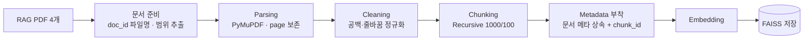
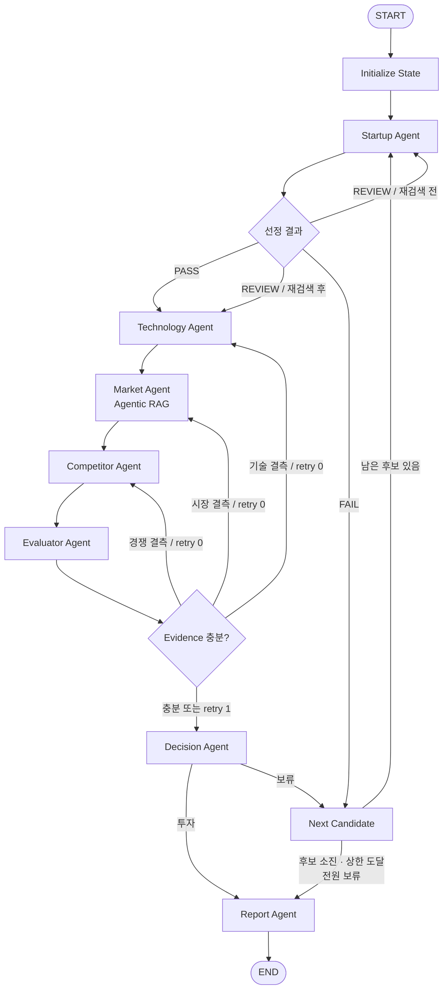

# 설계 산출물

> AI 스타트업 투자 평가 Agent (Semiconductor) · LangGraph 기반 Multi-Agent + Agentic RAG
>
> 울산 캠퍼스 4반 · 조원: 박연제, 이정인, 정예지

---

## A. Domain 선정

### 1. 반도체 선정 이유

**Semiconductor (AI 반도체)**: AI 연산에 특화된 칩(NPU, AI 가속기)을 설계하거나, AI로 반도체 설계·제조 공정을 개선하는 기술 분야

| 구분                  | 선정 이유                                                                                                                                            |
| --------------------- | ---------------------------------------------------------------------------------------------------------------------------------------------------- |
| 투자 정보 공개성      | 대규모 투자 라운드가 빈번하여 투자 유치 금액과 기업가치 관련 보도가 상대적으로 많음. Scorecard의 '실적', '투자조건' 항목까지 근거 기반 평가가 가능함 |
| 평가 대상 확보 용이성 | 국내 비상장 AI 반도체 스타트업이 다수 존재하여, 선정 기준을 적용해도 충분한 후보군 확보가 가능함                                                     |
| 명확한 경쟁 구도      | 글로벌 선두 기업(NVIDIA 등)과 해외 동종 스타트업이라는 비교 기준축이 뚜렷하여, 경쟁사 비교 에이전트의 분석 결과가 구체적으로 도출됨                  |
| RAG 문서 확보 용이성  | 정부·연구기관 및 글로벌 컨설팅의 AI 반도체 시장·산업 보고서가 공개되어 있어, 200페이지 이내의 신뢰도 높은 RAG 문서 구성이 가능함                     |
| 리스크 구체성         | 수출 통제(규제), 테이프아웃·양산 수율(기술), 막대한 자본 소요(시장), 선두 기업의 생태계 지배력(경쟁) 등 보고서에 필요한 리스크 요소가 명확함         |

### 2. 문제 정의

AI 반도체 스타트업은 **기술 난도가 높고 자본 소요가 커서**, 투자 판단 시 기술 검증·시장성·글로벌 선두 기업 대비 경쟁력을 동시에 분석해야 한다. 그러나 이러한 정보는 기업 홈페이지, 투자 기사, 산업 보고서 등에 분산되어 있어 **수작업 조사에 많은 시간이 소요되고, 평가자에 따라 판단 기준이 달라지는 문제**가 있다.

본 프로젝트는 **LangGraph 기반 멀티 에이전트와 Agentic RAG**를 활용하여 국내 AI 반도체 스타트업을 탐색·분석·평가하고, 정량화된 평가표(Scorecard + Bessemer Checklist)에 따라 투자 여부를 판단한 뒤, **근거와 출처가 명시된 투자 평가 보고서를 자동 생성**하는 것을 목표로 한다.

- **입력**: 평가 도메인(AI 반도체), 후보 탐색 조건
- **처리**: 후보 탐색 → 기술·시장성·경쟁력 분석 → 평가표 기반 점수화 → 투자/보류 판단
- **출력**: 투자 평가 보고서 (SUMMARY ~ REFERENCE, 5장 이내)

### 3. 스타트업 선정 기준

가이드에 제시된 스타트업 정의(비상장, Seed~Series C, Exit 미완료)를 기반으로, 도메인 적합성과 평가 가능성을 추가하여 **6개 기준**을 수립한다. 각 기준은 **PASS / FAIL / REVIEW** 3단계로 판정한다.

| #   | 기준        | PASS                                                           | FAIL                                    | REVIEW                                      |
| --- | ----------- | -------------------------------------------------------------- | --------------------------------------- | ------------------------------------------- |
| 1   | 도메인 해당 | 주력 제품이 AI 반도체(NPU·AI 가속기, AI 기반 설계·공정 솔루션) | 반도체와 무관하거나 단순 유통·부품 판매 | 반도체 사업이 일부 사업부에 한정            |
| 2   | AI 핵심성   | AI가 제품의 핵심 가치임                                        | AI가 마케팅 문구 수준에 그침            | AI 활용 범위가 불명확                       |
| 3   | 비상장      | 코스피·코스닥·코넥스 미상장                                    | 상장 완료                               | 상장예비심사 청구 또는 IPO 주관사 공식 발표 |
| 4   | 투자 단계   | 최근 라운드가 Seed~Series C                                    | Series D 이상 또는 Pre-IPO              | 투자 단계 비공개                            |
| 5   | Exit 미완료 | 피인수·합병·상장 이력 없음                                     | 타사에 인수되어 독립 법인 소멸          | 합병 또는 지분 매각 진행 중                 |
| 6   | 정보 충분성 | 공개 자료가 홈페이지 + 관련 기사 2건 이상                      | 공개 정보가 거의 없음                   | 관련 자료 1건 수준                          |

**최종 판정 규칙**

- FAIL이 1개 이상이면 **평가 대상에서 제외**
- 모든 기준이 PASS이면 **평가 대상으로 확정**
- FAIL 없이 REVIEW가 있으면 해당 기준에 대해 **추가 웹검색 1회 후 재판정**
  - 재판정 결과 PASS이면 평가 대상으로 확정
  - 여전히 REVIEW이면 `uncertain` 플래그를 부여하여 평가를 진행하고, 보고서 한계점에 "정보 불확실"로 명시

**설계 근거**

- **투자 단계를 Seed~Series C로 한정한 이유**: Series D 이상 및 Pre-IPO 기업은 후기 단계로, 초기 스타트업 투자 평가라는 과제 취지와 다르며 본 프로젝트가 채택한 Scorecard Method가 초기 기업 평가에 적합한 방법론이기 때문
- **국내 기업으로 한정한 이유**: 국내 투자자 관점의 평가 일관성과 한국어 기반 자료 활용도를 확보하기 위함. 해외 AI 반도체 기업은 **Competitor Agent에서 비교 대상으로 조사**하여 국내외 조사 범위를 모두 포괄함
- **정보 충분성 기준을 추가한 이유**: 공개 정보가 부족한 기업은 분석 결과가 빈약해져 평가 신뢰도와 보고서 품질이 저하되므로, '평가 가능성' 자체를 선정 기준에 포함함
- **판정 방식**: 기준별 판정 근거(문장)와 출처(URL)는 LLM 구조화 출력으로 수집하고, 최종 PASS/FAIL 결정은 **코드 규칙**으로 처리하여 판정의 일관성과 재현성을 확보함

---

## B. 설계

### B-1. Agent 설계

#### 1. 에이전트 정의

| 에이전트                           | 역할                                                                                  | 입력 (State에서 읽음)                        | 출력 (State에 씀)                                   | 도구                                |
| ---------------------------------- | ------------------------------------------------------------------------------------- | -------------------------------------------- | --------------------------------------------------- | ----------------------------------- |
| **Startup Agent** (스타트업 탐색)  | 후보 탐색, 선정 기준 판정(PASS/FAIL/REVIEW), 평가용 기업 프로필 수집                  | `domain`, `candidates`, `current_idx`        | `candidates`, `current_startup`, `selection_status` | Tavily 웹검색                       |
| **Technology Agent** (기술 요약)   | 핵심 기술, 개발 단계(설계/테이프아웃/양산), 장단점 요약                               | `current_startup`                            | `tech_summary`, `evidence`                          | Tavily 웹검색                       |
| **Market Agent** (시장성 평가)     | 목표 시장 규모, 성장률, 수요처, 시장·규제 리스크 분석                                 | `current_startup`, `tech_summary`            | `market_analysis`, `evidence`                       | **RAG (Hybrid 검색)** + Tavily 보완 |
| **Competitor Agent** (경쟁사 비교) | 국내외 경쟁사 대비 차별성, 진입장벽 분석                                              | `current_startup`, `tech_summary`            | `competitor_analysis`, `evidence`                   | Tavily 웹검색                       |
| **Evaluator Agent** (평가)         | 평가표(C-1)에 따라 지표별 점수 산출 (정성: 루브릭 + LLM, 정량: 수치 추출 + 코드 공식) | 분석 결과 3종, `current_startup`, `evidence` | `scores`, `total_score`, `missing_evidence`         | LLM 구조화 출력 + 계산 로직         |
| **Decision Agent** (투자 판단)     | 총점·리스크·기대수익(ROI) 관점을 종합해 투자/보류 결정, 평가 이력 기록                | `total_score`, `missing_evidence`            | `decision`, `evaluated`                             | 없음 (코드 규칙)                    |
| **Report Agent** (보고서 생성)     | 전 단계 결과를 목차에 맞춰 보고서로 작성하고 PDF로 변환                               | 전체 State                                   | `final_report`                                      | LLM + PDF 변환                      |

> 가이드의 에이전트 정의(안) 6개에 **Evaluator Agent**를 추가했다. 점수 산출(Evaluator)과 판정(Decision)을 분리하여, LLM이 관여하는 채점과 코드 규칙으로만 이루어지는 판정의 책임을 명확히 나누기 위함이다.
>
> **판정 권한 원칙**: Technology·Market·Competitor Agent는 분석과 근거(evidence)만 생성하며 탈락 판정을 하지 않는다. 후보 제외는 Startup Agent의 선정 기준으로만, 투자/보류는 Decision Agent로만 결정한다.

#### 2. 도구(Tool) 정의

에이전트가 사용하는 외부 정보 검색·문서 요약 도구를 목적별로 정의한다.

| 도구                | 목적                                               | 입력                            | 출력                                                | 사용 에이전트                                 |
| ------------------- | -------------------------------------------------- | ------------------------------- | --------------------------------------------------- | --------------------------------------------- |
| `web_search`        | 기업별 최신 정보 검색 (Tavily)                     | `query`, `max_results`(기본 5)  | `[{title, url, content, published_date}]`           | Startup, Technology, Competitor, Market(보완) |
| `rag_search`        | 산업 보고서 근거 검색 (Dense + BM25 Hybrid)        | `query`, `k`(기본 5), `filters` | `[{content, doc_id, title, page, chunk_id, score}]` | Market                                        |
| `grade_relevance`   | 검색 청크의 질의 관련성 판정 (LLM)                 | `query`, `chunks`               | 청크별 `yes/no`                                     | Market                                        |
| `summarize_sources` | 검색 결과·문서 요약 및 수치 추출 (LLM 구조화 출력) | `topic`, `documents`            | `{summary, metrics, sources}`                       | Technology, Market, Competitor                |
| `export_report_pdf` | Markdown 보고서를 PDF로 변환 (한글 폰트 포함)      | `markdown`, `path`              | PDF 파일 경로                                       | Report                                        |

#### 3. 에이전트별 상세

##### 3.1 Startup Agent

| 단계                   | 수행 작업                                                                                                              | 산출물                           |
| ---------------------- | ---------------------------------------------------------------------------------------------------------------------- | -------------------------------- |
| Step 1. 후보 수집      | Tavily로 국내 AI 반도체 스타트업 투자·기업 정보 검색 (최초 1회)                                                        | 검색 결과 원문                   |
| Step 2. 정규화         | LLM 구조화 출력(Pydantic)으로 기업명, 설립연도, 대표, 최근 라운드, 누적 투자액, 출처 URL 추출. 날짜는 ISO 8601로 통일  | 후보 레코드 목록                 |
| Step 3. 중복 제거      | 기업명 정규화(공백·'주식회사'·'Inc.' 제거) 후 `rapidfuzz` 문자열 유사도로 동일 기업 통합                               | 중복 없는 후보 목록              |
| Step 4. 선정 기준 판정 | A-3의 6개 기준을 기준별로 판정(LLM: 근거+출처, 코드: 최종 판정). REVIEW는 1회 재검색 후 재판정                         | `selection_status`, `candidates` |
| Step 5. 프로필 수집    | 평가 대상으로 확정된 후보에 대해 창업자·핵심 인력 경력, 인력 규모, 투자 라운드·누적액, 고객·PoC·계약을 웹검색으로 수집 | `current_startup`                |

- 후보 목록은 `outputs/candidates.json`으로도 저장하여 실행 결과를 확인할 수 있게 한다.
- Step 1에서 후보를 최대 10개 수집하고, 선정 기준을 통과해 **분석까지 진행하는 후보 수**는 `max_candidates`(기본 5)로 제한한다. 선정 FAIL 후보는 이 수에 포함하지 않는다.
- 선정 판정 결과(기준별 PASS/FAIL/REVIEW와 사유)는 `candidates`에 함께 저장하여 보고서 한계점에 활용한다.

##### 3.2 Technology Agent

| 단계                       | 수행 작업                                                                            | 산출물                     |
| -------------------------- | ------------------------------------------------------------------------------------ | -------------------------- |
| Step 1. 기술 정보 수집     | Tavily로 기업 홈페이지, 보도자료, 기술 기사, 학회 발표 소식 검색                     | 검색 결과                  |
| Step 2. 핵심 기술 추출     | 칩 아키텍처, 타깃 워크로드(추론/학습, 서버/엣지), 공개 성능(TOPS, TOPS/W), 공정 노드 | 기술 항목                  |
| Step 3. 개발 단계 확인     | 설계 → 시제품(FPGA) → 테이프아웃 → 양산 중 현재 단계와 근거                          | 개발 단계                  |
| Step 4. 진입장벽 요소 확인 | 특허 보유 언급, 자체 SW 스택(컴파일러·SDK), 파운드리·클라우드 파트너십               | 진입장벽 항목              |
| Step 5. 요약 작성          | 장점·약점을 포함한 `tech_summary` 작성, 모든 수치에 출처 부착                        | `tech_summary`, `evidence` |

##### 3.3 Market Agent (Agentic RAG)

시장 규모·성장률은 기관 보고서의 신뢰도가 높고 변동이 적어 RAG를 적용한다. 검색 결과의 품질을 스스로 평가하고 부족하면 재검색하는 **Corrective RAG** 구조로 설계한다.

| 단계                       | 수행 작업                                                                                       | 산출물                        |
| -------------------------- | ----------------------------------------------------------------------------------------------- | ----------------------------- |
| Step 1. 질의 생성          | `current_startup`의 타깃 시장과 `tech_summary`로 질의 3개 생성 (시장 규모, 성장률, 수요처·규제) | 검색 질의                     |
| Step 2. Hybrid 검색        | Dense(임베딩) + BM25(키워드) 결합 검색, Top-5                                                   | 후보 청크 + 메타데이터        |
| Step 3. 관련성 평가        | LLM이 각 청크가 질의에 답하는 근거인지 판정 (yes/no)                                            | 관련 청크                     |
| Step 4. 질의 재작성·재검색 | 관련 청크가 부족하면 질의를 재작성하여 재검색 (최대 2회, `rag_retry`)                           | 보완된 청크                   |
| Step 5. 웹 보완            | 재검색 후에도 부족하면 Tavily로 보완하고, 끝내 찾지 못한 지표는 `missing_evidence` 후보로 표시  | 보완 근거                     |
| Step 6. 분석 작성          | TAM, CAGR, 수요처, 시장·규제 리스크를 출처(doc_id, page)와 함께 작성                            | `market_analysis`, `evidence` |

##### 3.4 Competitor Agent

| 단계                     | 수행 작업                                                                                          | 산출물                            |
| ------------------------ | -------------------------------------------------------------------------------------------------- | --------------------------------- |
| Step 1. Peer Group 선정  | `tech_summary`의 타깃 워크로드를 기준으로 글로벌 선두(NVIDIA 등)와 국내외 동종 스타트업 3~5개 선정 | Peer Group                        |
| Step 2. 경쟁사 정보 수집 | Tavily로 경쟁사 제품 스펙, 투자 현황, 상용화 단계 검색                                             | 경쟁사 정보                       |
| Step 3. 3축 비교         | ① 성능·전력효율 ② SW 생태계(CUDA 대비 이식 난이도) ③ 사업화 단계(자금·양산 속도)                   | 비교표                            |
| Step 4. 분석 작성        | 차별점과 열위를 모두 포함한 `competitor_analysis` 작성                                             | `competitor_analysis`, `evidence` |

##### 3.5 Evaluator Agent

C-1 평가표의 **13개 세부 지표**를 채점한다.

| 단계              | 수행 작업                                                                         | 방식            |
| ----------------- | --------------------------------------------------------------------------------- | --------------- |
| Step 1. 근거 매핑 | 지표별로 관련 evidence를 모음                                                     | 코드            |
| Step 2. 정량 지표 | LLM은 수치만 추출하고, 점수 변환은 C-1의 구간 공식으로 계산                       | LLM 추출 + 코드 |
| Step 3. 정성 지표 | 루브릭(5/3/1점 기준 문장)과 근거를 제공하여 `{score, reason, source}` 구조화 출력 | LLM 루브릭      |
| Step 4. 결측 처리 | 근거가 없는 지표는 3점(중립) 처리하고 `missing_evidence`에 기록                   | 코드            |
| Step 5. 총점 계산 | 총점 = Σ(항목 평균 점수 / 5 × 가중치), 100점 만점                                 | 코드            |

##### 3.6 Decision Agent

| 조건 (코드 규칙)                                    | `decision` | 다음 노드      |
| --------------------------------------------------- | ---------- | -------------- |
| `total_score ≥ 70` 이고 `len(missing_evidence) < 5` | 투자       | Report Agent   |
| 위 조건 불충족                                      | 보류       | Next Candidate |

- 판정 결과(기업명, 항목별 점수, 총점, 판정, 사유)는 매번 `evaluated`에 누적한다.
- 다음 후보가 없거나 평가 완료 수(`len(evaluated)`)가 `max_candidates`에 도달하면 Next Candidate 노드가 Report Agent로 보내 **전원 보류 보고서**를 생성한다.
- **리스크·ROI 반영**: 리스크는 C-1의 '투자조건/리스크' 항목(역점수)으로 점수에 반영한다. ROI(기대수익)는 비상장 초기 기업 특성상 기업가치·지분율이 공개되지 않아 수치 산출이 불가하므로, **기대 성장 여력**(목표 시장 규모·성장률, 현재 투자 단계, 개발 단계)으로 대리 평가한다. 판정은 코드 규칙으로 하고, 판정 사유(투자 매력 요인, 주요 리스크, 기대 성장 여력)는 LLM이 근거를 바탕으로 서술하여 `evaluated`에 기록한다.

##### 3.7 Report Agent

E장의 목차에 따라 보고서를 작성하고 PDF로 변환한다.

| 섹션                        | 세부 작성 내용                                                                           | 참조 State                                                           | 분량 |
| --------------------------- | ---------------------------------------------------------------------------------------- | -------------------------------------------------------------------- | ---- |
| SUMMARY                     | 기업 개요, 최종 판단("투자"/"보류"), 총점, 핵심 근거 3줄                                 | `current_startup`, `decision`, `total_score`                         | 0.5p |
| 1. 기업 및 사업 개요        | 사업 아이디어·핵심 컨셉, 주요 제품, 타깃 고객, 사업 단계                                 | `current_startup`, `tech_summary`                                    | 0.5p |
| 2. 팀·기술 및 제품 경쟁력   | 창업자·핵심 인력, 핵심 기술, 개발 단계, 기술 차별성                                      | `current_startup`, `tech_summary`, `scores`                          | 1p   |
| 3. 시장성 및 경쟁 환경      | 시장 규모(TAM)·성장률(CAGR), 수요처, 경쟁 구도                                           | `market_analysis`, `competitor_analysis`                             | 1p   |
| 4. 투자 판단 및 주요 리스크 | Scorecard 점수표, 투자 판단 사유, **시장·기술·규제·경쟁 리스크**, 한계점, 보류 후보 요약 | `scores`, `total_score`, `decision`, `missing_evidence`, `evaluated` | 1p   |
| REFERENCE                   | 실제로 인용한 출처만 가이드 형식으로 기재                                                | `evidence`, `evaluated`                                              | 1p   |

- **투자 판정 시**: 투자 판정 기업 1곳을 중심으로 작성하고, 앞서 보류된 후보는 4장에 사유를 표로 요약한다.
- **전원 보류 시**: 후보별 점수·보류 사유를 비교하고, 공통 한계점과 추가 확인이 필요한 사항을 중심으로 작성한다.
- **분석 대상이 0개인 경우**(모든 후보가 선정 단계에서 FAIL): 후보별 선정 기준 판정 결과와 FAIL 사유를 중심으로 작성한다.

---

### B-2. Agent별 RAG 적용 대상

**적용 원칙**: "정적이고 신뢰도가 중요한 산업 정보는 RAG, 기업별 최신 정보는 웹검색"

| 에이전트                      | 가이드(안) | 본 설계     | 사유                                                                                                               |
| ----------------------------- | ---------- | ----------- | ------------------------------------------------------------------------------------------------------------------ |
| Startup                       | O          | X (웹검색)  | 스타트업 목록과 투자 단계는 수시로 변동되어 정적 문서보다 최신 웹 정보가 적합함                                    |
| Technology                    | O          | X (웹검색)  | 기업별 기술 정보는 홈페이지·보도자료에 분산되어 있고, 개별 기업 문서를 200p 내로 확보하기 어려움                   |
| **Market**                    | O          | **O (RAG)** | 시장 규모·성장률은 기관 보고서의 신뢰도가 높고 변동이 적어 RAG에 적합함. 평가표의 정량 지표(TAM, CAGR)의 근거가 됨 |
| Competitor                    | X          | X (웹검색)  | 경쟁사 동향은 최신성이 중요함                                                                                      |
| Evaluator / Decision / Report | X          | X           | 외부 검색 없이 State의 분석 결과만 사용함                                                                          |

---

### B-3. RAG 데이터 설계

#### 1. RAG 문서 구성

| #   | 문서명                                                    | 발행기관           | 발행일  | 사용 범위            | 페이지  | 언어 | 선정 이유                                               |
| --- | --------------------------------------------------------- | ------------------ | ------- | -------------------- | ------- | ---- | ------------------------------------------------------- |
| 1   | AI반도체 산업 도약 전략(안)(요약본)                       | 관계부처 합동      | 2025.12 | 전체                 | 10      | ko   | 최신 국내 시장 규모, 국산 NPU 현황, 정부 지원·규제 방향 |
| 2   | 2026 Global Semiconductor Industry Outlook                | Deloitte           | 2026.02 | 전체                 | 13      | en   | 글로벌 최신 전망, AI 수요 변화, 리스크                  |
| 3   | 새로운 기회의 창으로 AI반도체 시장 현황과 전망            | 정보통신정책연구원 | 2024.07 | 전체                 | 24      | ko   | 가치사슬 변화, 신규 진입 기회                           |
| 4   | AI반도체 글로벌 첨단 기술·산업 동향 조사 및 대응방향 연구 | 정보통신정책연구원 | 2024.02 | 1~2장 (원본 27~81쪽) | 55      | ko   | 시장 전망 수치, 선도기업 기술 동향                      |
|     | **합계**                                                  |                    |         |                      | **102** |      | **200p 이내**                                           |

#### 2. Metadata Schema

##### 2.1 Document Metadata

| 필드                  | 타입      | 용도                                                               |
| --------------------- | --------- | ------------------------------------------------------------------ |
| `doc_id`              | str       | 문서 고유 ID                                                       |
| `title`               | str       | 보고서명 / REFERENCE                                               |
| `source`              | str       | 발행기관                                                           |
| `date`                | str       | 발행일 (YYYY-MM-DD, 일자 미상 시 YYYY-MM). 최신성 판단 / REFERENCE |
| `url`                 | str       | 출처 추적 / REFERENCE                                              |
| `document_type`       | enum      | `gov_policy` / `market_report` / `research_report`                 |
| `domain`              | str       | `ai_semiconductor`                                                 |
| `language`            | str       | `ko` / `en`                                                        |
| `mentioned_companies` | list[str] | 문서 내 주요 언급 기업, 기업 Filter                                |

##### 2.2 Chunk Metadata

| 필드       | 타입 | 용도                                                  |
| ---------- | ---- | ----------------------------------------------------- |
| `chunk_id` | str  | 청크 고유 ID, Retriever 평가(Hit Rate/MRR)의 정답 키  |
| `page`     | int  | 원본 PDF 쪽수 (4번 문서는 원본 27~81쪽 기준으로 보정) |

> 각 청크는 Document Metadata 전체를 상속하고, Chunk Metadata를 추가로 가진다.

**설계 포인트**

- RAG 문서가 특정 기업에 종속되지 않는 산업 보고서이므로, 단일 `company` 대신 `mentioned_companies`로 설계함
- `source`, `date`, `title`, `url`로 가이드의 REFERENCE 형식 `발행기관(YYYY). *보고서명*. URL`을 자동 생성함
- `chunk_id`는 Retriever 평가에 사용하며, 결과는 README의 Retrieval 성능 지표로 연결함

##### 2.3 문서별 Metadata 값

| doc_id                    | title                                                            | source             | date       | document_type   | language | mentioned_companies (주요)                         |
| ------------------------- | ---------------------------------------------------------------- | ------------------ | ---------- | --------------- | -------- | -------------------------------------------------- |
| `gov_2025_strategy`       | AI반도체 산업 도약 전략(안)(요약본)                              | 관계부처 합동      | 2025-12-18 | gov_policy      | ko       | 퓨리오사AI, 리벨리온, 하이퍼엑셀, 딥엑스, 모빌린트 |
| `deloitte_2026_outlook`   | 2026 Global Semiconductor Industry Outlook                       | Deloitte           | 2026-02-05 | market_report   | en       | NVIDIA, AMD                                        |
| `kisdi_2024_perspectives` | 새로운 기회의 창으로 AI반도체 시장 현황과 전망                   | 정보통신정책연구원 | 2024-07-25 | research_report | ko       | (문서 내 언급 기업)                                |
| `kisdi_2024_research`     | AI반도체 글로벌 첨단 기술·산업 동향 조사 및 대응방향 연구(1~2장) | 정보통신정책연구원 | 2024-02    | research_report | ko       | (문서 내 언급 기업)                                |

#### 3. 문서 처리 설계

| 단계             | 방식                                                                                         | 설계 근거                                                                                                     |
| ---------------- | -------------------------------------------------------------------------------------------- | ------------------------------------------------------------------------------------------------------------- |
| 문서 준비        | 원본 PDF는 수정하지 않고 `doc_id` 기반 파일명으로 복사, 4번 문서는 사용 범위(27~81쪽)만 추출 | 원본 보존, 200p 제한 준수                                                                                     |
| Parsing          | PyMuPDF(`PyMuPDFLoader`)로 페이지 단위 텍스트 추출, 페이지 번호 보존                         | 한·영 PDF 모두 안정적으로 추출되고, 페이지 인용이 가능함                                                      |
| Cleaning         | 연속 공백·줄바꿈 정규화, 의미 없는 짧은 조각 제거                                            | 임베딩 품질 저하 요인 제거                                                                                    |
| Chunking         | `RecursiveCharacterTextSplitter` (chunk_size=1000, chunk_overlap=100)                        | 보고서 문단 단위로 수치와 그 설명 문맥이 한 청크 안에 함께 유지됨. Overlap으로 경계에서 잘리는 수치 문장 보완 |
| Metadata 부착    | Document Metadata 상속 + `chunk_id`, `page` 부여                                             | 출처 표기 및 Retriever 평가                                                                                   |
| Embedding · 저장 | 선정된 오픈소스 임베딩으로 로컬 임베딩 → FAISS 저장, 재실행 시 기존 인덱스 재사용            | 비용 0, 재현성 확보                                                                                           |

- 결과: 4개 문서, 102쪽 → **총 125개 청크**



---

### B-4. Embedding · Retrieval 설계

#### 1. Embedding 후보 선정

가이드의 "경제성을 고려한 오픈소스 임베딩" 요건에 따라 **로컬 실행 가능한 오픈소스 다국어 모델 3종**을 후보로 선정했다. RAG 문서가 한국어 3종·영어 1종이므로 **한·영 다국어 지원**을 공통 조건으로 했다.

| 후보                           | 차원 | 선정 이유                                                    |
| ------------------------------ | ---- | ------------------------------------------------------------ |
| BAAI/bge-m3                    | 1024 | 한국어 포함 다국어, 긴 입력 지원, 로컬 실행                  |
| intfloat/multilingual-e5-large | 1024 | 다국어 검색에 널리 쓰이는 기준 모델, query/passage 구분 입력 |
| Qwen/Qwen3-Embedding-0.6B      | 1024 | 경량(0.6B) 다국어 모델, 쿼리 instruction 지원                |

#### 2. 평가 방법

리더보드 순위가 아니라 **우리 RAG 문서로 직접 측정한 검색 성능**으로 선택한다.

1. 전체 125개 청크에서 고정 seed로 20개를 샘플링
2. LLM(gpt-4.1-nano)으로 각 청크에 대한 질문을 생성하여 (질문, 정답 `chunk_id`) 평가셋 구성
3. 세 모델 모두 **동일한 청크·동일한 평가셋**으로 인덱싱 후 검색
4. 모델별 권장 입력 규칙 적용 (e5: `query:`/`passage:` prefix, Qwen3: 쿼리 instruction)
5. 지표: Hit Rate@1/3/5, MRR, 인덱싱 시간

#### 3. 평가 결과

| 모델                           | Hit Rate@1 | Hit Rate@3 | Hit Rate@5 | MRR       | 인덱싱 시간(초) |
| ------------------------------ | ---------- | ---------- | ---------- | --------- | --------------- |
| BAAI/bge-m3                    | 0.75       | 0.95       | 0.95       | 0.842     | 48.4            |
| intfloat/multilingual-e5-large | 0.70       | 0.95       | 0.95       | 0.817     | 43.7            |
| **Qwen/Qwen3-Embedding-0.6B**  | **0.85**   | **1.00**   | **1.00**   | **0.925** | 110.4           |

#### 4. 최종 선택: Qwen/Qwen3-Embedding-0.6B

- **검색 정확도**: MRR과 Hit Rate@1이 가장 높고, Top-3 안에 정답을 모두 찾음. Market Agent가 Top-5 근거로 시장 수치를 작성하므로 상위 순위 정확도가 보고서 품질에 직결됨
- **비용**: 인덱싱 시간은 약 2배 길지만 **문서 적재 시 1회만 발생**하는 비용이며(102쪽 기준 약 2분), 이후에는 인덱스를 재사용함. 실행 중에는 질의 1건만 임베딩하므로 체감 차이가 작음
- **경제성**: 0.6B 경량 모델로 로컬 CPU에서 API 비용 없이 운영 가능
- **적용 전략**: 쿼리에만 instruction을 붙이고 문서는 그대로 임베딩하는 모델 규칙을 적용

#### 5. Retrieval 설계

| 단계               | 방식                                              | 이유                                              |
| ------------------ | ------------------------------------------------- | ------------------------------------------------- |
| 1. Metadata Filter | `domain`, `language` 등 필요 시 필터              | 검색 범위 축소                                    |
| 2. Dense 검색      | 선정 임베딩 + FAISS 유사도 검색                   | 의미 기반 검색 (표현이 달라도 검색)               |
| 3. Sparse 검색     | BM25 키워드 검색                                  | "CAGR", "TOPS", 기업명 등 고유명사·수치 용어 보완 |
| 4. Hybrid 결합     | Dense + BM25 결과를 가중 결합 (EnsembleRetriever) | 두 방식의 약점 상호 보완                          |
| 5. Top-K           | Top-5를 Market Agent에 전달                       | LLM Context 크기와 근거 충분성의 균형             |

- 검색 결과에는 `doc_id`, `title`, `page`, `chunk_id`를 포함하여 보고서에 출처를 표기한다.
- 관련성 평가·재검색 루프는 B-1 3.3 Market Agent에서 수행한다.

---

### B-5. RAG 비용 설계

| 단계                          | 비용 발생 요소                  | 빈도      | 비용 수준   | 설계 방향                       |
| ----------------------------- | ------------------------------- | --------- | ----------- | ------------------------------- |
| Parsing · Cleaning · Chunking | PDF 텍스트 추출, 규칙 기반 처리 | 최초/갱신 | 낮음        | PyMuPDF, LLM 미사용             |
| Document Embedding            | 전체 청크 임베딩                | 최초/갱신 | 중간 (로컬) | 인덱스 저장 후 재사용           |
| Vector Storage                | 로컬 FAISS 파일                 | 지속      | 낮음        | 102쪽 규모로 저장량 작음        |
| Query Embedding · 검색        | 질의 임베딩, Dense + BM25       | 질의마다  | 낮음        | Top-5 제한                      |
| 관련성 평가 · 재검색          | LLM 판정, 질의 재작성           | 조건부    | 낮음~중간   | 최대 2회로 제한, nano/mini 모델 |
| LLM 분석                      | `market_analysis` 생성          | 후보마다  | 주요 비용   | 전달 Context를 Top-5로 제한     |

**비용 절감 전략**: 오픈소스 로컬 임베딩(API 비용 0), 인덱스 1회 구축 후 재사용, Top-K 제한, 재검색 횟수 상한, LLM은 nano/mini 계열 사용

---

## C. 투자판단 기준

### C-1. 평가표 (항목, 가중치, 정성/정량 방식, 점수 계산)

Scorecard Method의 6개 항목을 AI 반도체에 맞게 조정하고(딥테크 특성상 기술·경쟁 각 +5%p), 각 항목의 세부 지표를 Bessemer Checklist 질문(시장 규모, 문제 해결, 차별성, 팀 신뢰도, 초기 고객 반응, 리스크 등)과 연결했다. 모든 지표는 1~5점이다.

| 항목 (가중치)         | 세부 지표                        | 방식       | 점수 기준                                                             |
| --------------------- | -------------------------------- | ---------- | --------------------------------------------------------------------- |
| 창업자/팀 (25%)       | 핵심 인력 반도체 경력            | 정성       | 칩 설계·양산 리드 이력 5 / 경력 있음 3 / 확인 불가 1                  |
|                       | 기술 인력 규모                   | 정량       | 100명↑ 5, 50~99 4, 20~49 3, 10~19 2, 10명 미만 1                      |
| 시장성 (20%)          | 목표 시장 규모 (TAM)             | 정량 (RAG) | 1,000억 달러↑ 5, 500~1,000억 4, 100~500억 3, 10~100억 2, 10억 미만 1  |
|                       | 목표 시장 성장률 (CAGR)          | 정량 (RAG) | 20%↑ 5, 15~20% 4, 10~15% 3, 5~10% 2, 5% 미만 1                        |
|                       | 수요처 명확성                    | 정성 (RAG) | 타깃+근거 5 / 타깃만 3 / 불명확 1                                     |
| 제품/기술력 (20%)     | 개발 단계                        | 정량       | 양산 5, 테이프아웃 4, 시제품 3, 설계 2, 구상 1                        |
|                       | 기술 독창성                      | 정성       | 독자 구조+수치 공개 5 / 주장만 3 / 차별 없음 1                        |
| 경쟁 우위 (15%)       | NVIDIA·동종 대비 차별성          | 정성       | 벤치마크로 우위 입증 5 / 주장만 3 / 차별 없음 1                       |
|                       | 진입장벽                         | 정성       | 특허·자체 SW 스택·전략 파트너십 3개 5 / 1~2개 3 / 없음 1              |
| 실적 (10%)            | 고객·PoC·계약 수                 | 정량       | 5건↑ 5, 3~4건 4, 2건 3, 1건 2, 0건 1                                  |
|                       | 매출 발생                        | 정량       | 양산 매출 5 / 초기 매출 3 / 없음 1                                    |
| 투자조건/리스크 (10%) | 누적 투자 유치액                 | 정량       | 3,000억↑ 5, 1,000~3,000억 4, 300~1,000억 3, 100~300억 2, 100억 미만 1 |
|                       | 기술·규제·공급망 리스크 (역점수) | 정성       | 완화 근거 확인 5 / 일부 완화 3 / 치명적 리스크 미해결 1               |

> 투자조건(Valuation, 지분율)은 비상장사 특성상 공개되지 않아, **누적 투자 유치액(자금 여력)과 리스크**로 대체했다.

**점수 계산**

- **정성**: LLM이 루브릭으로 채점하고 `{점수, 근거, 출처}`를 구조화 출력
- **정량**: LLM은 수치만 추출하고, 점수는 위 구간 공식으로 코드가 계산
- **총점** = Σ(항목 평균 점수 / 5 × 가중치), 100점 만점
- **판정**: 70점 이상 **투자**, 미만 **보류** (70점 = 전 항목 평균 3.5점, 중립보다 확실히 우수한 수준)
- **정보 부족**: 근거가 없는 지표는 3점(중립) 처리 후 보고서 한계점에 기록. 13개 지표 중 **5개 이상 결측이면 점수와 무관하게 보류** (근거 없는 투자 판정 방지)

---

## D. 그래프 설계

### 1. Graph 설계 목적

본 시스템의 Graph는 AI 반도체 스타트업 후보 탐색부터 기술·시장·경쟁 분석, 근거 검증, 점수화, 투자 판단, 보고서 생성까지의 전체 평가 과정을 **하나의 State 기반 워크플로로 제어**하기 위해 설계했다. 후보의 적합성에 따라 분석 여부를 결정하는 **Branch**, 부족한 근거를 다시 수집하는 **Loop**, 여러 Agent의 결과를 통합하는 **State**, 평가 기준을 코드 규칙으로 적용하는 **Evaluator/Decision 구조**를 포함한다.

| 설계 목적          | 적용 방식                                   | 기대 효과                   |
| ------------------ | ------------------------------------------- | --------------------------- |
| 평가 절차 표준화   | State 기반 Graph                            | 동일 기준의 반복 평가 가능  |
| 불필요한 분석 방지 | Startup Branch (선정 기준)                  | LLM/API 호출 비용 절감      |
| 근거 기반 평가     | 공통 Evidence 스키마                        | 평가 근거 및 출처 추적 가능 |
| 정보 부족 보완     | Evidence Retry Loop, Market 내부 RAG 재검색 | 평가 신뢰도 향상            |
| 평가 재현성 확보   | 코드 기반 점수 계산·판정                    | 동일 근거에 동일 결과       |
| 보고서 자동화      | Report Agent                                | 투자 검토 시간 단축         |

### 2. Graph Node 정의

| Node               | 역할                                   | 주요 입력                             | 주요 출력                                           |
| ------------------ | -------------------------------------- | ------------------------------------- | --------------------------------------------------- |
| `initialize_state` | 도메인, 후보 수 상한 등 초기값 설정    | 실행 인자                             | `domain`, `max_candidates`, 카운터                  |
| `startup_agent`    | 후보 탐색, 선정 기준 판정, 프로필 수집 | `domain`, `candidates`, `current_idx` | `candidates`, `current_startup`, `selection_status` |
| `technology_agent` | 기술·개발 단계 분석                    | `current_startup`                     | `tech_summary`, `evidence`                          |
| `market_agent`     | Agentic RAG 기반 시장성 분석           | `current_startup`, `tech_summary`     | `market_analysis`, `evidence`                       |
| `competitor_agent` | 국내외 경쟁사 비교                     | `current_startup`, `tech_summary`     | `competitor_analysis`, `evidence`                   |
| `evaluator_agent`  | 지표별 점수, 총점, 결측 계산           | 분석 3종, `evidence`                  | `scores`, `total_score`, `missing_evidence`         |
| `decision_agent`   | 투자/보류 판정, 이력 기록              | `total_score`, `missing_evidence`     | `decision`, `evaluated`                             |
| `next_candidate`   | 다음 후보로 이동, 후보별 필드 초기화   | `current_idx`, `candidates`           | `current_idx`, 초기화된 필드                        |
| `report_agent`     | 보고서 작성, PDF 변환                  | 전체 State                            | `final_report`                                      |

### 3. Agent 협업 순서

Startup Agent → Technology Agent → Market Agent → Competitor Agent → Evaluator Agent → Decision Agent → Report Agent 순서로 **순차 실행**한다. 가이드의 흐름(정보 수집 → 분석 → 평가 → 보고서)과 같고, Market·Competitor가 모두 `tech_summary`를 참고하므로 기술 분석을 먼저 수행한다.

### 4. Branch 설계

| Branch          | 위치                   | 조건 → 다음 노드                                                                                                                                        |
| --------------- | ---------------------- | ------------------------------------------------------------------------------------------------------------------------------------------------------- |
| 선정 Branch     | `startup_agent` 이후   | PASS → `technology_agent` / FAIL → `next_candidate` / REVIEW & 재검색 전 → `startup_agent` / REVIEW & 재검색 후 → `technology_agent` (`uncertain` 표시) |
| Evidence Branch | `evaluator_agent` 이후 | 기술·시장·경쟁 지표 결측 존재 & `evidence_retry = 0` → 결측이 가장 많은 영역의 Agent로 재수집 / 그 외 → `decision_agent`                                |
| 판정 Branch     | `decision_agent` 이후  | 투자 → `report_agent` / 보류 → `next_candidate`                                                                                                         |
| 후보 Branch     | `next_candidate` 이후  | `current_idx < len(candidates)` & `len(evaluated) < max_candidates` → `startup_agent` / 그 외 → `report_agent` (전원 보류 보고서)                       |

- Evidence 재수집은 해당 Agent부터 순차 흐름을 다시 수행한다. 팀·실적·투자 지표는 Startup Agent의 프로필 수집에서 확인하며 재수집 대상에서 제외한다.
- 모든 분기는 LLM이 아닌 **코드 기반 Conditional Edge**로 결정하여, 예상하지 못한 Agent 호출과 무한 반복을 방지한다.

### 5. Loop 설계

| Loop                        | 반복 조건                | 상한                                                              |
| --------------------------- | ------------------------ | ----------------------------------------------------------------- |
| 선정 재검색 Loop            | 선정 결과 REVIEW         | 1회 (`selection_retry`)                                           |
| Market 내부 RAG 재검색 Loop | 관련 청크 부족           | 2회 (`rag_retry`)                                                 |
| Evidence 재수집 Loop        | 기술·시장·경쟁 지표 결측 | 1회 (`evidence_retry`)                                            |
| Candidate Loop              | 보류 판정 또는 선정 FAIL | 후보 소진(수집 최대 10개) 또는 평가 완료 `max_candidates`(기본 5) |

모든 Loop에 상한이 있어 무한 반복이 발생하지 않는다.

### 6. State Schema

| 필드                  | 타입                   | Reducer                  | 쓰는 곳                        | 읽는 곳                               |
| --------------------- | ---------------------- | ------------------------ | ------------------------------ | ------------------------------------- |
| `domain`              | str                    | overwrite                | initialize_state               | Startup                               |
| `max_candidates`      | int                    | overwrite                | initialize_state               | next_candidate                        |
| `candidates`          | list[dict]             | overwrite                | Startup                        | Startup, next_candidate               |
| `current_idx`         | int                    | overwrite                | next_candidate                 | Startup, next_candidate               |
| `current_startup`     | dict                   | overwrite                | Startup                        | 모든 분석 Agent, Evaluator, Report    |
| `selection_status`    | str (PASS/FAIL/REVIEW) | overwrite                | Startup                        | 선정 Branch                           |
| `selection_retry`     | int                    | overwrite                | Startup                        | 선정 Branch                           |
| `uncertain`           | bool                   | overwrite                | Startup                        | Report (한계점)                       |
| `tech_summary`        | str                    | overwrite                | Technology                     | Market, Competitor, Evaluator, Report |
| `market_analysis`     | str                    | overwrite                | Market                         | Evaluator, Report                     |
| `rag_retry`           | int                    | overwrite                | Market                         | Market 내부 Loop                      |
| `competitor_analysis` | str                    | overwrite                | Competitor                     | Evaluator, Report                     |
| `evidence`            | list[Evidence]         | overwrite                | Technology, Market, Competitor | Evaluator, Report (REFERENCE)         |
| `evidence_retry`      | int                    | overwrite                | Evaluator                      | Evidence Branch                       |
| `scores`              | dict                   | overwrite                | Evaluator                      | Decision, Report                      |
| `total_score`         | float                  | overwrite                | Evaluator                      | Decision, Report                      |
| `missing_evidence`    | list[str]              | overwrite                | Evaluator                      | Decision, Report (한계점)             |
| `decision`            | str ("투자"/"보류")    | overwrite                | Decision                       | 판정 Branch, Report                   |
| `evaluated`           | list[dict]             | **add** (`operator.add`) | Decision                       | Report (보류 후보 요약)               |
| `final_report`        | str                    | overwrite                | Report                         | 출력                                  |

- `evidence`: 각 Agent는 기존 목록에서 **자기 카테고리 항목만 교체**하여 저장한다 (재수집 시 중복 방지).
- `evaluated`만 후보를 넘어 누적되며, 나머지 후보별 필드(`current_startup` ~ `missing_evidence`, 재시도 카운터)는 `next_candidate`에서 **초기화**한다.
- State 키 이름은 코드의 State 정의와 정확히 일치시킨다.

### 7. Evidence 스키마

Technology·Market·Competitor Agent의 근거를 공통 형식으로 저장하여, Evaluator가 동일한 방식으로 처리하고 Report가 REFERENCE를 자동 생성한다.

| 필드             | 설명                    | 예시                       |
| ---------------- | ----------------------- | -------------------------- |
| `evidence_id`    | 근거 ID                 | EV-001                     |
| `company`        | 대상 기업               | (후보 기업명)              |
| `category`       | 생성 Agent 영역         | tech / market / competitor |
| `metric`         | 연결된 평가 지표        | market_cagr                |
| `value`          | 추출 값                 | 24.3                       |
| `unit`           | 단위                    | %                          |
| `source_type`    | 출처 유형               | rag / web                  |
| `title`          | 출처 제목               | (보고서명 또는 기사 제목)  |
| `source`         | 발행기관·매체           | 정보통신정책연구원         |
| `date`           | 발행일                  | 2024-07-25                 |
| `url` / `doc_id` | 웹 URL 또는 RAG 문서 ID | kisdi_2024_perspectives    |
| `location`       | RAG 위치                | p.5 / chunk_id             |

### 8. LLM과 코드의 역할 분리

| 작업                                 | 담당 | 이유                                          |
| ------------------------------------ | ---- | --------------------------------------------- |
| 정보 추출·요약, 정성 지표 채점       | LLM  | 비정형 텍스트 해석 필요                       |
| 정량 지표 점수 변환                  | 코드 | 동일 수치에 동일 점수                         |
| 결측 판단, 총점 계산                 | 코드 | 계산 오류 방지, 재현성                        |
| 선정 최종 판정, 투자/보류 판정, 분기 | 코드 | 워크플로 제어가 LLM 출력에 의존하지 않도록 함 |

### 9. Graph Edge

| From             | 조건                                      | To                                                 |
| ---------------- | ----------------------------------------- | -------------------------------------------------- |
| START            | -                                         | initialize_state                                   |
| initialize_state | -                                         | startup_agent                                      |
| startup_agent    | PASS, 또는 REVIEW & 재검색 후             | technology_agent                                   |
| startup_agent    | REVIEW & 재검색 전                        | startup_agent                                      |
| startup_agent    | FAIL                                      | next_candidate                                     |
| technology_agent | -                                         | market_agent                                       |
| market_agent     | -                                         | competitor_agent                                   |
| competitor_agent | -                                         | evaluator_agent                                    |
| evaluator_agent  | 결측 & `evidence_retry = 0`               | technology_agent / market_agent / competitor_agent |
| evaluator_agent  | 그 외                                     | decision_agent                                     |
| decision_agent   | 투자                                      | report_agent                                       |
| decision_agent   | 보류                                      | next_candidate                                     |
| next_candidate   | 남은 후보 있음 & 평가 완료 수 상한 미도달 | startup_agent                                      |
| next_candidate   | 후보 소진 또는 상한 도달                  | report_agent                                       |
| report_agent     | -                                         | END                                                |

### 10. Graph 흐름 (mermaid)



### 11. Graph 설계 근거

| 설계 요소                    | 선택 이유                                              | 효과                                    |
| ---------------------------- | ------------------------------------------------------ | --------------------------------------- |
| LangGraph                    | State·Branch·Loop 지원                                 | 복잡한 평가 Flow 관리                   |
| Multi-Agent                  | 기술·시장·경쟁 분석의 성격이 다름                      | 전문성 및 유지보수성 향상               |
| 순차 실행                    | 후행 Agent가 `tech_summary`를 참조, 가이드 흐름과 일치 | 데이터 의존성 명확, State 충돌 없음     |
| Startup Branch               | 부적합 기업의 분석 비용 방지                           | 비용·Latency 감소                       |
| Evidence Branch / Retry Loop | 근거 없는 점수 방지, 검색 누락 보완                    | 신뢰성·정보 완전성 향상                 |
| 판정 단일화                  | 투자/보류는 Decision Agent만 결정                      | 판정 기준 일관성                        |
| 공통 Evidence                | Web/RAG 결과 형식 통합                                 | Evaluator 처리 단순화, REFERENCE 자동화 |
| Code Aggregation             | LLM 계산 오류 방지                                     | 결과 재현성 확보                        |
| 루프 상한                    | 모든 Loop에 최대 횟수 설정                             | 무한 반복 방지                          |

---

## E. 투자 보고서

### 보고서 목차

| 구분                        | 주요 내용                            | 권장 분량        |
| --------------------------- | ------------------------------------ | ---------------- |
| SUMMARY                     | 기업·투자 판단 핵심 요약             | 0.5 page         |
| 1. 기업 및 사업 개요        | 사업 아이디어, 제품, 고객, 사업 단계 | 0.5 page         |
| 2. 팀·기술 및 제품 경쟁력   | 창업자, 기술력, 제품 성숙도, 차별성  | 1 page           |
| 3. 시장성 및 경쟁 환경      | 시장 규모, 성장률, 수요, 경쟁 기업   | 1 page           |
| 4. 투자 판단 및 주요 리스크 | Scorecard, 투자 판단, 리스크, 한계   | 1 page           |
| REFERENCE                   | 실제 평가에 사용한 자료              | 1 page           |
| **총 분량**                 |                                      | **최대 5 pages** |

```
SUMMARY

1. 기업 및 사업 개요
   1.1 기업 기본 정보
   1.2 사업 아이디어 및 핵심 컨셉

2. 팀·기술 및 제품 경쟁력
   2.1 창업자 및 핵심 팀
   2.2 핵심 기술
   2.3 제품 성숙도
   2.4 기술 차별성

3. 시장성 및 경쟁 환경
   3.1 목표 시장
   3.2 시장 규모 및 성장성
   3.3 고객 및 수요
   3.4 경쟁 구도

4. 투자 판단 및 주요 리스크
   4.1 종합 Scorecard
   4.2 주요 투자 매력 요인
   4.3 주요 리스크 (시장 / 기술 / 규제 / 경쟁)
   4.4 한계 및 보류 후보 요약
   4.5 최종 투자 판단

REFERENCE
```

### 작성 규칙

- SUMMARY는 반 페이지 이내의 핵심 요약으로 작성한다 (목차·개요 장표가 아님).
- 투자 판정 시 해당 기업 중심으로 작성하고, 전원 보류 시 후보별 점수·보류 사유 비교 중심으로 작성한다.
- 4.4에는 `missing_evidence`와 `uncertain` 항목을 한계점으로 기재한다.
- REFERENCE는 실제로 인용한 자료만 가이드 형식으로 기재한다.
  - 기관 보고서: `발행기관(YYYY). *보고서명*. URL`
  - 학술 논문: `저자(YYYY). 논문제목. *학술지명*, 권(호), 페이지.`
  - 웹페이지: `기관명 또는 작성자(YYYY-MM-DD). *제목*. 사이트명, URL`
- 파일명: `RAG-Output_{캠퍼스}-{X반}_{이름1+…+이름6}.pdf`

---

## F. Tech Stack 및 구현 범위

### Tech Stack

| 구분               | 사용 기술                                                      |
| ------------------ | -------------------------------------------------------------- |
| Language / 패키지  | Python 3.11.11, uv                                             |
| Framework          | LangGraph, LangChain                                           |
| LLM / Generator    | gpt-4.1-mini (분석·보고서 생성)                                |
| LLM / Judge        | gpt-4.1-mini (정성 지표 채점, 선정 기준 판정, RAG 관련성 평가) |
| LLM / 평가셋 생성  | gpt-4.1-nano (Retriever 평가 질문 생성)                        |
| Web Search         | Tavily                                                         |
| Embedding          | Qwen/Qwen3-Embedding-0.6B (오픈소스, 로컬)                     |
| Vector DB / Sparse | FAISS / BM25                                                   |
| PDF 처리           | PyMuPDF                                                        |
| Retrieval 평가     | Hit Rate@K, MRR                                                |
| Tracing            | LangSmith                                                      |

### 향후 확장 (본 과제 범위 외)

| 항목                 | 내용                                                          | 제외 이유                                           |
| -------------------- | ------------------------------------------------------------- | --------------------------------------------------- |
| 전문 데이터 API 연동 | KIPRIS·USPTO 특허 DB, DART 공시, GitHub·arXiv 등              | API 키 발급·승인 필요, 재현성 저하                  |
| Evidence-aware 청킹  | 제목·표·수치 단위 구조 청킹, 표 행 그룹 청킹                  | 현재 문서 규모(102쪽)에서는 Recursive 청킹으로 충분 |
| Layout/VLM Parser    | 표·그림 추출 실패 페이지 재처리                               | 추가 모델 비용 대비 효과 제한                       |
| Reranker             | Cross-encoder 재정렬                                          | 추가 모델 다운로드 필요                             |
| 확장 메타데이터      | `section`, `evidence_category`, `content_hash`, `trust_level` | 문서 수 확대 시 필요                                |
| 재무 지표            | Burn Rate, 런웨이, 인력 이탈률                                | 비상장사 특성상 공개 데이터 부재                    |
